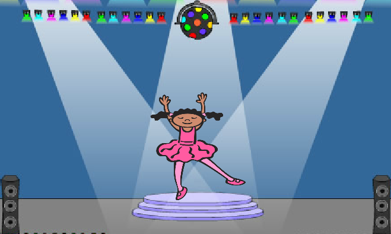
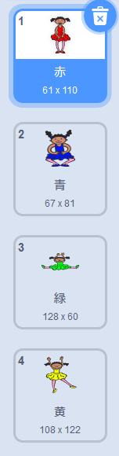
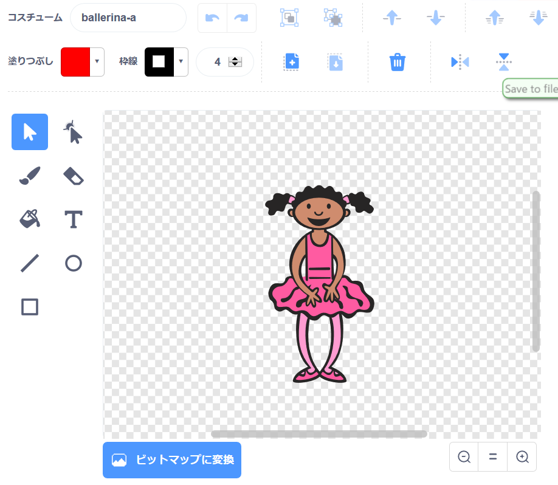
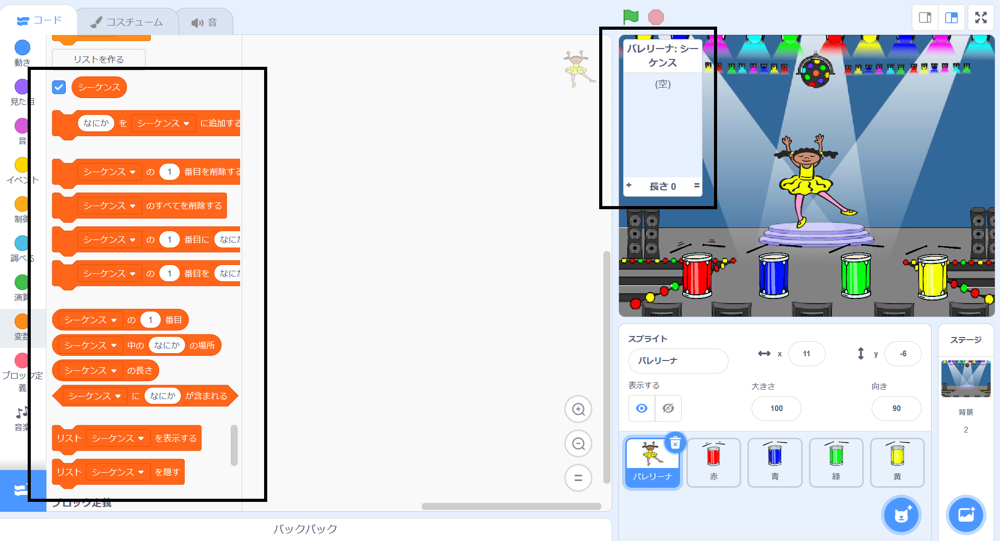

## カラーシーケンスを作成する

まずランダムな色のシーケンスを表示できる文字を作成します。

\--- task \--- 新しいScratchプロジェクトを開きます。

**オンライン**： [rpf.io/scratchon](https://rpf.io/scratchon)で新しいオンラインスクラッチプロジェクトを開く。

**オフライン**：オフラインエディタで新しいプロジェクトを開きます。

Scratchオフラインエディタをダウンロードしてインストールする必要がある場合は、 [rpf.io / scratchoff](https://rpf.io/scratchoff)で見つけることができます。

- - /仕事 - -

\--- task \--- キャラクタースプライトと背景を選択します。あなたはバレリーナを使うことができました、しかし、あなたのキャラクターは人である必要はなく、彼らは異なる色を見せることができる必要があります。

 - - /仕事 - -

+ あなたのゲームはそれぞれの色を表現するために異なる数を使うべきです：
    
    + 1 =赤
    + 2 =青
    + 3 =緑
    + 4 =黄色

\--- task \--- あなたのキャラクターに、色の異なる4つのコスチュームを、上に挙げた4色それぞれに1つずつ渡します。 あなたの色のついたコスチュームが上のリストと同じ順序であることを確認してください。

 - - /仕事 - -

あなたが望むならば、あなたは異なる色で衣装の部分を塗りつぶすために **色の形** ツールを使うことができます。



次に、プレイヤーが覚えておく必要がある色のランダムなシーケンスを格納するためのリストを追加します。

\--- task \--- `sequence`{：class = "block3variables"}という名前のリストを作成します。 このリストを見る必要があるのはキャラクタースプライトだけなので、 **を選択できます。リストを作成するときは、このスプライトには** のみを選択してください。

[[[generic-scratch3-make-list]]]

- - /仕事 - -

リストを使うためのたくさんの新しいコードブロックが見えるはずです。空のリストがステージの左上隅に表示されます。



色ごとに番号が異なるため、番号をランダムに選択してリストに追加することで、ランダムな色を選択できます。

\--- task \--- このコードを文字スプライトに追加して乱数を選択し、それを `シーケンスに追加します`{：class = "block3variables"}：


```blocks3
flagがクリックされたとき
追加する（ランダムに選択する（1）から（4））[シーケンスv]
```

- - /仕事 - -

\--- task \--- コードをテストしてください。フラグをクリックするたびに、1から4の間の乱数がリストに追加されることを確認します。 \--- / task \---

\--- task \--- プログラムにコードを追加して一度に5つの乱数を生成できますか？

\---ヒント\--- \--- \---ヒント 追加 `配列のすべての削除`{：クラス=「block3variables」}最初に、リスト上のすべての項目を削除し、そしてする追加 `リピート`リストに5つの乱数を追加する{：class = "block3control"}ブロック。 \--- /ヒント\--- \---ヒント\---

これはあなたのコードがどのように見えるべきかです：


```blocks3
フラグがクリックされたとき
[シーケンスv]を削除（all v）
繰り返し（5）
    [シーケンスv]に
追加する
```

\--- / hint \--- \--- / / hints \--- \--- / task \---

\--- task \--- 数字がリストに追加されるたびに、キャラクターは衣装の色が数字と一致するように衣装を変更する必要があります。 乱数が `シーケンス`追加される場所のすぐ下のコードにこれらのブロックを配置します。{：class = "block3variables"}：


```blocks3
（[配列V]の項目（[配列V]の長さ））に切り替え衣装
ウェイト（1）秒
```

- - /仕事 - -