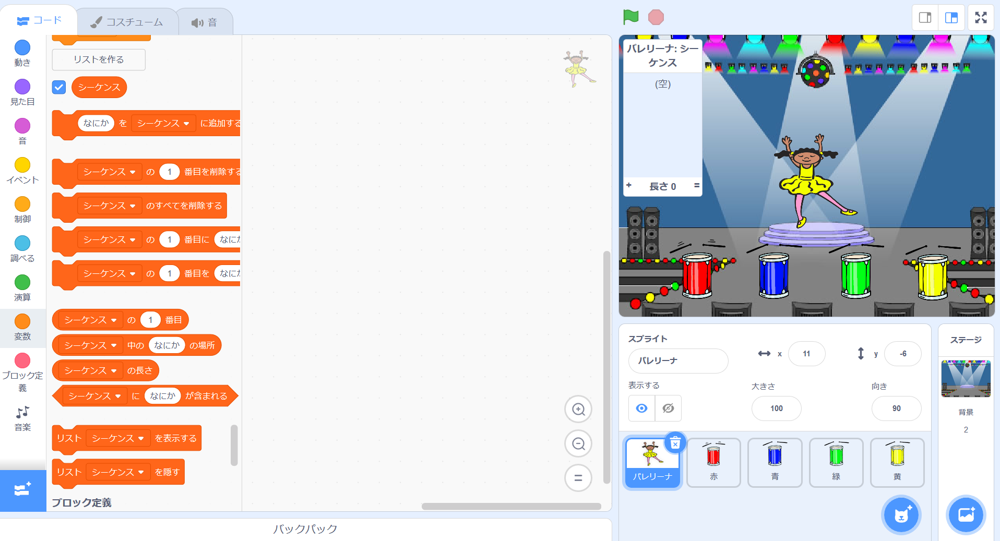

## カラーシーケンスを作成する

まず、文字列をランダムに表示して記憶させるキャラクターを作成しましょう。

+ 新しいScratchプロジェクトを開始し、catスプライトを削除してプロジェクトが空になるようにします。あなたは、オンラインスクラッチエディタを見つけることができます [ここ](http://jumpto.cc/scratch-new)。

+ 文字のスプライトと背景を選択します。あなたのキャラクターは人である必要はありませんが、異なる色を表示できる必要があります。


+ ゲームでは、それぞれの色を表すために異なる番号を使います：
    
    + 1 =赤
    + 2 =青
    + 3 =緑
    + 4 =イエロー
    
    あなたのキャラクターに4色の衣装を与えてください。あなたの色のついた衣装が上記のリストと同じ順序であることを確認してください。
    
    
    
    *色を使用して形状* ツールを使用して、衣装の一部を別の色で塗りつぶすことができます。

ランダムな色のシーケンスを作成しましょう。

+ `sequence`{：class = "blockdata"}というリストを作成します。 このリストを使用して、プレーヤーが覚えておかなければならない色のシーケンスを保存します。 文字スプライトのみがリストを参照する必要があるため、 **を選択することができます**このスプライトに対しては、**選択できます。</li> </ul> 
    
    [[[generic-scratch-make-list]]]
    
    ステージの左上に空のリストが表示され、リストを使用するための新しいブロックが多数表示されるはずです。
    
    
    
    + 我々は各色に数字を付けたのを覚えていますかランダムな色を選択してリストに追加することで、ランダムな色を選択できます。このコードを追加：
    
    ```blocks
    
    をクリックしたときに[sequence v]にadd（random（1）〜（4）を選択）
    ```
    
    + 緑色の旗をクリックしてコードをテストします。クリックするたびに、1〜4の乱数がリストに追加されていることを確認します。
    
    + 一度に5つのランダムな色を生成するためにこのブロックをプログラムに追加できますか？
    
    ```blocks
    repeat（5）
    
    end
    ```
    
    + あなたはあなたのリストが少しいっぱいになっていることに気付くかもしれません。数字を生成する前に、最初にリスト全体を削除するブロックを追加してみましょう。
    
    ```blocks
    フラグがクリックされたときに
    （全V）の[系列v]の削除
    リピート（5）
        追加（ピックランダム（1）〜（4））に[配列V]
    端を
    ```
    
    + 最後に、数字を選ぶたびに、ダンサーの衣装をリストに追加された最後のアイテムに変更しましょう。これは今選んだ番号になります。 乱数をリ​​ストに追加した直後に、次のブロックをコードに追加します。
    
    ```blocks
    （シーケンスvの項目（最後のv））
    ウェイト（1秒）
    ```