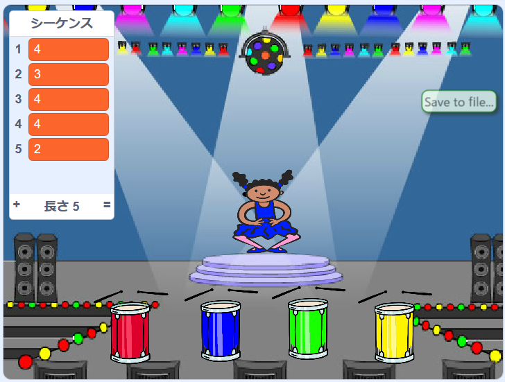
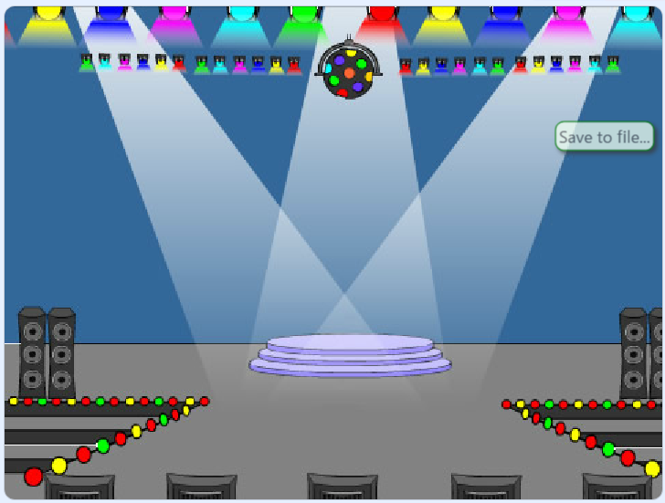

## シーケンスを繰り返す

これで、プレーヤーがカラーシーケンスを繰り返すために押す必要のある4つのボタンを追加します。

\--- task \--- 4つのボタンを表すために、プロジェクトに4つの新しいスプライトを追加します。

+ 4色それぞれに1つのスプライトがあるように、新しいスプライトの衣装を編集します。
+ 衣装と同じ順番でスプライトをステージ上に置きます。

 \--- /task \---

\--- task \--- 赤いスプライトにコードを追加して、スプライトがクリックされたときに `{`：：class = "block3events"}という文字が文字スプライトに '赤い'メッセージをブロードキャストするようにします。


```blocks3
    このスプライトが
    ブロードキャストをクリックしたとき（赤v）
```

\--- /task \---

`ブロードキャスト`{：class = "block3events"}は、スピーカーでアナウンスされたメッセージのようなもので、たとえば学校やスーパーマーケットで聞くことができます。 すべてのスプライトは `ブロードキャスト`{：class = "block3events"}を聞くことができますが、応答するのが仕事であるスプライトだけが何かをします。

\--- task \---

青、緑、黄色のスプライトに同様のコードを追加して、それぞれの色について `ブロードキャスト`{：class = "block3events"}メッセージにします。

\--- /task \---

あなたは `ブロードキャスト`{：class = "block3events"}が拡声器メッセージのようであることを覚えていますか？ `ブロードキャスト`{：class = "block3events"}メッセージに応答するのがキャラクタースプライトの仕事になるようにコードを追加します。

\--- task \---

キャラクタースプライトがメッセージを受信したときに `赤`：{クラス=「block3eventsを」}、コードが数かどうかをチェックする必要が `1` の開始時である `列`を意味する（リスト：{クラス=「block3variables」}その `赤`{：class = "block3events"}はシーケンスの次の色です）。

`1` がリストの先頭にある場合、プレーヤーは正しい色を覚えているので、コードはリストから番号を削除する必要があります。 さもなければそれはゲームオーバーであり、そしてコードはゲームを終了するために ``すべて停止する必要があります。


```blocks3
私は[赤V]受信したときに
場合 <（項目は（1 V）[シーケンスV]で）=[1]> その後、
の削除（1 V）[シーケンスV]
他
[ゲームオーバーを！]と言うために（1）秒
停止[すべてv]
終了
```

\--- /task \---

\--- task \--- 文字スプライトが正しい `ブロードキャスト`{：class = "block3events"}を受信したときにドラムビートも再生するように、作成したコードに追加します。

\---ヒント\--- \---ヒント\--- 各ドラムに対応する数字を使って正しいドラムビートを演奏できますか。

+ 1 =赤
+ 2 =青
+ 3 =緑
+ 4 =黄色 \--- /ヒント\--- \--- \---ヒント 以上 `配列の1削除`追加、ブロック：{クラス= "block3variables"} `プレイドラム`「=クラス：{ block3sound "} `シーケンス`{：class =" block3variables "}リストの最初のサウンドを再生するためのブロック。

\--- / hint \--- \--- hint \--- これが追加が必要なコードです。

```blocks3
<（[sequence v]のitem（1 v））=[1]> とき、[red v]
を受け取ったとき

+（0.25）のために

 +ドラム（\（1 \）Snare Drum v）を演奏する
delete（1 v） [sequence v]

（1）秒間[Game over！]と言う
stop [all v]
end

```

\--- / hint \--- \--- / hints \--- \--- / task \---

\--- task \--- キャラクタスプライトがメッセージ `red`{：class = "block3events"}に応答するようにするために使用したコードを複製します。 重複コードを変更して、メッセージ `blue`{：class = "block3events"}を送信するようにします。 \--- /task \---

スプライトがメッセージ `blue`{：class = "block3events"}に応答するとき、どのコードのビットが同じままで、どのビットが変わるべきか？ 各色には対応する番号があります。

\--- task \--- 文字が `blue`{：class = "block3events"}メッセージに正しく反応するように、文字スプライトのコードを変更してください。

\--- hints \--- \--- hint \---

これらのブロックを保管してください。しかし、何らかの方法でそれらを変更する必要があります。


```blocks3
<（[シーケンスv]の項目（1 v））= [1]>

[0.25]ビートの場合、[赤v]

演奏ドラム（\（1 \）スネアドラムv）
```

\--- / hint \--- \--- hint \--- があなたのコードが `blue`{：class = "block3events"}ブロードキャストを探す方法です。


```blocks3
私は[ブルーV]を受信したときに
場合 <（[配列V]の項目（1 V））=[2]> 、次いで
    （0.25）のためのプレイドラム（\（2 \）バスドラムV）ビート
    （1 V）を削除します[sequence v]
それ以外の
    は[1]秒間[Game over！]と言う
    stop [all v]
end
```

\--- / hint \--- \--- / hints \--- \--- / task \---

\--- task \--- コードを2回複製し（緑色と黄色のボタン用）、必要な部分を変更して、文字が新しい `ブロードキャストに正しく応答するようにします`{：class = "block3events"}。 \--- /task \---

コードをテストするのを忘れないでください。あなたは5色のシーケンスを記憶することができますか？シーケンスは毎回異なりますか？

プレーヤーがカラーシーケンス全体を正しく繰り返すと、 `シーケンス`{：class = "block3variables"}のリストが空になり、プレーヤーが勝利します。 必要に応じて、 `sequence`{：class = "block3variables"}リストが空になったら、報酬としていくつかの点滅ライトを表示することもできます。

\--- task \--- flagがクリックされたとき、このコードをあなたのキャラクターの `最後に追加します`{：class = "block3events"}スクリプト：


```blocks3
    < （[sequence v]の長さ）= [0]>
    broadcast（vに勝ちました）まで待ってから待つ
```

\--- /task \---

\--- task \--- ステージに切り替えて、 `ドラムマシン` サウンドまたは他の好きなサウンドをインポートします。

[[[generic-scratch3-sound-from-library]]]

\--- /task \---

\--- task \--- このコードを追加すると、サウンドが再生され、プレーヤーの勝利時に背景の色が変わります。



```blocks3
    [win v]を受け取ったとき
    音が鳴る（ドラムマシンv）
    繰り返し（50）
        [color v]効果を（25）
        wait（0.1）秒
    end
    クリアグラフィック効果
```

\--- /task \---