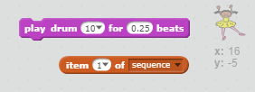

## シーケンスを繰り返す

プレイヤーが押した4つのボタンを追加して、覚えていたシーケンスを繰り返してみましょう。

+ 4つの新しいスプライトをプロジェクトに追加して、4つのボタンを表します。 衣装を編集して、4色のそれぞれにスプライトが1つあるようにします。 赤、青、緑、黄色の衣装と同じ順序でスプライトをレイアウトします。


+ 赤いドラムがクリックされたら、キャラクターにメッセージをブロードキャストして、赤いボタンがクリックされたことを知らせる必要があります。あなたの赤いドラムにこのコードを追加してください：

```blocks
    このスプライトが
    放送をクリックしたとき[赤いv]
```

放送は、ラウドスピーカーでアナウンスをするようなものです。スーパーマーケットで買い物をしているときに聞いたことがあります。 すべてのスプライトはメッセージを聞くことができますが、応答するジョブのスプライトだけが何かをします。

+ 青色、緑色、黄色のドラムに同様のコードを追加して、自分の色に関するメッセージをブロードキャストします。

\---ヒント\--- \---ヒント\--- \--- つのスプライトから別のスプライトにコードをコピーする簡単な方法です。 各スプライトのブロードキャストメッセージをスプライトの色に合わせて変更します。  \--- /ヒント\--- \--- /ヒント\---

放送はラウドスピーカーで発表するようなものだと言ったことを覚えていますか？ そのジョブが応答するスプライトだけが何かをするので、メッセージに応答するキャラクタースプライトの仕事にしましょう。 キャラクターが各メッセージを聞いたときに行うべきいくつかのコードを書くことでこれを行います。

+ キャラクタースプライトがメッセージ受信したときに `赤`、コード番号かどうかをチェックする必要が `1` （ことを意味するリストの先頭にある `赤` シーケンス内の次の色です）。
    
    そうであれば、色は正しく推測されたので、コードはリストから数値を削除する必要があります。それ以外の場合は、ゲームオーバーだし、我々はする必要が `ストップすべて`：ゲームを停止するには、{クラス=「blockcontrol」}。

```blocks
    私は[赤V]受信したときに
    場合 <（項目は（1 V）[シーケンスV]で）=[1]> その後、
        の削除（1 V）[シーケンスV]
    他
        [ゲームオーバーを！]と言うために（1）秒
        ストップ[all v]
    end
```

+ あなたが書いたコードに加えて、正しい色を受け取ったときにドラムビートも再生されるようにします。

\---ヒント\--- \---ヒント\--- 正しいドラムビートを演奏するために各色に対応する数字を使用できますか？

+ 1 =赤
+ 2 =青
+ 3 =緑
+ 4 =黄色 \--- /ヒント\--- \---ヒント\--- `演奏ドラム`{：class = "blocksound"}ブロックを追加して、前のシーケンスリストの最初の音を再生する必要があります `シーケンス`削除1 {：class = "blockdata"}：

 \--- / hint \--- \--- hint \--- 以下は、追加が必要なコードです：

```blocks
（0.25）ビートのためのドラムをプレイする（シーケンスvの項目（1v））
```

\--- /ヒント\--- \--- /ヒント\---

+ キャラクタースプライトをメッセージに反応させるために使用したコードを複製する `赤`。今回は、メッセージを `青色に変更します`。

スプライトが `blue`のメッセージに応答すると、どのビットが同じままで、どのビットが変わるべきですか？各色には対応する番号があることに注意してください。

+ キャラクターが `青の` メッセージに正しく反応するようにコードを変更してください。

\---ヒント\--- \---ヒント\--- \--- これらのブロックは保持しますが、何らかの方法でそれらを変更する必要があります：  \--- /ヒント\--- \---ヒント\--- コードが青い放送を探す方法は次のとおりです。

```blocks
    私は[ブルーV]を受信したときに
    場合に <（アイテム（1 V）[配列V]の）=[2]> 、次いで
        （0.25）は、ビートのためにプレイドラム（項目（1 V）[配列V]の）
        削除（1 v）of [sequence v]
    else
        ゲームオーバー！（1秒）
        stop [all v]
    end
```

\--- /ヒント\--- \--- /ヒント\---

+ 緑色と黄色のボタンのコードをもう一度2回複製し、文字が正しく反応するように必要な部分を変更します。

+ 追加したコードをテストすることを忘れないでください！あなたは5色のシーケンスを暗記することはできますか？シーケンスは毎回異なるのですか？

リストが空になったら報酬としていくつかの点滅を表示することもできます。これは、シーケンス全体が正しく記憶されたことを意味します。

+ フラグが</code>{{class = "blockevents"}}スクリプトをクリックすると、キャラクターの `最後にこのコードを追加します：</li>
</ul>

<pre><code class="blocks">    < （長さ[シーケンスv]）= [0]>
    ブロードキャスト[ウォンv]と待ち
`</pre> 
    + ステージに切り替えて、このコードを追加してサウンドを再生し、プレーヤーが勝ち次第、色を変えるようにします。好きな音を選ぶことができます。
    ```blocks
        私は受け取ったときに
        再生音[ドラムマシンv]
        リピート（50）
            変更[色v]効果（25）
            待機（0.1）秒
        終了
        クリアグラフィックエフェクト
    ```