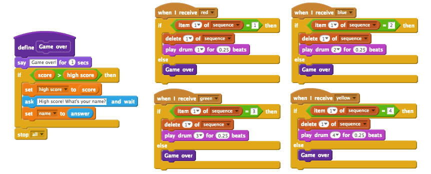
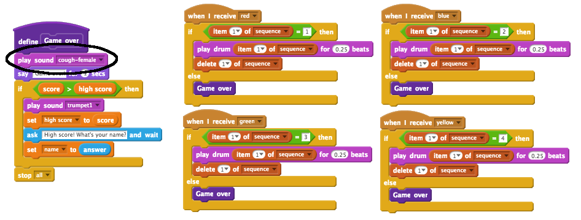

## 高得点

高いスコアを保存して、あなたの友達と遊ぶことができます。

+ `ハイスコ​​ア`{：class = "blockdata"}と `名前`{：class = "blockdata"}という2つの新しい変数をプロジェクトに追加します。

プレイヤーがシーケンスを間違えたためにゲームが終了したら、あなたのスコアが現在のハイスコアより高いかどうかをチェックする必要があります。 そうであれば、スコアをハイスコアとして保存し、プレーヤーの名前を保存する必要があります。

+ ハイスコ​​アを格納するコードを文字スプライトに追加します。また、プレーヤーに自分の名前を尋ね、 `name`{：class = "blockdata"}変数に記録します。

[[[generic-scratch-high-score]]]

\---ヒント\--- \--- \---ヒント ：あなたの新しいコードは、このロジックに従う必要が 後 `上にゲーム` メッセージ `場合` `スコア` ある `を超える` `ハイスコア` `セット` `高いスコア` へ `スコア` `質問` 遊技者の名前 `セット` `名` に `答え` \--- /ヒント\--- \---ヒント- - 次のブロックが必要です。


\--- / hint \--- \---ヒント\--- 赤いボタンが押されたときのコードは次のようになります：

```blocks
    私は[赤V]受信したときに
    場合 <（項目は（1 V）[シーケンスV]で）=[1]> その後、
        の削除（1 V）[シーケンスV]
    他
        [ゲームオーバーを！]と言うために（1）秒
        もし < （スコア） > （ハイスコア） > そして
            セット（ハイスコアv）から（スコア）
            質問[ハイスコア！ あなたの名前は何ですか？]そして待ち
            セット[名前v]（答え）
        終了
        停止[すべてv]
    終了
```

\--- /ヒント\--- \--- /ヒント\---

+ 他の3つの色についても、この新しいコードを文字スプライトに追加する必要があります。あなたは、4色それぞれの「ゲームオーバー」コードがまったく同じであることに気付きましたか？


たとえば、サウンドを追加したり、「ゲームオーバー」メッセージを変更するなど、このコードを変更する必要があった場合は、それを4回変更する必要があります。それは迷惑になり、多くの時間を無駄にする可能性があります。

代わりに、独自のブロックを定義してプロジェクトで再利用することができます。 これを行うには、 `以上のブロック`{{class = "blockmoreblocks"}をクリックし、次に **ブロックを作成します**。 この新しいブロックを「ゲームオーバー」と呼んでください。


+ 以下からのコードを追加します。 `他に`あなたが作成したブロックに赤いボタンに接続されたブロック：{クラス=「blockcontrol」}：


+ これで、新しい作った *機能* と呼ばれる `ゲームオーバーを`あなたはどこでもあなたが好き使用することができます：{クラス=「blockmoreblocks」}、。 新しい `Game over`{：class = "blockmoreblocks"}ブロックをボタン用の4つのスクリプトにドラッグします。



+ 間違ったボタンが押されたときにサウンドを追加します。このコードは、 `Game Over`{：class = "blockmoreblocks"}ブロックに</code>回だけ追加する必要があります。

