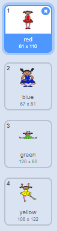

## ಒಂದು ಬಣ್ಣ ಅನುಕ್ರಮವನ್ನು ರಚಿಸಿ

ಮೊದಲು ಒಂದು ಕ್ಯಾರೆಕ್ಟರ್ವನ್ನು ರಚಿಸಿ, ಈ ಕ್ಯಾರೆಕ್ಟರ್ ಸ್ವೇಚ್ಛೆಯಾದ ಬಣ್ಣ ಅನುಕ್ರಮದ ಪ್ರದರ್ಶನ ಮಾಡುತ್ತೆ.

\--- task \---

ಹೊಸ Scratch ಯೋಜನೆಯನ್ನು ತೆರೆಯಿರಿ.

**Online**: ಹೊಸ Scratch ಯೋಜನೆ ಆನ್ಲೈನ್ ನಲ್ಲಿ ತೆರೆಯಲು[rpf.io/scratch-new](https://rpf.io/scratch-new){:target="_blank"}.

**Offline**: ಹೊಸ ಯೋಜನೆಯನ್ನು ಅಫ್ಲಿನ್ ಎಡಿಟರ್ ಮೂಲಕ ತೆರೆಯಿರಿ.

ನೀಮಗೆ Scratch ಅಫ್ಲಿನ್ ಎಡಿಟರ್ ಬೇಕಿದ್ರೆ, ಇಲ್ಲಿ ಡೋಲೋಡ್ ಮತ್ತು ಇನ್ಸ್ಟಾಲ್ ಮಾಡಿ [rpf.io/scratchoff](https://rpf.io/scratchoff){:target="_blank"}.

\--- /task \---

\--- task \---

ಕ್ಯಾರೆಕ್ಟರ್ sprite ಮತ್ತು ಹಿನ್ನೆಲೆ ಆಯ್ಕೆಮಾಡಿ. ನೀವು ನರ್ತಿಕಿಯನ್ನು ಬಲಿಸಬಹುದು, ಆದರೆ ನಿಮ್ಮ ಕ್ಯಾರೆಕ್ಟರ್ ವ್ಯಕ್ತಿಯಾಗಿರಬೇಕು ಅಂತ ಏನು ಇಲ್ಲ, ವಿಭಿನ್ನ ಬಣ್ಣಗಳನ್ನು ತೋರಿಸಿದರೆ ಸಾಕು.


\--- /task \---

+ ಪ್ರತಿ ಬಣ್ಣವನ್ನು ಪ್ರತಿನಿಧಿಸಲು ನಿಮ್ಮ ಆಟವು ಬೇರೆ ಸಂಖ್ಯೆಯನ್ನು ಬಳಸಬೇಕು:
    
    + 1 = red
    + 2 = blue
    + 3 = green
    + 4 = yellow

\--- task \---

ನಿಮ್ಮ ಪಾತ್ರಕ್ಕೆ ವಿಭಿನ್ನ ಬಣ್ಣಗಳನ್ನು ಹೊಂದಿರುವ ನಾಲ್ಕು ವೇಷಭೂಷಣಗಳನ್ನು ನೀಡಿ, ಮೇಲೆ ತೋರಿಸಿರುವ ನಾಲ್ಕು ಬಣ್ಣಗಳಲ್ಲಿ ಪ್ರತಿಯೊಂದಕ್ಕೂ ಒಂದು ವೇಷಭೂಷಣಗಳನ್ನು ನೀಡಿ. ನಿಮ್ಮ ಬಣ್ಣದ ವೇಷಭೂಷಣಗಳು ಮೇಲಿನ ಪಟ್ಟಿಯಂತೆಯೇ ಇರುತ್ತವೆ ಎಂದು ಖಚಿತಪಡಿಸಿಕೊಳ್ಳಿ.



\--- /task \---

ನೀವು ಬಯಸಿದರೆ, ವೇಷಭೂಷಣ ಭಾಗಗಳನ್ನು ಬೇರೆ ಬಣ್ಣದಿಂದ ತುಂಬಿಸಳ್ಳು ನೀವು **color a shape**ಸಾಧನ ಬಳಸಬಹುದು.


ಮುಂದೆ, ಆಟಗಾರನು ನೆನಪಿಟ್ಟುಕೊಳ್ಳಬೇಕಾದ ಬಣ್ಣಗಳ ಯಾದೃಚ್ ಅನುಕ್ರಮವನ್ನು ಸಂಗ್ರಹಿಸಲು ಪಟ್ಟಿಯನ್ನು ಸೇರಿಸಿ.

\--- task \---

`sequence`{: class = "block3variables"} ಎಂಬ ಪಟ್ಟಿಯನ್ನು ರಚಿಸಿ. ಕ್ಯಾರೆಕ್ಟರ್ sprite ಮಾತ್ರ ಪಟ್ಟಿಯನ್ನು ನೋಡಬೇಕಂದ್ರೆ ನೀವು ಇದನ್ನು ಉಪಯೋಗಿಸಿ **For this sprite only** ನೀವು ಪಟ್ಟಿಯನ್ನು ರಚಿಸಿದಾಗ.

[[[generic-scratch3-make-list]]]

\--- /task \---

ಪಟ್ಟಿಗಳನ್ನು ಬಳಸುವುದಕ್ಕಾಗಿ ನೀವು ಈಗ ಸಾಕಷ್ಟು ಹೊಸ ಕೋಡ್ ಬ್ಲಾಕ್‌ಗಳನ್ನು ನೋಡಬೇಕು. ಖಾಲಿ ಪಟ್ಟಿ ಹಂತದ ಮೇಲಿನ ಎಡ ಮೂಲೆಯಲ್ಲಿ ಗೋಚರಿಸಬೇಕು.


ಪ್ರತಿಯೊಂದು ಬಣ್ಣವು ವಿಭಿನ್ನ ಸಂಖ್ಯೆಯನ್ನು ಹೊಂದಿದೆ, ಆದ್ದರಿಂದ ನೀವು ಯಾದೃಚ್ ಸಂಖ್ಯೆಯನ್ನು ಆರಿಸಿ ಮತ್ತು ಅದನ್ನು ಪಟ್ಟಿಗೆ ಸೇರಿಸುವ ಮೂಲಕ ಯಾದೃಚ್ ಬಣ್ಣವನ್ನು ಆಯ್ಕೆ ಮಾಡಬಹುದು.

\--- task \---

ಯಾದೃಚ್ಛಿಕ ಸಂಖ್ಯೆಯನ್ನು ಆಯ್ಕೆ ಮಾಡಲು ಈ ಕೋಡ್ ಅನ್ನು ಕ್ಯಾರೆಕ್ಟರ್ sprite ಇಗೆ ಸೇರಿಸಿ ಮತ್ತು `sequence`{:class="block3variables"}:ಇಗೆ ಸೇರಿಸಿ:


```blocks3
when flag clicked
add (pick random (1) to (4)) to [sequence v]
```

\--- /task \---

\--- task \---

ನಿಮ್ಮ ಕೋಡ್ ಅನ್ನು ಪರೀಕ್ಷಿಸಿ. ಪರಿಶೀಲಿಸಿ, ಪ್ರತಿ ಬಾರಿ ನೀವು ಧ್ವಜವನ್ನು ಕ್ಲಿಕ್ ಮಾಡಿದಾಗ, 1 ಮತ್ತು 4 ರ ನಡುವಿನ ಯಾದೃಚ್ ಸಂಖ್ಯೆಯನ್ನು ಪಟ್ಟಿಗೆ ಸೇರಿಸಲಾಗುತ್ತದೆ.

\--- /task \---

\--- task \---

ಏಕಕಾಲದಲ್ಲಿ ಐದು ಯಾದೃಚ್ಕ ಸಂಖ್ಯೆಗಳನ್ನು ರಚಿಸಲು ನಿಮ್ಮ ಪ್ರೋಗ್ರಾಂಗೆ ಕೋಡ್ ಸೇರಿಸಬಹುದೇ?

\--- hints \---

\--- hint \---

ಸೇರಿಸಿ `delete all of sequence`{:class="block3variables"} ಮೊದಲು ಪಟ್ಟಿಯಲ್ಲಿರುವ ಎಲ್ಲಾ ವಸ್ತುಗಳನ್ನು ಡಿಲೀಟ್ ಮಾಡಲು, ತದನಂತರ ಒಂದು`repeat`{:class="block3control"} ಬ್ಲಾಕ್ ಸೇರಿಸಿ ಅದ್ದು ಐದು ರ್ಯಾಂಡಮ್ ಸಂಖ್ಯೆಗಳ ಪಟ್ಟಿಗೆ ಸೇರಿಸುತ್ತದೆ.

\--- /hint \---

\--- hint \---

ನಿಮ್ಮ ಕೋಡ್ ಹೀಗಿರಬೇಕು:


```blocks3
when flag clicked
delete (all v) of [sequence v]
repeat (5)
    add (pick random (1) to (4)) to [sequence v]
end
```

\--- /hint \---

\--- /hints \---

\--- /task \---

\--- task \---

ಪ್ರತಿ ಬಾರಿ ಪಟ್ಟಿಗೆ ಸಂಖ್ಯೆಯನ್ನು ಸೇರಿಸಿದಾಗ, ಕ್ಯಾರೆಕ್ಟರ್ವು ವೇಷಭೂಷಣ ಬದಲಾಯಿಸಬೇಕು ಆದ್ದರಿಂದ ವೇಷಭೂಷಣದ ಬಣ್ಣವು ಸಂಖ್ಯೆಗೆ ಹೊಂದಿಕೆಯಾಗುತ್ತದೆ. ಈ ಬ್ಲಾಕ್‌ಗಳನ್ನು ತಕ್ಷಣವೇ ನಿಮ್ಮ ಕೋಡ್‌ಗೆ ಇರಿಸಿ ಅಲ್ಲಿ ಒಂದು ರ್ಯಾಂಡಮ್ ಸಂಖ್ಯೆಯನ್ನು ಸೇರಿಸಲಾಗಿದೆ `sequence`{:class="block3variables"}:


```blocks3
switch costume to (item (length of [sequence v]) of [sequence v])
wait (1) seconds
```

\--- /task \---