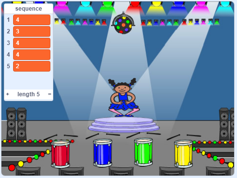

## ಅನುಕ್ರಮವನ್ನು ಪುನಃ ಮಾಡಿ

ಈಗ ನೀವು ನಾಲ್ಕು ಗುಂಡಿಗಳನ್ನು ಸೇರಿಸಲು ಹೊರಟಿದ್ದೀರಿ ಅದ್ದನು ಆಟಗಾರನು ಬಣ್ಣ ಅನುಕ್ರಮವನ್ನು ಪುನರಾವರ್ತಿಸಲು ಒತ್ತಬೇಕು.

\--- task \---

ನಾಲ್ಕು ಗುಂಡಿಗಳನ್ನು ಪ್ರತಿನಿಧಿಸಲು ನಿಮ್ಮ ಯೋಜನೆಗೆ ನಾಲ್ಕು ಹೊಸ sprite‌ಗಳನ್ನು ಸೇರಿಸಿ.

+ ಹೊಸ sprite‌ಗಳ ವೇಷಭೂಷಣಗಳನ್ನು ಸಂಪಾದಿಸಿ ಇದರಿಂದ ನಾಲ್ಕು ಬಣ್ಣಗಳಲ್ಲಿ ಪ್ರತಿಯೊಂದಕ್ಕೂ ಒಂದು sprite ಇರುತ್ತದೆ
+ ವೇಷಭೂಷಣಗಳಂತೆ ವೇದಿಕೆಯಲ್ಲಿ sprite‌ಗಳನ್ನು ಒಂದೇ ಕ್ರಮದಲ್ಲಿ ಇರಿಸಿ: red, blue, green, yellow



\--- /task \---

\--- task \---

Red sprite ಇ‌ಗೆ ಕೋಡ್ ಸೇರಿಸಿ ಇದರಿಂದ sprite ಕ್ಲಿಕ್ ಮಾಡಿದಾಗ ಅದು `broadcasts`{:class="block3events"} ಕ್ಯಾರೆಕ್ಟರ್ sprite 'red' ಸಂದೇಶ ಪ್ರಸಾರವಾಗುತ್ತದೆ:


```blocks3
    when this sprite clicked
    broadcast (red v)
```

\--- /task \---

`broadcast`{:class="block3events"} ಎಂಬುದು ಧ್ವನಿವರ್ಧಕದ ಮೂಲಕ ಘೋಷಿಸಲಾದ ಸಂದೇಶದಂತೆ, ಉದಾಹರಣೆಗಾಗಿ ಇದನ್ನು ನೀವು ಶಾಲೆಗಳು ಅಥವಾ ಸೂಪರ್ಮಾರ್ಕೆಟ್ಗಳಲ್ಲಿ ಕೇಳಬಹುದು. ಎಲ್ಲಾ spriteಗಳು `broadcast`{:class="block3events"}ಕೇಳಬಹುದು, ಆದರೆ ಪ್ರತಿಕ್ರಿಯಿಸುವುದು ಅವರ ಕೆಲಸವಾದ sprite ಮಾತ್ರ ಏನನ್ನಾದರೂ ಮಾಡುತ್ತದೆ.

\--- task \---

ಇದೇ ರೀತಿಯ ಕೋಡ್ blue, green ಮತ್ತು yellow sprites ಇಗೆ ಸೇರಿಸಿ `broadcast`{:class="block3events"} ತಮ್ಮದೇ ಬಣ್ಣಗಳ ಬಗ್ಗೆ ಸಂದೇಶಗಳ ಪ್ರಸಾರ ಮಾಡಲು.

\--- /task \---

ಅದು ನಿಮಗೆ ನೆನಪಿದೆಯೇ `broadcast`{:class="block3events"} ಧ್ವನಿವರ್ಧಕ ಸಂದೇಶದಂತೆ? ನೀವು ಕೋಡ್ ಅನ್ನು ಸೇರಿಸುತ್ತೀರಿ ಅದನ್ನು ಕ್ಯಾರೆಕ್ಟರ್ sprite's ಪ್ರತಿಕ್ರಿಯಿಸುವ ಕೆಲಸ ಮಾಡಲು `broadcast`{:class="block3events"} ಸಂದೇಶಗಳು.

\--- task \---

ನಿಮ್ಮ ಕ್ಯಾರೆಕ್ಟರ್ sprite `red`{:class="block3events"} ಸಂದೇಶವನ್ನು ಸ್ವೀಕರಿಸಿದಾಗ, ಕೋಡ್ ಸಂಖ್ಯೆ `1` `sequence`{:class="block3variables"} ಪಟ್ಟಿಯ ಪ್ರಾರಂಭದಲ್ಲಿದೆ ಎಂಬುದನ್ನು ಪರಿಶೀಲಿಸಬೇಕು (ಇದರರ್ಥ `red`{:class="block3events" ಎಂಬುದು ಅನುಕ್ರಮದಲ್ಲಿನ ಮುಂದಿನ ಬಣ್ಣವಾಗಿದೆ).

`1` ಪಟ್ಟಿಯ ಪ್ರಾರಂಭದಲ್ಲಿದೆ ಆಗಿದ್ದರೆ, ಕೋಡ್ ಸಂಖ್ಯೆಯನ್ನು ಪಟ್ಟಿಯಿಂದ ತೆಗೆದುಹಾಕಬೇಕು, ಏಕೆಂದರೆ ಆಟಗಾರನು ಸರಿಯಾದ ಬಣ್ಣವನ್ನು ನೆನಪಿಸಿಕೊಳ್ಳುತ್ತಾನೆ. ಇಲ್ಲದಿದ್ದರೆ ಆಟ ಮುಗಿದಿದೆ, ಮತ್ತು ಕೋಡ್ಇ‌ಗೆ `stop all`{:class="block3control"} ಆಟವನ್ನು ಕೊನೆಗೊಳಿಸಲು ಅಗತ್ಯವಿದೆ.


```blocks3
when I receive [red v]
if <(item (1 v) of [sequence v])=[1]> then
delete (1 v) of [sequence v]
else
say [Game over!] for (1) seconds
stop [all v]
end
```

\--- /task \---

\--- task \---

ಕ್ಯಾರೆಕ್ಟರ್ sprite ಸರಿಯಾದ ಉತ್ತರ ಸಿಕ್ಕಿದಾಗ ಡ್ರಮ್ ಆಡುವಂತೆ ನಿಮ್ಮ ಕೋಡ್ ಬರಿಯಿರಿ `broadcast`{:class="block3events"}.

\--- hints \---

\--- hint \---

ಸರಿಯಾದ ಡ್ರಮ್ ಬೀಟ್ ನುಡಿಸಲು ನೀವು ಪ್ರತಿ ಬಣ್ಣಕ್ಕೆ ಅನುಗುಣವಾದ ಸಂಖ್ಯೆಗಳನ್ನು ಬಳಸಬಹುದೇ?

+ 1 = red
+ 2 = blue
+ 3 = green
+ 4 = yellow

\--- /hint \---

\--- hint \---

`delete 1 of sequence`{:class="block3variables"} ಬ್ಲಾಕಿನ ಮೇಲೆ, `play drum`{:class="block3sound"}ಬ್ಲಾಕ್ ಸೇರಿಸಿ ಮೊದಲು ಧ್ವನಿಯನ್ನು ಪ್ಲೇ ಮಾಡಲು `sequence`{:class="block3variables"}ಲಿಸ್ಟ್ ನಲ್ಲಿ.

\--- /hint \---

\--- hint \---

ನೀವು ಸೇರಿಸಬೇಕಾದ ಕೋಡ್ ಇಲ್ಲಿದೆ:

```blocks3
when I receive [red v]
if <(item (1 v) of [sequence v])=[1]> then

+ play drum (\(1\) Snare Drum v) for (0.25) beats
delete (1 v) of [sequence v]
else
say [Game over!] for (1) seconds
stop [all v]
end
```

\--- /hint \---

\--- /hints \---

\--- /task \---

\--- task \---

ನಿಮ್ಮ ಕ್ಯಾರೆಕ್ಟರ್ sprite `red`{:class="block3events"}ಸಂದೇಶಕ್ಕೆ ಪ್ರತಿಕ್ರಿಯಿಸುವಂತೆ ಮಾಡಲು ನೀವು ಬಳಸಿದ ಕೋಡ್ ಅನ್ನು ನಕಲು ಮಾಡಿ. ನಕಲಿ ಕೋಡ್ ಅನ್ನು ಬದಲಾಯಿಸಿ ಇದರಿಂದ ಅದು `blue`{:class="block3events"} ಸಂದೇಶವನ್ನು ಕಳುಹಿಸುತ್ತದೆ.

\--- /task \---

Sprite `blue`{:class="block3events"} ಸಂದೇಶಕ್ಕೆ ಪ್ರತಿಕ್ರಿಯಿಸಿದಾಗ, ಯಾವ ಬಾಗ ಕೋಡ್ ಒಂದೇ ಆಗಿರಬೇಕು ಮತ್ತು ಯಾವ ಬಾಗ ಬದಲಾಗಬೇಕು? ಪ್ರತಿಯೊಂದು ಬಣ್ಣವು ಅನುಗುಣವಾದ ಸಂಖ್ಯೆಯನ್ನು ಹೊಂದಿದೆ ಎಂಬುದನ್ನು ನೆನಪಿಡಿ.

\--- task \---

ನಿಮ್ಮ ಕ್ಯಾರೆಕ್ಟರ್ sprite ಕೋಡ್ ಬದಲಾಯಿಸಬೇಕು, ಆದ್ದರಿಂದ ಕ್ಯಾರೆಕ್ಟರ್`blue`{:class="block3events"} ಸಂದೇಶಕ್ಕೆ ಪ್ರತಿಕ್ರಿಯಿಸಬೇಕು.

\--- hints \---

\--- hint \---

ಈ ಬ್ಲಾಕ್ಗಳನ್ನು ಇರಿಸಿ, ಆದರೆ ನೀವು ಅವುಗಳನ್ನು ಕೆಲವು ರೀತಿಯಲ್ಲಿ ಬದಲಾಯಿಸಬೇಕಾಗಿದೆ:


```blocks3
<(item (1 v) of [sequence v]) = [1]>

when I receive [red v]

play drum (\(1\) Snare Drum v) for (0.25) beats
```

\--- /hint \---

\--- hint \---

ನಿಮ್ಮ ಕೋಡ್ ಹೇಗೆ ನೋಡಬೇಕು ಎಂಬುದು ಇಲ್ಲಿದೆ `blue`{:class="block3events"} ಬ್ರಾಡ್ಕಾಸ್ಟ್.


```blocks3
when I receive [blue v]
if <(item (1 v) of [sequence v])=[2]> then
    play drum (\(2\) Bass Drum v) for (0.25) beats
    delete (1 v) of [sequence v]
else
    say [Game over!] for (1) seconds
    stop [all v]
end
```

\--- /hint \---

\--- /hints \---

\--- /task \---

\--- task \---

ಕೋಡ್ ಅನ್ನು ಮತ್ತೆ ಎರಡು ಬಾರಿ ನಕಲಿಸಿ (green ಮತ್ತು yellow ಬಟನ್ಸ್ ಗಾಗಿ), ಮತ್ತು ಅಗತ್ಯ ಭಾಗಗಳನ್ನು ಬದಲಾಯಿಸಿ ಇದರಿಂದ ಕ್ಯಾರೆಕ್ಟರ್ ಹೊಸದಕ್ಕೆ ಸರಿಯಾಗಿ ಪ್ರತಿಕ್ರಿಯಿಸುತ್ತದೆ `broadcasts`{:class="block3events"}.

\--- /task \---

ಕೋಡ್ ಪರೀಕ್ಷಿಸಲು ಮರೆಯದಿರಿ! ಐದು ಬಣ್ಣಗಳ ಅನುಕ್ರಮವನ್ನು ನೀವು ನೆನಪಿಟ್ಟುಕೊಳ್ಳಬಹುದೇ? ಪ್ರತಿ ಬಾರಿಯೂ ಅನುಕ್ರಮವು ವಿಭಿನ್ನವಾಗಿದೆಯೇ?

When the player repeats the whole colour sequence correctly, the `sequence`{:class="block3variables"} list is empty and the player wins. ನೀವು ಬಯಸಿದರೆ, ನೀವು ಕೆಲವು ಮಿನುಗುವ ದೀಪಗಳನ್ನು ಬಹುಮಾನವಾಗಿ ಪ್ರದರ್ಶಿಸಬಹುದು ಒಮ್ಮ `sequence`{:class="block3variables"} ಪಟ್ಟಿ ಖಾಲಿಯಾಗಿದಾಗ.

\--- task \---

ನಿಮ್ಮ ಕ್ಯಾರೆಕ್ಟರ್ 'ಸ್ ಕೊನೆಯಲ್ಲಿ ಈ ಕೋಡ್ ಸೇರಿಸಿ `when flag clicked`{:class="block3events"} ಸ್ಕ್ರಿಪ್ಟ್:


```blocks3
    wait until < (length of [sequence v]) = [0]>
    broadcast (won v) and wait
```

\--- /task \---

\--- task \---

ಹಂತಕ್ಕೆ ಬದಲಿಸಿ, ಮತ್ತು ಆಮದು ಮಾಡಿ `drum machine`ಧ್ವನಿ ಅಥವಾ ನೀವು ಇಷ್ಟಪಡುವ ಮತ್ತೊಂದು ಧ್ವನಿ.

[[[generic-scratch3-sound-from-library]]]

\--- /task \---

\--- task \---

ಧ್ವನಿಯನ್ನು ಪ್ಲೇ ಮಾಡಲು ಈ ಕೋಡ್ ಅನ್ನು ಸೇರಿಸಿ ಮತ್ತು ಆಟಗಾರನು ಗೆದ್ದಾಗ ಬ್ಯಾಕ್‌ಡ್ರಾಪ್ ಬಣ್ಣವನ್ನು ಬದಲಾಯಿಸಿ.


```blocks3
    when I receive [won v]
    start sound (drum machine v)
    repeat (50)
        change [color v] effect by (25)
        wait (0.1) seconds
    end
    clear graphic effects
```

\--- /task \---