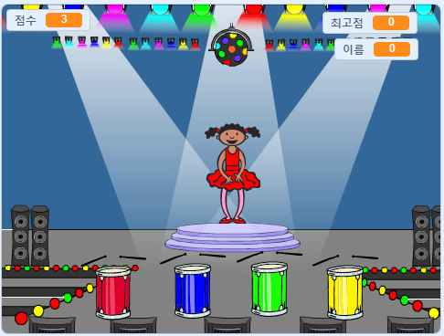

\--- no-print \---

이것은 **스크래치 3** 버전의 프로젝트입니다. 도있다 [프로젝트의 스크래치 2 버전](https://projects.raspberrypi.org/en/projects/memory-scratch2).

\--- /no-print \---

## 소개

이 프로젝트에서는 무작위로 연속 나오는 색상 순서를 기억하고 반복하는 메모리 게임을 만듭니다!

### 만들 작품

\--- no-print \--- 시작하려면 녹색 플래그를 클릭하십시오. 댄서의 드레스에 표시된 색상 순서를보고 동반하는 드럼 비트를 듣고 다시 색상을 반복하십시오. 색상 순서가 잘못되면 게임이 끝납니다!

  <iframe allowtransparency="true" width="485" height="402" src="//scratch.mit.edu/projects/embed/284452634/?autostart=false" frameborder="0" allowfullscreen scrolling="no" mark="crwd-mark"></iframe> 

\--- /no-print \---

\--- 인쇄 전용 \---  \--- / 인쇄 전용 \---

## \--- collapse \---

## title: 배우게 될 것

+ 스크래치 프로젝트에 사운드를 추가하는 방법
+ 목록을 작성하고 사용하여 데이터를 저장하는 방법
+ 반복 코드에 대한 사용자 정의 블록을 작성하고 사용하는 방법

\--- /collapse \---

## \--- 중간생략 \---

## title: 준비물

### 하드웨어

+ 스크래치 3을 실행할 수 있는 컴퓨터

### 소프트웨어

스크래치 3 ( [온라인](https://rpf.io/scratchon){: target = "_ blank"} 또는 오프라인 {: target = "_ blank"}) \--- / collapse \---

## \--- 중간생략 \---

## title : 교사를위한 추가 정보

\--- no-print \---

이 프로젝트를 인쇄한다면 [프린트용 버전](https://projects.raspberrypi.org/en/projects/memory/print){:target="_blank"}을 사용해 주십시오.

\--- /no-print \---

당신은 수 [여기에 완성 된 프로젝트를 다운로드](http://rpf.io/p/en/memory-get).

-- /collapse \---