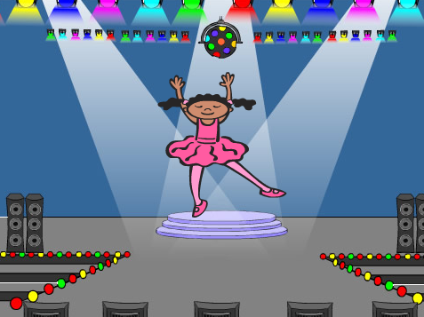
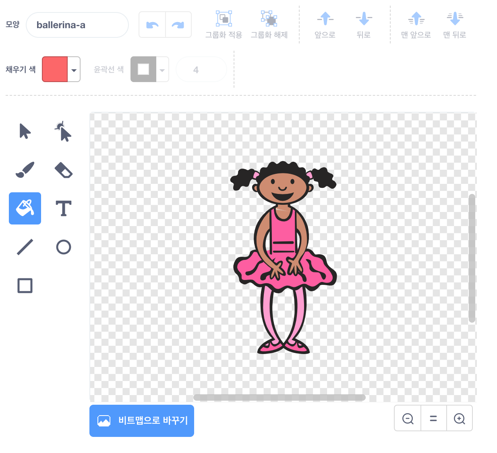
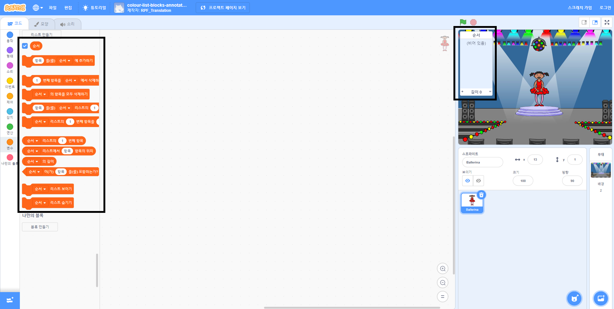

## 색상 순서 만들기

먼저 임의의 색상 순서를 표시 할 수있는 문자를 만듭니다.

\--- task \---

새 스크래치 프로젝트를 엽니다.

**온라인:** [rpf.io/scratch-new](https://rpf.io/scratch-new){:target="_ blank"}에서 새로운 온라인 스크래치 프로젝트 열기

**오프라인**: 오프라인 편집기에서 새 프로젝트를 엽니다.

스크래치 오프라인 편집기를 다운로드해야 하는 경우, [rpf.io/scratchoff](https://rpf.io/scratchoff){:target="_blank"}에서 다운로드할 수 있습니다.

\--- /task \---

\--- task \---

캐릭터 스프라이트와 배경을 선택하세요. 발레리나를 사용할 수는 있지만 캐릭터가 사람일 필요는 없으며 다른 색상을 보여줄 수 있어야합니다.



\--- /task \---

+ 게임에서 각 색상을 나타내는데 다른 숫자를 사용해야합니다.
    
    + 1 = 빨간색
    + 2 = 파란색
    + 3 = 초록색
    + 4 = 노란색

\--- task \---

위에 언급된 4가지 색상 각각에 대하여 하나씩 캐릭터에 4 가지 색상으로 다른 의상을 지정하세요. 색칠된 의상이 위 리스트와 같은 순서인지 확인하세요.


\--- /task \---

원한다면 의상의 일부분을 다른 색으로 채우기 위해 **색칠하기 ** 도구를 사용할 수 있습니다.



그런 다음, 플레이어가 기억해야 할 임의의 색상 순서를 저장하기 위한 리스트를 추가하세요.

\--- task \---

`순서`{:class="block3variables"}라는 이름의 리스트를 새로 만들어 보세요. 발레리나 캐릭터 스프라이트만 리스트를 볼 필요가 있으므로 리스트를 만들 때 **이 스프라이트에서만 사용**을 선택할 수 있습니다.

[[[generic-scratch3-make-list]]]

\--- /task \---

이제 리스트를 사용하기 위한 새로운 코드 블록이 많이 나타납니다. 빈 리스트는 스테이지의 왼쪽 상단에 표시되어야합니다.



각 색상은 숫자가 다르므로 임의로 숫자를 선택하고 리스트에 이 숫자를 추가하여 임의의 색상을 선택할 수 있습니다.

\--- task \---

임의의 숫자를 선택하기 위해 이 코드를 캐릭터 스프라이트에 추가하고 ` 순서 `에 추가하세요. {: class = "block3variables"}:


```blocks3
깃발을 클릭되면
랜덤 수 (1) ~ (4) 을 골라서 [순서 v] 에 추가하세요.
```

\--- /task \---

\--- task \---

코드를 테스트 해보세요. 클릭할 때마다 1에서 4까지의 랜덤 수가 리스트에 추가되는지 확인하세요.

\--- /task \---

\--- task \---

한꺼번에 5 개의 임의의 색상을 생성하기 위해 블록을 프로그램에 추가할 수 있습니까?

\--- hints \---

\--- hint \---

Add a `delete all of sequence`{:class="block3variables"} to first delete all the items on the list, and then add a `repeat`{:class="block3control"} block that adds five random numbers to the list.

\--- /hint \---

\--- hint \---

This is what your code should look like:


```blocks3
when flag clicked
delete (all v) of [sequence v]
repeat (5)
    add (pick random (1) to (4)) to [sequence v]
end
```

\--- /hint \---

\--- /hints \---

\--- /task \---

\--- task \---

Each time a number gets added to the list, the character should change its costume so the costume's colour matches the number. Put these blocks into your code immediately below where a random number is added to `sequence`{:class="block3variables"}:


```blocks3
switch costume to (item (length of [sequence v]) of [sequence v])
wait (1) seconds
```

\--- /task \---