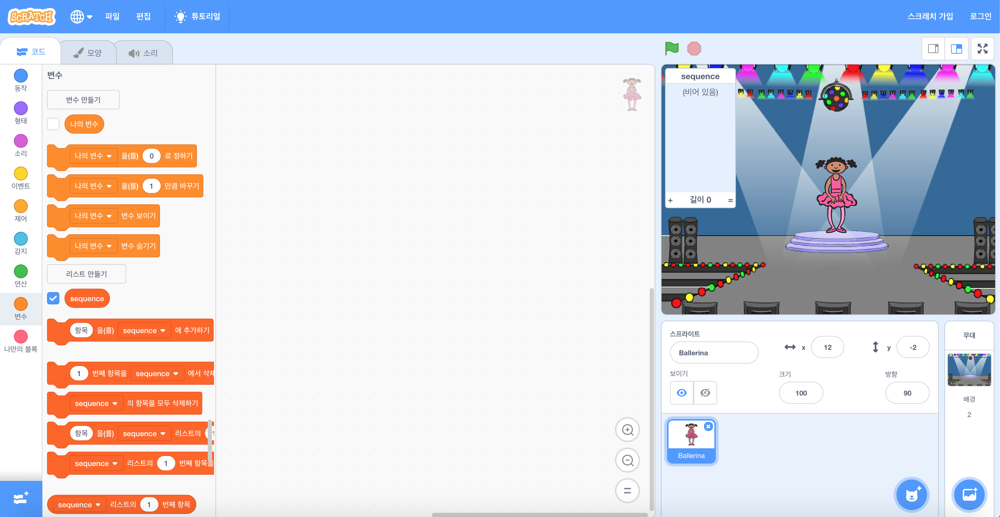

## 색상 순서 만들기

먼저 기억해야되는, 규칙없이 연속해서 나오는 색상 순서를 표시하는 캐릭터를 만듭니다.

+ 새 Scratch 프로젝트를 시작하고 프로젝트가 비어 있도록 cat 스프라이트를 삭제하십시오. 온라인 스크래치 편집기 [여기에서 찾을 수 있습니다](http://jumpto.cc/scratch-new).

+ 캐릭터 스프라이트와 배경을 선택하십시오. 캐릭터는 사람일 필요는 없지만, 다른 색상을 보여줄 수 있어야합니다.


+ 게임에서는 각각의 색상에 대하여 다른 숫자를 사용할 것입니다.
    
    + 1 = 적색
    + 2 = 청색
    + 3 = 녹색
    + 4 = 노란색
    
    위에 언급된 4가지 색상 각각에 대하여 하나씩 캐릭터에 4 가지 색상으로 다른 모양을 지정합니다. 색칠해져 있는 모양이 위 리스트와 같은 순서인지 확인하십시오.
    
    
    
    모양의 부분을 다른 색으로 채우는도구 *색칠하기 *를 사용할 수 있습니다.

랜덤 색상 순서를 만듭니다.

+ `연속리스트`{: class = "blockdata"}라는 리스트를 만듭니다. 이 목록을 사용하여 플레이어가 기억해야하는 색상 순서를 저장합니다. 단지 발레리나 캐릭터 스프라이트만 리스트를 볼 필요가 있으므로 **이 스프라이트에서만 사용**을 선택할 수 있습니다.

[[일반적인 스크래치 리스트 만들기]]]

스테이지의 왼쪽 상단에 빈 리스트가 표시되고 리스트를 사용하기위한 새로운 많은 블록이 표시됩니다.



+ 우리는 각 색깔마다 숫자 하나를 부여했다는 것을 기억 하는가? 난수를 선택하고 리스트에 추가함으로써 랜덤 색상을 선택할 수 있습니다. 이 코드 추가:

```blocks
깃발을 클릭할 때
랜덤 수 (1) ~ (4) 을 골라서 연속 V에 추가하세요.
```

+ 녹색 깃발을 클릭하여 코드를 테스트하십시오. 클릭 할 때마다 1에서 4 까지의 랜덤수가 리스트에 추가되는지 확인하십시오.

+ 한꺼번에 5 개 랜덤 색상을 생성하기 위해이 블록을 프로그램에 추가 할 수 있습니까?

```blocks
반복 (5)

끝
```

+ 리스트가 조금 채워지고 있음을 네가 알아차릴 수도 있습니다. 어떤 수를 생성하기 이전에 시작 할 때에 전체 리스트를 삭제할 블록 하나를 추가합시다.

```blocks
깃발이  클릭 될 때
[연속  V] 의 모든 V  삭제
반복 (5)
    추가 ((1) ~ (4) 랜덤을 골라  [연속 V] 에 추가하십시오.
끝
```

+ 마지막으로, 번호를 선택할 때마다 댄서의 모양을 목록에 추가 된 마지막 항목으로 변경해 봅니다.이 마지막 항목은 바로 전에 선택한 항목입니다. 난수를 리스트에 추가 한 후에 코드에 즉시 이 블록을 추가하십시오.

```blocks
모양을 ([시퀀스 v] 의 (마지막 v) 항목으로 바꾸십시요.
 (1 초) 기다리기
```