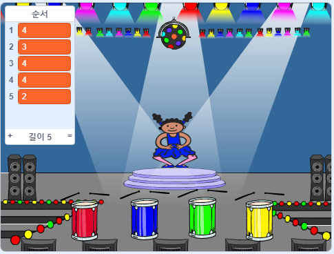

## 시퀀스 반복

이제 플레이어가 색 순서를 반복하기 위해 누르는 버튼 4 개를 추가 할 것입니다.

\--- task \---

Add four new sprites to your project to represent the four buttons.

+ 새로운 스프라이트의 복장을 편집하여 네 가지 색상 각각에 스프라이트가 하나가되게하십시오.
+ 의상과 같은 순서로 스프라이트를 무대에 올려 놓습니다 : 빨간색, 파란색, 녹색, 노란색



\--- /task \---

\--- task \---

Add code to the red sprite so that, when the sprite is clicked, it `broadcasts`{:class="block3events"} a 'red' message to the character sprite:


```blocks3
    이 스프라이트가
    방송을 클릭했을 때 (빨간색 v)
```

\--- /task \---

A `broadcast`{:class="block3events"} is like a message announced over a loudspeaker, which you can for example hear in schools or supermarkets. All of the sprites can hear the `broadcast`{:class="block3events"}, but only the sprite whose job it is to respond will do something.

\--- task \---

Add similar code to the blue, green, and yellow sprites to make them `broadcast`{:class="block3events"} messages about their own colour.

\--- /task \---

Do you remember that the `broadcast`{:class="block3events"} is like a loudspeaker message? You will add code to make it the character sprite's job to respond to the `broadcast`{:class="block3events"} messages.

\--- task \---

When your character sprite receives the message `red`{:class="block3events"}, the code should check whether the number `1` is at the start of the `sequence`{:class="block3variables"} list (which means that `red`{:class="block3events"} is the next colour in the sequence).

If `1` is at the start of the list, the code should remove the number from the list, because the player remembered the correct colour. Otherwise it's game over, and the code needs to `stop all`{:class="block3control"} to end the game.


```blocks3
I는 [적색 V] 나타나면
경우 <(항목 (1 V) [서열 V]의) =[1]> 다음
의 삭제 (1 V) [서열 V]
다른
[위에 게임!] 말 (1) 초
스톱 [모두 v]
끝
```

\--- /task \---

\--- task \---

Add to the code you just wrote so that a drum beat also plays when the character sprite receives the correct `broadcast`{:class="block3events"}.

\--- hints \---

\--- hint \---

Can you use the numbers that correspond to each colour to play the correct drum beat?

+ 1 = 적색
+ 2 = 청색
+ 3 = 녹색
+ 4 = yellow

\--- /hint \---

\--- hint \---

Above the `delete 1 of sequence`{:class="block3variables"} block, add the `play drum`{:class="block3sound"} block to play the first sound in the `sequence`{:class="block3variables"} list.

\--- /hint \---

\--- hint \---

Here is the code you will need to add:

```blocks3
I는 [적색 V] 나타나면
경우 <(항목 (1 V) [서열 V]의) =[1]> 다음,

(0.25)에 대한 + 재생 드럼 (\ (1 \) 스네어 드럼 V)를 친다
(1 V 삭제 ) of [sequence v]
else
게임 오버! (1) 초 동안
stop [all v]
end
```

\--- /hint \---

\--- /hints \---

\--- /task \---

\--- task \---

Duplicate the code you used to make your character sprite respond to the message `red`{:class="block3events"}. Change the duplicated code so that it sends the message `blue`{:class="block3events"}.

\--- /task \---

When the sprite responds to the message `blue`{:class="block3events"}, which bit of code should stay the same, and which bit should change? Remember that each colour has a corresponding number.

\--- task \---

Change the character sprite's code so that the character responds correctly to the `blue`{:class="block3events"} message.

\--- hints \---

\--- hint \---

Keep these blocks, but you need to change them in some way:


```blocks3
(시퀀스 v)의 <(1 v) = [1]>

(0.25) 박자의 경우 [빨간색 v]

재생 드럼 (\ (1 \) 스네어 드럼 v)
```

\--- /hint \---

\--- hint \---

Here is how your code should look for the `blue`{:class="block3events"} broadcast.


```blocks3
I는 [블루 V] 나타나면
경우 <(항목 (1 V) [서열 V]의) =[2]> 다음
    재생 드럼 (\ (2 \)은베이스 드럼 V) (0.25)에 대한 박동
    삭제 (1 V) [시퀀스 v]
else
    [게임 오버!] 동안 (1 초)
    stop [all v]
end
```

\--- /hint \---

\--- /hints \---

\--- /task \---

\--- task \---

Duplicate the code again twice (for the green and yellow buttons), and change the necessary parts so that the character responds correctly to the new `broadcasts`{:class="block3events"}.

\--- /task \---

Remember to test the code! Can you memorise a sequence of five colours? Is the sequence different each time?

When the player repeats the whole colour sequence correctly, the `sequence`{:class="block3variables"} list emtpy and the player wins. If you want, you can also display some flashing lights as a reward once the `sequence`{:class="block3variables"} list is empty.

\--- task \---

Add this code to the end of your character's `when flag clicked`{:class="block3events"} script:


```blocks3
    < (시퀀스 v의 길이) = [0]>
    브로드 캐스트 (v를 획득)와 대기
```

\--- /task \---

\--- task \---

Switch to the Stage, and import the `drum machine` sound or another sound you like.

[[[generic-scratch3-sound-from-library]]]

\--- /task \---

\--- task \---

Add this code to play a sound and make the backdrop change colour when the player wins.


```blocks3
    I받을 때 원 V]
    시작 음 (드럼 머신 V)
    반복 (50)
        변화량 색상 V] (25)에 의한 효과
        대기 (0.1) 초
    단
    분명 그래픽 효과
```

\--- /task \---