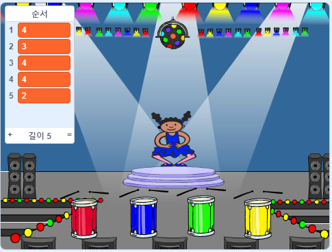

## 순서를 반복

플레이어가 기억하고있는 순서를 되풀이하기 위해 누를 수있는 4 개의 버튼을 추가합시다.

+ 4 개의 버튼을 표시하기 위해서 프로젝트에 새로운 스프라이트 4 개를 추가하세요. 네 가지 색상 각각에 대하여 하나의 스프라이트가 있도록 모양을 수정하십시오. 빨강, 파랑, 녹색, 노란색 모양과 같은 순서로 스프라이트를 배치하십시오.



+ 빨간색 드럼을 클릭하면 캐릭터에게 방송하기를 하여 빨간색 버튼이 클릭되었음을 알게 하도록 합니다. 빨간색 드럼에 다음 코드를 추가하십시오.

```blocks
    이 스프라이트가
    방송하기 [빨간색 v]
```

방송은 확성기를 통해 전달하는 것과 약간 비슷합니다. 여러분은 슈퍼마켓에서 쇼핑 할 때 들었을 것입니다. 모든 스프라이트는 메시지를 들을 수는 있지만 단지 응답해야하는 스프라이트만이 뭔가를 할 것입니다.

+ 자신의 색깔에 대해서 메시지를 방송할 수 있도록 파란색, 녹색, 노란색 드럼에 같은 코드를 추가하십시오.

\--- 귀뜸말 \--- \--- 귀뜸말 \--- 다음은 한 스프라이트에서 다른 스프라이트로 코드를 복사하는 쉬운 방법입니다. 각 스프라이트에서 방송 메시지를 수정하여 스프라이트의 색상과 일치시킵니다.  \--- / 귀뜸말 \--- \--- / 귀뜸말\---

방송이 스피커를 통해 전달되는 것과 같다고 말했던 것을 기억하십니까? 단지 응답해야 하는 스프라이트만이 뭔가를 할 것입니다. 그러므로 메시지에 응답하도록 스프라이트가 해야 할 일을 만들어 보겠습니다. 방송을 받았을 때 캐릭터가 수행 할 코드를 작성하여 이 것을 합니다.

+ 스프라이트가 방송 `빨강`을 받으면 , 코드는 숫자`(1)`이 리스트의 처음에 있는지의 여부를 확인합니다. (이 것은 `빨강`이 순서에서 다음 색이라는 것을 의미합니다. )
    
    그럴 경우, 코드는 색상이 정확하게 추측되었으므로 목록에서 번호를 제거해야합니다. 그렇지 않으면 게임은 끝났다, 우리는 필요 `정지 모두`: 게임을 중지 {클래스 = "blockcontrol"}.

```blocks
    I는 [적색 V] 나타나면
    경우 <(항목 (1 V) [서열 V]의) =[1]> 다음
        의 삭제 (1 V) [서열 V]
    다른
        [위에 게임!] 말 (1) 초
        스톱 [all v]
    끝
```

+ 방금 쓴 코드에 추가하여 올바른 색을 받으면 드럼 비트도 재생합니다.

\--- 힌트 \--- \--- 힌트 \--- 각 색에 해당하는 숫자를 사용하여 정확한 드럼 비트를 연주 할 수 있습니까?

+ 1 = 적색
+ 2 = 청색
+ 3 = 녹색
+ 4 = 황색 \--- / 힌트 \--- \--- 힌트 \--- 이전에 시퀀스 목록에서 첫 번째 사운드를 재생하려면 `플레이 드럼`{: class = "blocksound"} 블록을 추가해야합니다 `시퀀스`1 삭제 {: class = "blockdata"} :

 \--- / hint \--- \--- 힌트 \--- 다음은 추가해야 할 코드입니다.

```blocks
(0.25) 박자 ([시퀀스 v]의 항목 (1 v))
```

\--- / 힌트 \--- \--- / 힌트 \---

+ 문자 스프라이트를 메시지 `응답하게하는 데 사용한 코드를 복제하십시오.`. 이번에는 메시지를 `파란색으로 변경하십시오`.

스프라이트가 메시지 `파란색`응답 할 때 어떤 비트의 코드가 동일하게 유지되어야하고 어떤 비트가 변경되어야합니까? 각 색상에는 해당 번호가 있음을 기억하십시오.

+ 문자가 `파란색` 메시지에 올바르게 응답하도록 코드를 변경하십시오.

\--- 힌트 \--- \--- 힌트 \--- 이 블록을 유지하지만 어떤 방식 으로든 변경해야합니다 :  \--- / 힌트 \--- \--- 힌트 \--- 다음은 코드에서 파란색 방송을 찾는 방법입니다.

```blocks
    I는 [블루 V] 나타나면
    경우 <(항목 (1 V) [서열 V]의) =[2]> 다음,
        (0.25) 심박동 재생 드럼 (항목 (1 V) [서열 V]로)
        삭제 (1 v) of [sequence v]
    else
        [게임 오버!] for (1) 초
        stop [all v]
    end
```

\--- / 힌트 \--- \--- / 힌트 \---

+ 녹색과 노란색 단추에 대해 코드를 두 번 다시 복제하고 문자가 올바르게 응답 할 수 있도록 필요한 부분을 변경하십시오.

+ 추가 한 코드를 테스트하는 것을 잊지 마십시오! 5 가지 색상의 순서를 암기 할 수 있습니까? 시퀀스가 매번 다른가요?

목록이 비어 있으면 보상으로 표시 될 수 있습니다. 이는 전체 시퀀스가 ​​올바르게 기억된다는 의미입니다.

+ 깃발이</code>{{class = "blockevents"} 스크립트를 클릭하면 캐릭터 `의 끝에이 코드를 추가하십시오.</li>
</ul>

<pre><code class="blocks">    < (시퀀스 v의 길이) = [0]>
    브로드 캐스트 [승 v] 및 대기
`</pre> 
    + 무대로 전환 한 다음이 코드를 추가하여 사운드를 재생하고 플레이어가 우승하면 배경색을 변경합니다. 원하는 사운드를 선택할 수 있습니다.
    ```blocks
        I받을 때 원 V]
        소리 재생 [드럼 머신 V]
        반복 (50)
            변화량 색상 V] (25)에 의한 효과
            대기 (0.1) 초
        단
        분명 그래픽 효과
    ```