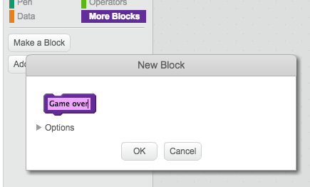

## 높은 점수

높은 점수를 저장하여 친구들과 놀 수있게하십시오.

+ `높은 점수`{: class = "blockdata"} 및 `이름`{: class = "blockdata"}라는 두 개의 새 변수를 프로젝트에 추가하십시오.

플레이어가 시퀀스가 ​​잘못되어 게임이 끝나면 자신의 점수가 현재의 높은 점수보다 높은지 확인해야합니다. 그렇다면 점수를 최고 점수로 저장하고 플레이어의 이름을 저장해야합니다.

+ 높은 점수를 저장하기 위해 캐릭터 스프라이트에 코드를 추가하십시오. 또한 플레이어에게 자신의 이름을 물어보고 `name`{: class = "blockdata"} 변수에 기록하십시오.

[[[generic-scratch-high-score]]]

\--- 힌트 \--- \--- 힌트 \--- 새 코드는이 논리를 따를 필요가있다 : 후 `게임 이상` 메시지 `만약` `점` 인 `보다 큰` `높은 점수` `세트` `고득점` 받는 `의 점수` `요청` , 플레이어 이름 `의 집합` `명` 받는 `않음` \--- / 힌트 \--- \--- 힌트 - - 다음 블록이 필요합니다.


\--- / 힌트 \--- \--- 힌트 \--- 다음은 빨간 버튼을 눌렀을 때의 코드입니다 :

```blocks
    I는 [적색 V] 나타나면
    경우 <(항목 (1 V) [서열 V]의) =[1]> 다음
        의 삭제 (1 V) [서열 V]
    다른
        [위에 게임!] 말 (1) 초
 < (점수) > (높은 점수) >
            (높은 점수 v) ~
            (점수)로 설정 [높은 점수! 당신의 이름은 무엇입니까?] 그리고 기다림
            [이름 v]를 (답)

        종료 [모두 v]
    끝
```

\--- / 힌트 \--- \--- / 힌트 \---

+ 다른 세 가지 색상에 대해서도이 새로운 코드를 문자 스프라이트에 추가해야합니다! 네 가지 색상의 각각에 대한 '게임 오버'코드가 정확히 동일하다는 것을 알고 계셨습니까?


예를 들어 소리를 추가하거나 '게임 오버'메시지를 변경하는 것과 같이이 코드를 변경해야한다면 4 번 변경해야합니다. 그것은 귀찮아지고 많은 시간을 낭비 할 수 있습니다.

대신 자신 만의 블록을 정의하여 프로젝트에서 다시 사용할 수 있습니다. 이렇게하려면 `추가 블록`{{class = "blockmoreblocks"}을 클릭 한 다음 **블록을 만듭니다**. 이 새로운 블록을 '게임 오버'라고 부르세요.



+ 빨간색 버튼에 연결된 `else`{: class = "blockcontrol"} 블록의 코드를 작성한 블록에 추가하십시오.


+ 이제 새로운했습니다 *기능* 이라는 `이상 게임을`어디서든 원하는 사용할 수 있습니다 : {클래스 = "blockmoreblocks"},. 새로운 `Game over`{: class = "blockmoreblocks"} 블록을 버튼에 대한 4 개의 스크립트로 드래그하십시오.


+ 이제 잘못된 버튼을 눌렀을 때 소리를 추가하십시오. 당신은 단지 한 번이 코드를 추가 할 필요가 `이상 게임`{: 클래스 = "blockmoreblocks"} 블록 당신이 만든, 그리고 네 개의 개별 번!

