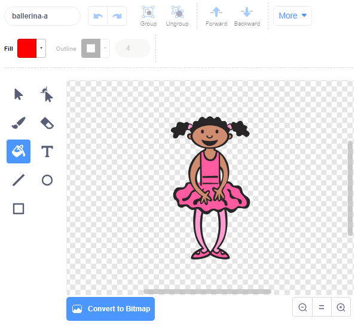

## रंग क्रम (sequence) तयार करा

प्रथम एक पात्र तयार करा जो रंगांचा यादृच्छिक (random) क्रम प्रदर्शित करू शकेल.

--- task ---

नवीन Scratch प्रकल्प तयार करा.

**ऑनलाइन**: [rpf.io/scratch-new](https://rpf.io/scratch-new){:target="_blank"} वर एक नवीन स्क्रॅच प्रकल्प उघडा.

**ऑफलाइनः** ऑफलाइन संपादकात नवीन प्रकल्प उघडा.

आपल्याला Scratch ऑफलाइन संपादक डाउनलोड आणि स्थापित करणे आवश्यक असल्यास, आपण ते [rpf.io/scratchoff](https://rpf.io/scratchoff){:target="_blank"} येथे शोधू शकता.

--- /task ---

--- task ---

पात्र sprite आणि बॅकड्रॉप निवडा. आपण बॅलेरीना वापरू शकता, परंतु आपल्या पात्राला एक व्यक्ती असणे आवश्यक नाही, त्यांना फक्त भिन्न रंग दर्शविण्यास सक्षम असणे आवश्यक आहे.


--- /task ---

+ प्रत्येक रंगाचे प्रतिनिधित्व करण्यासाठी आपल्या खेळामध्ये भिन्न संख्या वापरावी:
    
    + 1 = red
    + 2 = blue
    + 3 = green
    + 4 = yellow

--- task ---

आपल्या पात्राला चार रंगांचे पोशाख द्या ज्यांचे भिन्न रंग आहेत, वर दर्शविलेल्या प्रत्येक चार रंगांसाठी एक पोशाख. आपली रंगीबेरंगी वेशभूषा वरील सूची प्रमाणेच क्रमाने असल्याचे सुनिश्चित करा.


--- /task ---

आपण इच्छित असल्यास आपण **color a shape** साधन वापरू शकता पोशाखातील भाग वेगळ्या रंगाने भरण्या साठी.



पुढे, खेळाडूला लक्षात ठेवावे लागेल अशा रंगांच्या यादृच्छिक क्रमवारीसाठी सूची (list) जोडा.

--- task ---

`sequence`{:class="block3variables"} नावाची एक सूची (list) तैयार करा. केवळ पात्राच्या sprite ला ही सूची पहाण्याची आवश्यकता आहे, म्हणून आपण हि निवड करु **For this sprite only** जेव्हा आपण हि सूची बनवाल.

[[[generic-scratch3-make-list]]]

--- /task ---

याद्या(list) वापरण्यासाठी आपल्याला आता बरेच नवीन कोड ब्लॉक दिसले पाहिजेत. रिकाम्या सूची स्टेजच्या वरच्या डाव्या कोपर्यात दृश्यमान असावी.


प्रत्येक रंगाची भिन्न संख्या असते, म्हणून आपण यादृच्छिक (random) पणे संख्या निवडून त्यास सूचीमध्ये जोडून यादृच्छिक रंग निवडू शकता.

--- task ---

यादृच्छिक क्रमांक निवडण्यासाठी हा कोड पात्राच्या sprite मध्ये जोडा `sequence`{:class="block3variables"}:


```blocks3
when flag clicked
add (pick random (1) to (4)) to [sequence v]
```

--- /task ---

--- task ---

आपल्या कोडची चाचणी घ्या. तपासा की प्रत्येक वेळी तुम्ही ध्वज क्लिक करता तेव्हा 1 ते 4 मधील यादृच्छिक क्रमांक यादीमध्ये जोडली जाते.

--- /task ---

--- task ---

आपण एकाच वेळी पाच यादृच्छिक संख्या निर्माण करण्यासाठी आपल्या प्रोग्राममध्ये कोड जोडू शकता?

--- hints ---


--- hint ---

जोडा एक `delete all of sequence`{:class="block3variables"} प्रथम सूचीतील सर्व आयटम हटविण्यासाठी, आणि नंतर एक `repeat`{:class="block3control"} ब्लॉक जो सूची मध्ये पाच यादृच्छिक संख्या जोडतो.

--- /hint ---

--- hint ---

तुमचा कोड असा दिसला पाहिजे:


```blocks3
when flag clicked
delete (all v) of [sequence v]
repeat (5)
    add (pick random (1) to (4)) to [sequence v]
end
```

--- /hint ---

--- /hints ---

--- /task ---

--- task ---

प्रत्येक वेळी सूची मध्ये संख्या जोडली गेल्यानंतर त्या पत्राने आपली पोशाख बदलली पाहिजे जेणेकरून पोशाखाचा रंग अंकांशी जुळेल. हे ब्लॉक्स ताबडतोब खाली आपल्या कोडमध्ये ठेवा जेथे `sequence`{:class="block3variables"}अनुक्रमात यादृच्छिक क्रमांक जोडला जाईल:


```blocks3
switch costume to (item (length of [sequence v]) of [sequence v])
wait (1) seconds
```

--- /task ---