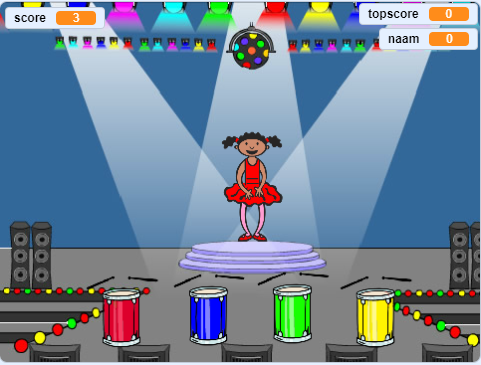

--- no-print ---

Dit is de **Scratch 3** versie van het project. Er is ook een [Scratch 2 versie van het project](https://projects.raspberrypi.org/nl-NL/projects/memory-scratch2).

--- /no-print ---

## Inleiding

In dit project ga je een geheugenspel maken waarin je een willekeurige reeks kleuren moet onthouden en herhalen!

### Wat ga je maken

--- no-print --- Klik op de groene vlag om te starten. Kijk naar de reeks kleuren van de jurk van de danseres en luister naar de bijbehorende slagen op de trommels, en herhaal ze daarna. Als je de verkeerde volgorde van de kleuren kiest, is het spel voorbij!

  <iframe allowtransparency="true" width="485" height="402" src="//scratch.mit.edu/projects/embed/284452634/?autostart=false" frameborder="0" allowfullscreen scrolling="no" mark="crwd-mark"></iframe> 

--- /no-print ---

--- print-only ---  --- /print-only ---

--- collapse ---
---
title: Wat ga je leren
---

+ Hoe voeg je een geluid toe aan je Scratch-project
+ Hoe maak je lijsten en gebruik je ze om gegevens op te slaan
+ Hoe aangepaste blokken te maken en te gebruiken voor het herhalen van code

--- /collapse ---

--- collapse ---
---
title: Wat heb je nodig
---

### Hardware

+ Een computer die Scratch 3 kan uitvoeren

### Software

Scratch 3 ([online](https://rpf.io/scratchon){:target="_blank"} of [offline](https://rpf.io/scratchoff){:target="_ blank}) 

--- /collapse ---

--- collapse ---
---
title: Aanvullende informatie voor docenten
---

--- no-print ---

Als je dit project wilt afdrukken, gebruik dan de [printvriendelijke versie](https://projects.raspberrypi.org/nl-NL/projects/memory/print){:target="_ blank"}.

--- /no-print ---

Je kunt [het voltooide project hier downloaden](http://rpf.io/p/nl-NL/memory-get).

--- /collapse ---