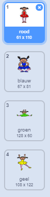
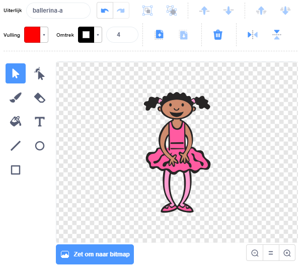
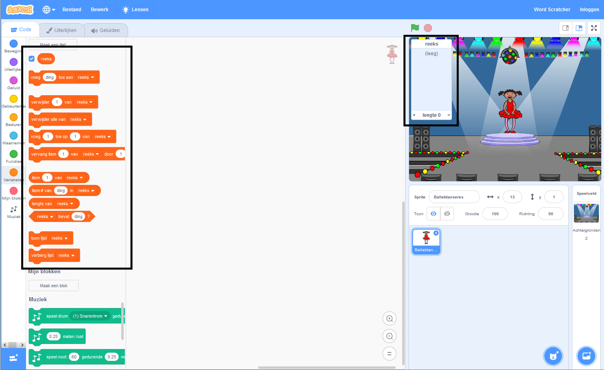

## Maak een kleurenreeks

Maak eerst een personage dat een willekeurige reeks kleuren kan weergeven.

--- task --- 

Open een nieuw Scratch project.

**Online**: open een nieuw online Scratch project op [rpf.io/scratch-new](https://rpf.io/scratchon).

**Offline:** open een nieuw project in de offline editor.

Als je de Scratch offline editor wilt downloaden en installeren dan kan je die vinden op [rpf.io/scratchoff](https://rpf.io/scratchoff).

--- /task ---

--- task --- Kies een personage-sprite en een achtergrond. Je zou de ballerina kunnen gebruiken, maar je personage hoeft geen persoon te zijn, ze moeten alleen in staat zijn om verschillende kleuren te laten zien.

 --- /task ---

+ Je game moet verschillende getallen gebruiken om elke kleur weer te geven:
    
    + 1 = rood
    + 2 = blauw
    + 3 = groen
    + 4 = geel

--- task --- Geef je personage vier kostuums met verschillende kleuren, een kostuum voor elk van de vier kleuren hierboven. Zorg ervoor dat je gekleurde kostuums in dezelfde volgorde staan als de bovenstaande lijst.

 --- /task ---

Als je wilt, kun je het **vulling** gereedschap gebruiken om delen van het kostuum met een andere kleur te vullen.



Voeg vervolgens een lijst toe voor het opslaan van de willekeurige reeks kleuren die de speler moet onthouden.

--- task --- Maak een lijst met de naam `reeks`{:class="block3variables"}. Alleen de sprite van de personage gebruikt deze lijst, dus kun je **Alleen voor deze sprite** selecteren.

[[[generic-scratch3-make-list]]]

--- /task ---

Je zou nu veel nieuwe codeblokken moeten zien voor het gebruik van lijsten. De lege lijst moet zichtbaar zijn in de linkerbovenhoek van het werkgebied.



Elke kleur heeft een ander nummer, dus je kunt een willekeurige kleur kiezen door willekeurig een getal te kiezen en het toe te voegen aan de lijst.

--- task --- Voeg deze code toe aan de personage-sprite om een willekeurig getal te kiezen en toe te voegen aan de `reeks`{:class="block3variables"}:


```blocks3
wanneer groene vlag wordt aangeklikt
voeg (willekeurig getal tussen (1) en (4)) toe aan [reeks v]
```

--- /task ---

--- task --- Test je code. Controleer of elke keer dat je op de vlag klikt, een willekeurig getal tussen 1 en 4 aan de lijst wordt toegevoegd. --- /task ---

--- task --- Kun je code aan je programma toevoegen om in één keer vijf willekeurige getallen te genereren?

--- hints ---
 --- hint --- Voeg een `verwijder alle van reeks`{:class="block3variables"} toe om eerst alle items uit de lijst te verwijderen en vervolgens een `herhaal`{:class="block3control"} blok dat vijf willekeurige nummers toevoegt aan de lijst.
--- /hint ---
 --- hint ---

Dit is hoe je code eruit zou moeten zien:


```blocks3
wanneer groene vlag wordt aangeklikt
verwijder (alle v) van [reeks v]
herhaal (5) 
  voeg (willekeurig getal tussen (1) en (4)) toe aan [reeks v]
end
```

--- /hint ---
--- /hints --- 
--- /task ---

--- task --- Elke keer dat een getal wordt toegevoegd aan de lijst, moet het karakter zijn kostuum wijzigen zodat de kleur van het kostuum overeenkomt met het nummer. Plaats deze blokken in je code direct onder waar een willekeurig nummer aan `reeks` wordt toegevoegd{:class="block3variables"}:


```blocks3
verander uiterlijk naar (item (lengte van [reeks v]) van [reeks v])
wacht (1) sec.
```

--- /task ---