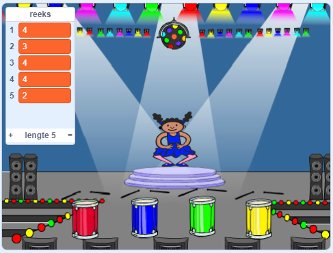

## Herhaal de reeks

Nu ga je vier knoppen toevoegen die de speler moet indrukken om de volgorde van de kleuren te herhalen.

\--- task \---

Voeg vier nieuwe sprites toe aan je project voor de vier knoppen.

+ Bewerk de uiterlijken van de nieuwe sprites zodat er één sprite in elk van de vier kleuren is
+ Zet de sprites in dezelfde volgorde op het podium als de uiterlijken: rood, blauw, groen, geel



\--- /task \---

\--- task \---

Voeg code toe aan de rode sprite zodat, wanneer de sprite geklikt wordt, het een 'rood' bericht `uitzendt`:class="block3events"} naar de personage-sprite:


```blocks3
    wanneer op deze sprite wordt geklikt
    zend signaal (rood v)
```

\--- /task \---

Een `uitzending`{:class="block3events"} is als een bericht dat wordt aangekondigd over een luidspreker, die je bijvoorbeeld kunt horen in scholen of supermarkten. Alle sprites kunnen de `uitzending`{:class="block3events"} horen, maar alleen de sprite wiens taak het is om te reageren zal iets doen.

\--- task \---

Voeg vergelijkbare code toe aan de blauwe, groene en gele sprites om ze berichten over hun eigen kleur te laten `uitzenden`{:class="block3events"}.

\--- /task \---

Weet je nog dat de `uitzending`{:class="block3events"} is als een luidsprekerbericht? Je zult code toevoegen om het de taak van de personage-sprite te maken om te reageren op de `uitzending`{:class="block3events"} van berichten.

\--- task \---

Als de personage-sprite een signaal `rood`{:class="block3events"} krijgt moet het programma controleren of het getal `1` aan het begin van de `reeks`{:class="block3variables"} lijst staat (wat betekent dat `rood`{:class="block3events"} de volgende kleur in de reeks is).

Als `1` aan het begin van de lijst staat, moet de code het nummer uit de lijst verwijderen, omdat de speler de juiste kleur heeft onthouden. Anders is het game over en moet de code `stop alle`{:class="block3control"} het spel te beëindigen.


```blocks3
wanneer ik signaal [rood v] ontvang
als <(item(1 v) van [reeks v]) = [1]> dan 
 verwijder (1 v) van [reeks v]
anders
 zeg [Game over!] (1) sec.
 stop [alle v]
einde
```

\--- /task \---

\--- task \---

Voeg toe aan de code die je zojuist hebt geschreven, dat er een drum beat speelt wanneer de personage-sprite de juiste `uitzending`{:class="block3events"} ontvangt.

\--- hints \---

\--- hint \---

Kun je de getallen gebruiken die overeenkomen met elke kleur om de juiste trommelgeluiden af te spelen?

+ 1 = rood
+ 2 = blauw
+ 3 = groen
+ 4 = geel

\--- /hint \---

\--- hint \---

Boven het `verwijder 1 van reeks`{:class="block3variables"} blok, voeg het `speel drum`{:class="block3sound"} blok toe om het eerste geluid in de `reeks`{:class="block3variables"} lijst af te spelen.

\--- /hint \---

\--- hint \---

Hier is de code die je moet toevoegen:

```blocks3
wanneer ik signaal [rood v] ontvang
als <(item (1 v) van [reeks v]) = [1]> dan

speel drum (\(1\) Snarentrom v) gedurende (0.25) maten
  verwijder (1 v) van [reeks v]
anders
  zeg [Game over!] (1) sec.
  stop [alle v]
einde
```

\--- /hint \---

\--- /hints \---

\--- /task \---

\--- task \---

Dupliceer de code die je hebt gebruikt om je personage-sprite op het bericht `rood`{:class="block3events"} te laten reageren. Wijzig de gedupliceerde code zodat deze het bericht `blauw`{:class="block3events"} verzendt.

\--- /task \---

Wanneer de sprite reageert op het bericht `blauw`{:class="block3events"}, welk deel van de code moet hetzelfde blijven en welk deel moet veranderen? Vergeet niet dat elke kleur een bijbehorend nummer heeft.

\--- task \---

Wijzig de code van de personage-sprite zodat het personage correct reageert op het `blauw`{:class="block3events"} bericht.

\--- hints \---

\--- hint \---

Bewaar deze blokken, maar je moet ze op de een of andere manier veranderen:


```blocks3
<(item (1 v) van [reeks v]) = [1]>

wanneer ik signaal [rood v] ontvang

speel drum (\(1\) Snarentrom v) gedurende (0.25) maten
```

\--- /hint \---

\--- hint \---

Hier is hoe je code er uit moet zien voor het signaal `blauw`{:class="block3events"}.


```blocks3
wanneer ik signaal [blauw v] ontvang
als <(item (1 v) van [reeks v]) = [2]> dan 
  speel drum (item (1 v) van [reeks v]) gedurende (0.25) maten
  verwijder (1 v) van [reeks v]
anders
  zeg [Game over!] (1) sec.
  stop [alle v]
end
```

\--- /hint \---

\--- /hints \---

\--- /task \---

\--- task \---

Dupliceer de code nogmaals twee keer (voor de groene en gele knoppen) en verander de benodigde delen zodat het personage correct reageert op de nieuwe `uitzendingen`{:class="block3events"}.

\--- /task \---

Vergeet niet om de code te testen! Kun je een reeks van vijf kleuren uit het hoofd leren? Is de volgorde elke keer anders?

Wanneer de speler de hele kleursequentie correct herhaalt, is de `reeks`{:class="block3variables"} lijst leeg en de speler wint. Als je wilt, kun je ook enkele knipperende lampjes als beloning weergeven nadat de `reeks`{:class="block3variables"} lijst leeg is.

\--- task \---

Voeg deze code toe aan het eind van het blok van het personage met ` wanneer groene vlag wordt aangeklikt`{:class="block3events"}:


```blocks3
    wacht tot < (lengte van [reeks v]) = [0]>
    zend signaal (gewonnen v) en wacht
```

\--- /task \---

\--- task \---

Schakel naar het Speelveld en importeer het `drum machine` geluid of een ander geluid dat je wilt.

[[[generic-scratch3-sound-from-library]]]

\--- /task \---

\--- task \---

Voeg deze code toe om een geluid te spelen en de achtergrond van kleur te laten veranderen als de speler wint.


```blocks3
    wanneer ik signaal [gewonnen v] ontvang
start geluid [Drum machine v]
herhaal (50) keer 
  verander [kleur v] effect met (25)
  wacht (0.1) sec.
einde
zet alle effecten uit
```

\--- /task \---