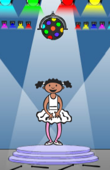

## Uitdaging: verbeter je spel

### Maak meer blokken

Zie je nog meer code die voor alle knoppen hetzelfde is?

```blocks3
when I receive [rood v]
if <((1 v) of [reeks v]) = [1]> then 
  play drum ((1) Snarentrom v) for (0.25) beats
  delete (1 v) of [reeks v]
else 
  Game Over :: custom
end

when I receive [blauw v]
if <((1 v) of [reeks v]) = [1]> then 
  play drum ((2) Basdrum v) for (0,25) beats
  delete (1 v) of [reeks v]
else 
  Game over :: custom
end
```

Kun je een ander aangepast blok maken dat alle knoppen kunnen gebruiken?

### Nog een kostuum

Zie je dat je spel begint met je personage met een van de vier kleuren en dat het personage altijd de laatste kleur in de reeks weergeeft terwijl de speler de volgorde van de kleuren herhaalt?

Kun je nog een gewoon wit kostuum aan je personage toevoegen en code toevoegen zodat het personage dit kostuum aan het begin van het spel laat zien en terwijl de speler de reeks herhaalt?



### Moeilijkheidsgraad

Kun je je speler laten kiezen tussen 'eenvoudige modus' (alleen de rode en blauwe trommels gebruiken) en 'normale modus' (die alle vier de trommels gebruikt)?

Je zou zelfs een 'moeilijke' modus kunnen toevoegen, die gebruik maakt van een vijfde trommel!