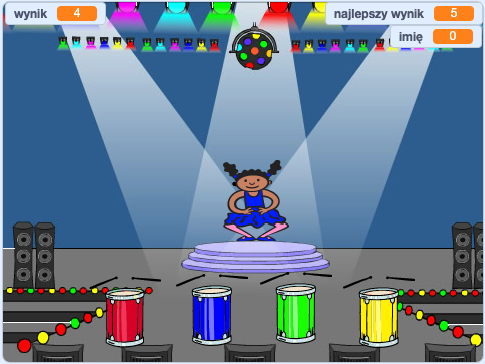

\--- no-print \---

Ta wersja projektu jest przeznaczona dla języka **Scratch 3**. Projekt dostępny jest również [w wersji dla języka Scratch 2](https://projects.raspberrypi.org/en/projects/memory-scratch2).

\--- /no-print \---

## Wprowadzenie

W tym projekcie stworzysz grę pamięciową, w której będziesz musiał zapamiętać i powtórzyć losową sekwencję kolorów!

### Co będziesz robił

\--- no-print \--- Kliknij zieloną flagę, aby rozpocząć. Obserwuj sekwencję kolorów zaprezentowaną przez sukienkę tancerki i wysłuchaj towarzyszących rytmów bębna. Następnie powtórz zaprezentowane kolory. Jeśli źle podasz kolejność kolorów, gra się kończy!

  <iframe allowtransparency="true" width="485" height="402" src="//scratch.mit.edu/projects/embed/284452634/?autostart=false" frameborder="0" allowfullscreen scrolling="no" mark="crwd-mark"></iframe> 

\--- /no-print \---

\--- print-only \---  \--- /print-only \---

## \--- collapse \---

## title: Czego się nauczysz

+ Jak dodać dźwięk do projektu Scratch
+ Jak tworzyć listy i używać ich do przechowywania danych
+ Jak tworzyć spersonalizowane bloki i używać ich do powtarzania kodu

\--- /collapse \---

## \--- collapse \---

## title: Czego będziesz potrzebować

### Sprzęt

+ Komputer, na którym można uruchomić Scratch 3

### Oprogramowanie

Scratch 3 (either [online](https://rpf.io/scratchon){:target="_blank"} or [offline](https://rpf.io/scratchoff){:target="_blank"}) \--- /collapse \---

## \--- collapse \---

## title: Dodatkowe informacje dla nauczycieli

\--- no-print \---

Jeśli chcesz wydrukować ten projekt, użyj [wersji do druku](https://projects.raspberrypi.org/en/projects/memory/print){:target="_blank"}.

\--- /no-print \---

Tutaj znajdziesz [ukończoną wersję projektu](http://rpf.io/p/en/memory-get).

\--- /collapse \---