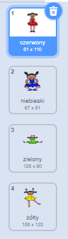
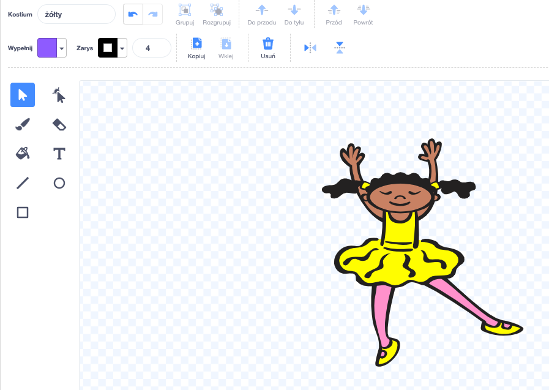
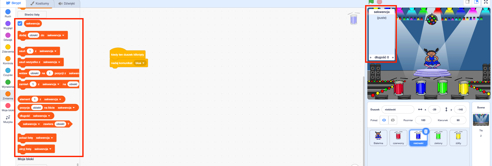

## Utwórz sekwencję kolorów

Najpierw utwórz postać, która może wyświetlać losową sekwencję kolorów.

\--- task \--- Otwórz nowy projekt Scratcha.

**Online**: open a new online Scratch project at [rpf.io/scratch-new](https://rpf.io/scratch-new){:target="_blank"}.

**Offline**: otwórz nowy projekt w edytorze offline.

If you need to download and install the Scratch offline editor, you can find it at [rpf.io/scratchoff](https://rpf.io/scratchoff){:target="_blank"}.

\--- /zadanie \---

\--- zadanie \--- Wybierz postać oraz tło. Możesz użyć postać baleriny, ale nie musi być to osoba. Powinna tylko móc pokazywać różne kolory.

 \--- /zadanie \---

+ W Twojej grze każdy kolor powinien być reprezentowany przez liczbę:
    
    + 1 = czerwony
    + 2 = niebieski
    + 3 = zielony
    + 4 = żółty

Daj swojej postaci cztery stroje, które mają różne kolory, jeden strój dla każdego z czterech kolorów pokazanych powyżej. Upewnij się, że kolory Twoich strojów są ułożone w tej samej kolejności zgodnie z powyższą listą.

 \--- /zadanie\---

Jeśli chcesz, możesz użyć narzędzia do **wypełniania kształtu**, aby wypełnić części kostiumu innym kolorem.



Następnie dodaj listę do przechowywania losowej sekwencji kolorów, które gracz musi zapamiętać.

\--- zadanie \--- Utwórz listę o nazwie `sekwencja`{:class="block3variables"}. Tylko duszek postaci powinien widzieć tę listę, więc możesz wybrać **Tylko dla tego duszka** podczas tworzenia listy.

[[[generic-scratch3-make-list]]]

\--- /zadanie \---

Powinieneś teraz zobaczyć wiele nowych bloków kodu do korzystania z list. Pusta lista powinna być widoczna w lewym górnym rogu planszy.



Każdy kolor ma przypisaną inną liczbę, więc losowy kolor możesz wybrać poprzez losowe wybranie liczby i dodanie jej do listy.

\--- zadanie \--- Dodaj ten kod do duszka postaci, aby wybrać losową liczbę i dodać ją do `sekwencji`{:class="block3zmienne"}:


```blocks3
kiedy kliknięto flagę
dodaj (losuj liczbę od (1) do (4)) do [sekwencja v]
```

\--- /zadanie \---

\--- zadanie \--- Przetestuj swój kod. Sprawdź, czy za każdym razem, gdy klikniesz flagę, do listy zostanie dodana losowa liczba od 1 do 4. \--- /zadanie \---

\--- zadanie \--- Czy do swojego programu możesz dodać kod, który jednocześnie wygeneruje pięć losowych liczb?

\--- hints \--- \--- hint \--- Dodaj `usuń wszystkie z sekwencji` {:class="block3variables"}, aby najpierw usunąć wszystkie elementy z listy, a następnie dodaj blok `powtórz`{:class="block3control"}, który dodaje pięć losowych liczb do listy. -- /hint \--- \--- hint \---

Tak powinien wyglądać Twój kod:


```blocks3
kiedy kliknięto flagę
usuń (wszystkie v) z [sekwencja v]
powtarzaj (5)
    dodaj (losuj liczbę od (1) do (4)) do [sekwencja v]
koniec
```

\--- /wskazówka \--- \--- /wskazówki\--- \--- /zadanie\---

\--- task \--- Za każdym razem, gdy liczba zostanie dodana do listy, postać powinna zmienić swój kostium tak, aby jego kolor pasował do liczby. Umieść te bloki w swoim programie bezpośrednio poniżej kodu, gdzie losowa liczba jest dodawana do `sekwencja`{:class="block3variables"}:


```blocks3
zmień kostium na (element (długość [sekwencja v]) z [sekwencja v]) 
czekaj (1) sekund
```

\--- /zadanie \---