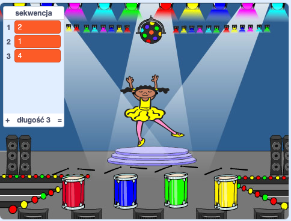

## Powtórz sekwencję

Teraz dodasz cztery przyciski, które gracz musi nacisnąć, aby powtórzyć sekwencję kolorów.

\--- task \--- Dodaj cztery nowe duszki do swojego projektu, aby reprezentowały cztery przyciski.

+ Edytuj kostiumy nowych duszków tak, aby był duszek był w każdym z czterech kolorów
+ Na scenie umieść duszki na w tej samej kolejności, co kostiumy: czerwony, niebieski, zielony, żółty

 \--- /task \---

\--- task \--- Dodaj kod do czerwonego duszka, tak aby po kliknięciu duszka `nadawał`{:class="block3events"} komunikat „czerwony” do duszka postaci:


```blocks3
    kiedy duszek kliknięty
    nadaj komunikat (czerwony v)
```

\--- /task \---

`Nadanie komunikatu`{:class="block3events"} przypomina wiadomość ogłaszaną przez głośnik, którą można usłyszeć na przykład w szkołach lub supermarketach. Wszystkie duszki słyszą `nadawany komunikat`{:class="block3events"}, ale tylko duszek, którego zadaniem jest odpowiadać, zrobi coś.

\--- task \---

Dodaj podobny kod do niebieskiego, zielonego i żółtego duszka, aby wszystkie `nadawały`{:class="block3events"} wiadomości o własnym kolorze.

\--- /task \---

Pamiętasz, że `nadawanie komunikatu`{:class="block3events"} jest jak wiadomość głośnika? Dodasz kod, aby zadaniem duszka było odpowiadanie na wiadomości z `nadawanych komunikatów`{:class="block3events"}.

\--- task \---

Gdy duszek twojej postaci otrzyma komunikat `czerwony`{:class="block3events"}, kod powinien sprawdzić, czy liczba `1` znajduje się na początku listy `sekwencji`{:class="block3variables"} (co oznacza, że `czerwony`{:class="block3events"} to kolejny kolor w sekwencji).

If `1` is at the start of the list, the code should remove the number from the list, because the player remembered the correct colour. Otherwise it's game over, and the code needs to `stop all`{:class="block3control"} to end the game.


```blocks3
when I receive [red v]
if <(item (1 v) of [sequence v])=[1]> then
delete (1 v) of [sequence v]
else
say [Game over!] for (1) seconds
stop [all v]
end
```

\--- /task \---

\--- task \--- Add to the code you just wrote so that a drum beat also plays when the character sprite receives the correct `broadcast`{:class="block3events"}.

\--- hints \--- \--- hint \--- Can you use the numbers that correspond to each colour to play the correct drum beat?

+ 1 = czerwony
+ 2 = niebieski
+ 3 = zielony
+ 4 = yellow \--- /hint \--- \--- hint \--- Above the `delete 1 of sequence`{:class="block3variables"} block, add the `play drum`{:class="block3sound"} block to play the first sound in the `sequence`{:class="block3variables"} list.

\--- /hint \--- \--- hint \--- Here is the code you will need to add:

```blocks3
when I receive [red v]
if <(item (1 v) of [sequence v])=[1]> then

+ play drum (\(1\) Snare Drum v) for (0.25) beats
delete (1 v) of [sequence v]
else
say [Game over!] for (1) seconds
stop [all v]
end

```

\--- /hint \--- \--- /hints \--- \--- /task \---

\--- task \--- Duplicate the code you used to make your character sprite respond to the message `red`{:class="block3events"}. Change the duplicated code so that it sends the message `blue`{:class="block3events"}. \--- /task \---

When the sprite responds to the message `blue`{:class="block3events"}, which bit of code should stay the same, and which bit should change? Pamiętaj, że każdy kolor ma odpowiedni numer.

\--- task \--- Change the character sprite's code so that the character responds correctly to the `blue`{:class="block3events"} message.

\--- hints \--- \--- hint \---

Zachowaj te bloki, ale musisz je zmienić w jakiś sposób:


```blocks3
<(item (1 v) of [sequence v]) = [1]>

when I receive [red v]

play drum (\(1\) Snare Drum v) for (0.25) beats
```

\--- /hint \--- \--- hint \--- Here is how your code should look for the `blue`{:class="block3events"} broadcast.


```blocks3
when I receive [blue v]
if <(item (1 v) of [sequence v])=[2]> then
    play drum (\(2\) Bass Drum v) for (0.25) beats
    delete (1 v) of [sequence v]
else
    say [Game over!] for (1) seconds
    stop [all v]
end
```

\--- /hint \--- \--- /hints \--- \--- /task \---

\--- task \--- Duplicate the code again twice (for the green and yellow buttons), and change the necessary parts so that the character responds correctly to the new `broadcasts`{:class="block3events"} . \--- /task \---

Pamiętaj, aby przetestować kod! Czy możesz zapamiętać sekwencję pięciu kolorów? Czy kolejność jest inna za każdym razem?

When the player repeats the whole colour sequence correctly, the `sequence`{:class="block3variables"} list emtpy and the player wins. If you want, you can also display some flashing lights as a reward once the `sequence`{:class="block3variables"} list is empty.

\--- task \--- Add this code to the end of your character's `when flag clicked`{:class="block3events"} script:


```blocks3
    wait until < (length of [sequence v]) = [0]>
    broadcast (won v) and wait
```

\--- /task \---

\--- task \--- Switch to the Stage, and import the `drum machine` sound or another sound you like.

[[[generic-scratch3-sound-from-library]]]

\--- /task \---

\--- task \--- Add this code to play a sound and make the backdrop change colour when the player wins.


```blocks3
    when I receive [won v]
    start sound (drum machine v)
    repeat (50)
        change [color v] effect by (25)
        wait (0.1) seconds
    end
    clear graphic effects
```

\--- /task \---