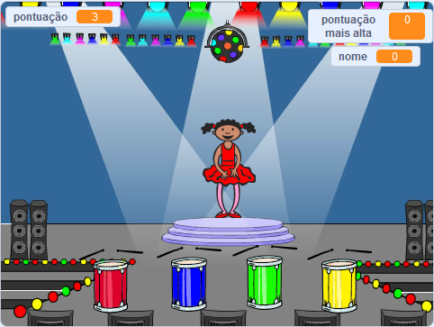

\--- no-print \---

Esta é a versão **Scratch 3** do projeto. Há também uma versão [Scratch 2 do projeto](https://projects.raspberrypi.org/en/projects/memory-scratch2).

\--- /no-print \---

## Introdução

Neste projeto, você criará um jogo de memória no qual você terá que memorizar e repetir uma sequência aleatória de cores!

### O que você vai fazer

\--- no-print \---

Clique na bandeira verde para começar. Observe a sequência de cores mostradas pelo vestido da bailarina e ouça as batidas de tambor que as acompanham e repita-as de volta para ela. Se você errar a ordem das cores, o jogo acaba!

  <iframe allowtransparency="true" width="485" height="402" src="//scratch.mit.edu/projects/embed/284452634/?autostart=false" frameborder="0" allowfullscreen scrolling="no" mark="crwd-mark"></iframe> 

\--- /no-print \---

\--- print-only \---

\--- /print-only \---

## \--- collapse \---

## title: O que você vai aprender

+ Como adicionar som ao seu projeto Scratch
+ Como criar e utilizar listas para armazenar dados
+ Como criar e usar blocos personalizados para repetir código

\--- /collapse \---

## \--- collapse \---

## title: O que você vai precisar

### Hardware

+ Um computador capaz de executar o Scratch 3

### Software

Scratch 3 ([online](https://rpf.io/scratchon){:target="_blank"} ou [offline](https://rpf.io/scratchoff){:target="_blank"})

\--- /collapse \---

## \--- collapse \---

## informações adicionais para educadores

\--- no-print \---

Se você precisar imprimir este projeto, por favor, use a [versão para impressão](https://projects.raspberrypi.org/en/projects/memory/print){:target="_blank"}.

\--- /no-print \---

You can find the [completed project here](https://rpf.io/p/en/memory-get).

\--- /collapse \---