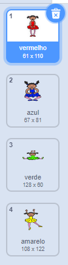
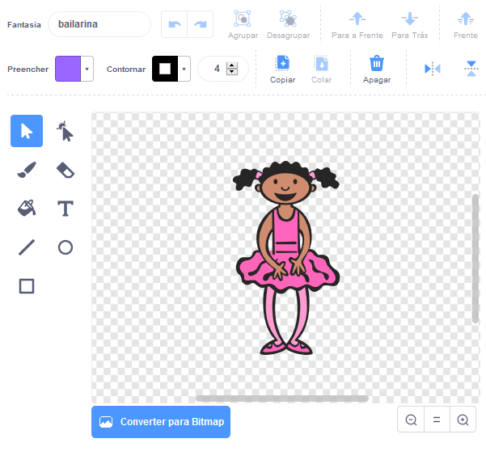
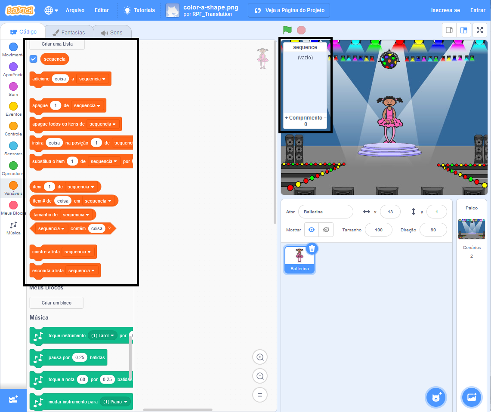

## Crie uma sequência de cores

Primeiro, crie uma entidade que possa exibir uma sequência aleatória de cores.

\--- task \---

Abra um projeto novo Scratch.

**Online**: abra um novo projeto online de Scratch em [rpf.io/scratch-new](https://rpf.io/scratch-new){:target="_blank"}.

**Offline**: abra um novo projeto no editor offline.

Se você precisa baixar e instalar o editor offline do Scratch, você pode encontra-lo em [rpf.io/scratchoff](https://rpf.io/scratchoff){:target="_blank"}.

\--- /task \---

\--- task \---

Escolhe um ator e um cenário. Você pode utilizar a bailarina, mas a entidade não tem que ser uma pessoa, só precisa ser capaz de mostrar cores diferentes.


\--- /task \---

+ Seu jogo deve usar um número diferente para representar cada cor:
    
    + 1 = vermelho
    + 2 = azul
    + 3 = verde
    + 4 = amarelo

\--- task \---

Dê ao seu personagem quatro fantasias de cores diferentes, um para cada uma das quatro cores acima. Certifique-se de que a cor dos trajes estão na mesma ordem que a da lista acima.



\--- /task \---

Se você quiser, você pode usar a ferramenta **preencher** para colorir partes da fantasia com uma cor diferente.



Em seguida, adicione uma lista para armazenar a sequência aleatória de cores que o jogador tem que lembrar.

\--- task \---

Crie uma lista chamada `sequência`{:class="block3variables"}. Apenas o ator precisa ver a lista, então você pode selecionar **Para este ator apenas** quando você criar a lista.

[[[generic-scratch3-make-list]]]

\--- /task \---

Agora você já deve ver muitos blocos novos de código para utilizar com listas. A lista vazia deve estar visível no canto superior esquerdo do Palco.



Cada cor tem um número diferente, você pode escolher uma cor aleatória escolhendo aleatoriamente um número e adicionando-a à lista.

\--- task \---

Adiciona este código ao ator para escolher um número aleatório e adicioná-lo a `sequência`{:class="block3variables"}:


```blocks3
quando clicar em bandeira verde
insira (número aleatório entre (1) e (4)) a [sequência v]
```

\--- /task \---

\--- task \---

Teste seu código. Verifique que, a cada vez que você clica na bandeira, um número aleatório entre 1 e 4 é adicionado à lista.

\--- /task \---

\--- task \---

Você consegue adicionar código ao seu programa para gerar cinco números aleatórios de uma só vez?

\--- hints \---

\--- hint \---

Add a `delete all of sequence`{:class="block3variables"} to first delete all the items on the list, and then add a `repeat`{:class="block3control"} block that adds five random numbers to the list.

\--- /hint \---

\--- hint \---

É assim que seu código deve parecer:


```blocks3
quando clicar em bandeira verde
apague (todos v) de [sequência v]
repita (5) vezes
   insira (número aleatório entre (1) e (4)) a [sequência v]
fim
```

\--- /hint \---

\--- /hints \---

\--- /task \---

\--- task \---

Cada vez que um número é adicionado à lista, o personagem deve mudar sua fantasia para que a cor da fantasia corresponda ao número. Coloque estes blocos no seu código imediatamente abaixo onde um número aleatório é adicionado a `sequência`{:class="block3Varible"}:


```blocks3
mude para a fantasia (item (tamanho de [sequência v]) de [sequência v])
espere (1) seg
```

\--- /task \---