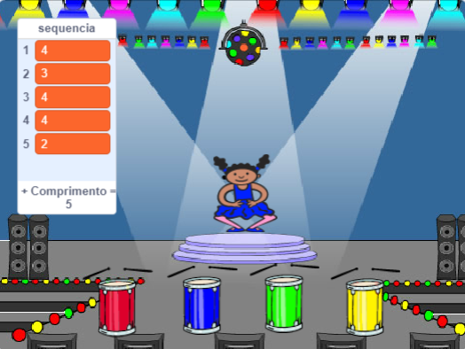

## Desafio: Adicionando som

Agora você vai acrescentar quatro botões que o jogador deve usar para repetir a sequência de cores.

\--- task \--- Adicione quatro novos atores ao seu projeto para representar os quatro botões.

+ Edite as fantasias dos novos atores para que haja um ator fantasiado em cada uma das quatro cores
+ Coloque os atores no palco na mesma ordem que as fantasias: vermelho, azul, verde, amarelo

 \--- /task \---

\--- task \--- Adicione código ao ator vermelho para que, quando o ator for clicado, ele `transmita`{:class="block3events"} a mensagem 'vermelho' ao ator:


```blocks3
    quando este ator for clicado
transmita (vermelho v)
```

\--- /task \---

Uma `transmissão`{:class="block3events"} é como uma mensagem anunciada por um alto-falante, o qual você pode ouvir por exemplo, nas escolas ou supermercados. Todos os atores podem ouvir a `transmissão`{:class="block3events"}, mas apenas o ator cujo papel é responder fará alguma coisa.

\--- task \---

Adicione um código semelhante aos tambores azul, verde e amarelo para que eles também `transmitam`{:class="block3events"} uma mensagem sobre sua própria cor.

\--- /task \---

Você se lembra que a `transmissão`{:class="block3events"} é como uma mensagem no alto-falante? Você vai adicionar código para fazer com que a função do ator seja responder às mensagens de `transmissões`{:class="block3events"}.

\--- task \---

Quando seu ator recebe a mensagem `vermelho`{:class="block3events"}, o código deve verificar se o número `1` está no início da `sequência`{:class="block3variable"} da lista (o que significa que `vermelho`{:class="block3events"} é a próxima cor na sequência).

Se `1` está no início da lista, o código deve remover o número da lista, porque o jogador lembrou a cor correta. Caso contrário o jogo acabou e o código precisa `parar todos`{:class="block3control"} para terminar o jogo.


```blocks3
quando eu receber [vermelho v]
se <(item (1 v) de [sequência v]) = [1]> então 
 apague (1 v) de [sequência v]
senão 
 diga [Fim de jogo!] por (1) segundos
 pare [todos v]
fim
```

\--- /task \---

\--- task \--- Adicione ao código que você acabou de escrever para que uma batida de tambor também toque quando o ator recebe a `transmissão`{:class="block3events"} correta.

\--- hints \--- \--- hint \--- Você consegue usar os números que correspondem a cada cor para tocar a batida correta?

+ 1 = vermelho
+ 2 = azul
+ 3 = verde
+ 4 = amarelo \--- / hint \--- \--- hint \--- Acima do bloco `apaga o 1 da sequência`{:class="block3variables"}, acrescente o bloco `toca o tambor`{:class="block3variables"} para tocar o primeiro som da lista `sequência`{:class="block3variables"}.

\--- /hint \--- \--- hint \--- Aqui está o código que você vai precisar:

```blocks3
quando eu receber [vermelho v]
se <(item (1 v) de [sequência v]) = [1]> então 
 + toque instrumento ((1) Tarol v) por (0.25) batidas
 apague (1 v) de [sequência v]
senão 
 diga [Fim de jogo!] por (1) segundos
 pare [todos v]
fim

```

\--- /hint \--- \--- /hints \--- \--- /task \---

\--- task \--- Duplique o código que você usou para fazer o seu ator responder à mensagem `vermelho`{:class="block3events"}. Altere o código duplicado para que ele envie a mensagem `azul`{:class="block3events"}. \--- /task \---

Quando o ator responder à mensagem `azul`{:class="block3events"}, qual parte do código deve permanecer o mesmo, e qual parte deve mudar? Lembre-se de que cada cor tem um número correspondente.

\--- task \--- Altere o código do ator de modo que o ator responda corretamente a mensagem `azul`{:class="block3events"}.

\--- hints \--- \--- hint \---

Mantenha esses blocos, mas você precisa alterá-los de alguma forma:


```blocks3
<(item (1 v) de [sequência v]) = [1]>

quando eu receber [vermelho v]

toque instrumento ((1) Tarol v) por (0.25) batidas
```

\--- /hint \--- \--- hint \--- Aqui está como seu código deve procurar pela transmissão `azul`{:class="block3events"}.


```blocks3
quando eu receber [azul v]
se <(item (1 v) de [sequência v]) = [2]> então 
  toque instrumento ((2) Bumbo v) por (0.25) batidas
  apague (1 v) de [sequência v]
senão 
  diga [Fim de jogo!] por (1) segundos
  pare [todos v]
fim
```

\--- /hint \--- \--- /hints \--- \--- /task \---

\--- task \--- Duplica o código mais duas vezes (para os botões verde e amarelo) e altere as partes necessárias para que o ator responda corretamente às novas `transmissões`{:class="block3events"}. \--- /task \---

Lembre-se de testar o código! Você consegue memorizar uma sequência de cinco cores? A sequência é diferente a cada vez?

Quando o jogador repete corretamente toda a sequência de cores, a lista da `sequência`{:class="block3variables"} esvazia e o jogador vence. Se você quiser, você também pode exibir algumas luzes piscantes como recompensa uma vez que a lista da `sequência`{:class="block3variáveis"} está vazia.

\--- task \--- Adicione este código no final do bloco de código `quando clicar em bandeira verde`{:class="block3events"} do seu ator:


```blocks3
    espere até que <(tamanho de [sequência v]) = [0]>
transmita (ganhou v) e espere
```

\--- /task \---

\--- task \--- Alterne para o Palco e importe o som da `bateria eletrônica` ou outro som que você gosta.

[[[generic-scratch3-sound-from-library]]]

\--- /task \---

\--- task \--- Adicione este código para reproduzir um som e fazer com que o cenário mude de cor quando o jogador vencer.


```blocks3
    quando eu receber [ganhou v]
toque o som (bateria eletrônica v)
repita (50) vezes 
  mude (25) no efeito [cor v]
  espere (0.1) seg
fim
remova os efeitos gráficos
```

\--- /task \---