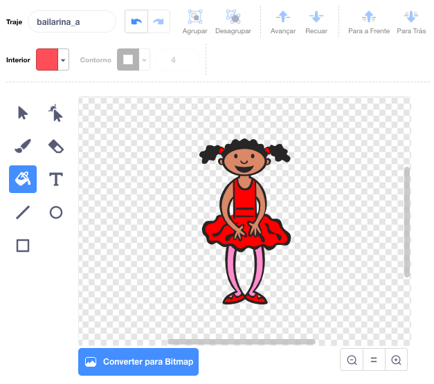
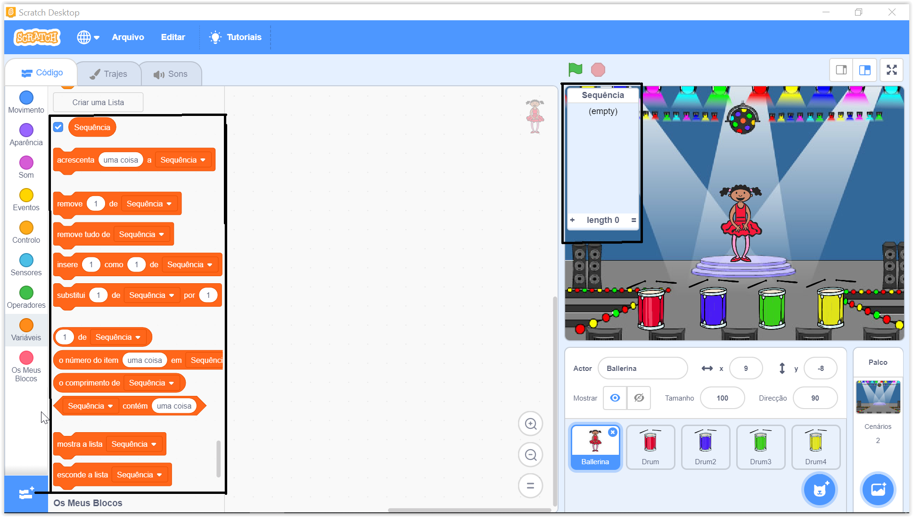

## Cria uma sequência de cores

Primeiro cria um personagem que possa exibir uma sequência aleatória de cores.

\--- task \--- Abra um novo projeto Scratch.

**Online:** abre um novo projeto online Scratch em [rpf.io/scratch-new](https://rpf.io/scratchon){:target="_blank.

**Offline:** abre um novo projeto no editor offline.

Se precisares de descarregar e instalar o editor offline do Scratch, podes encontrá-lo em [rpf.io/scratchoff](https://rpf.io/scratchoff).

\--- /task \---

\--- task \--- Escolhe um sprite e um pano de fundo. Podes utilizar a bailarina, mas o personagem não tem que ser uma pessoa, só precisa ser capaz de mostrar cores diferentes.

 \--- /task \---

+ O teu jogo deve usar um número diferente para representar cada cor:
    
    + 1 = vermelho
    + 2 = azul
    + 3 = verde
    + 4 = amarelo

\--- task \--- Dá ao teu personagem quatro trajes com cores diferentes, um traje para cada uma das quatro cores acima indicadas. Certifica-te que as roupas coloridas estão na mesma ordem da lista acima.

 \--- /task \---

Se quiseres, podes utilizar a ferramenta ** color a shape ** para preencher partes do traje com uma cor diferente.



De seguida, acrescenta uma lista para armazenar a sequência aleatória de cores que o jogador deve memorizar.

\--- task \--- Cria uma lista chamada `melhor pontuaçāo`{:class="block3variables"}. Apenas o sprite necessita ver esta lista, por isso seleciona **For this sprite only** quando criares a lista.

[[[generic-scratch3-make-list]]]

\--- /task \---

Agora já deves ver muitos novos blocos de código para utilizar com listas. A lista vazia deve estar visível no canto superior esquerdo do Palco.



Como cada cor tem um número diferente, podes escolher uma cor aleatória escolhendo aleatoriamente um número e adicionando-o à lista.

\--- task \--- Adicione este código ao sprite para escolher um número aleatório e adicioná-lo à sequência `sequence` {: class = "block3variables"}:


```blocks3
when flag clicked
add (pick random (1) to (4)) to [sequence v]
```

\--- /task \---

\--- task \--- Testa o teu código. Verifica se, de cada vez que clicas no sinalizador, um número aleatório entre 1 e 4 é adicionado à lista. \--- / task \---

\--- task \--- Consegues adicionar código ao teu programa para gerar cinco números aleatórios de uma só vez?

\--- hints \--- \--- hint \--- Acrescenta `delete all of sequence`{:class="block3variables"} para primeiro apagar todos os itens na lista, e depois um bloco `repeat`{:class="block3control"}que acrecenta cinco números aleatórios à lista. \--- /hint \--- \--- hint \---

Este é o aspeto que o teu código deve ter:


```blocks3
when flag clicked
delete (all v) of [sequence v]
repeat (5)
    add (pick random (1) to (4)) to [sequence v]
end
```

\--- /hint \--- \--- /hints \--- \--- /task \---

\--- task \--- De cada vez que um número é acrescentado à lista, o sprite deve mudar seu traje para que a cor do traje corresponda ao número. Coloca esses blocos no teu código imediatamente abaixo de onde um número aleatório é adicionado à sequência ` ` {: class = "block3variables"}:


```blocks3
switch costume to (item (length of [sequence v]) of [sequence v])
wait (1) seconds
```

\--- /task \---