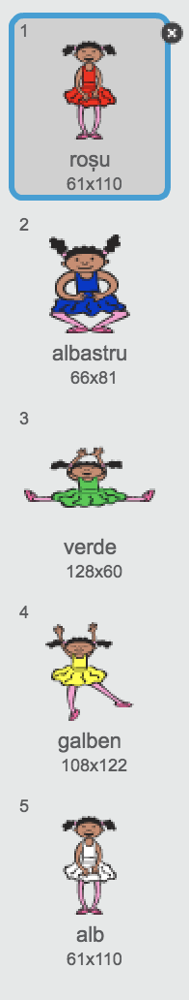

## Creează o secvenţă de culori

Mai întâi creați un caracter care poate afișa o secvență aleatoare de culori.

\--- task \--- Deschide un nou proiect Scratch.

**Online<0>: deschide un proiect Scratch nou în [rpf.io/scratch-new](https://rpf.io/scratchon).</p> 

**Offline**: deschideți un nou proiect în editorul offline.

Dacă trebuie să descărcați și să instalați editorul Scratch offline, îl puteți găsi la [rpf.io/scratchoff](https://rpf.io/scratchoff).

\--- /task \---

\--- task \--- Alege un personaj "sprite " și un fundal. Poți folosi balerina, dar personajul tău nu trebuie să fie o persoană, trebuie doar să poată indica culori diferite.

 \--- /task \---

+ Jocul dvs. ar trebui să utilizeze un număr diferit pentru a reprezenta fiecare culoare:
    
    + 1 = roșu
    + 2 = albastru
    + 3 = verde
    + 4 = galben

\--- task \--- Dă personajul tău patru costume care au culori diferite, câte un costum pentru fiecare dintre cele patru culori prezentate mai sus. Asigurați-vă că costumele dvs. colorate sunt în aceeași ordine ca și lista de mai sus.

 \--- /task \---

Dacă doriți, puteți utiliza instrumentul de culoare **colorează o formă** pentru a umple părțile costumului cu o altă culoare.


Apoi, adăugați o listă pentru stocarea secvenței aleatorii a culorilor pe care playerul trebuie să o rețină.

\--- task \--- Creați o listă numită `secvență`{:class="block3variables"}. Numai personajul "sprite" trebuie să vadă această listă, de aceea puteți selecta **Doar pentru aceast personaj "sprite"** când creați lista.

[[[generic-scratch3-make-list]]]

\--- /task \---

Ar trebui să vedeți acum o mulțime de blocuri de coduri noi pentru utilizarea listelor. Lista goală ar trebui să fie vizibilă în colțul din stânga sus al scenei.


Fiecare culoare are un număr diferit, astfel încât să puteți alege o culoare aleatorie prin alegerea unui număr și adăugarea acestuia în listă.

\--- task \--- Adăugați acest cod lpersonajului "sprite" pentru a alege un număr aleator și a-l adăuga la `secvență`{:class="block3variables"}:


```blocks3
atunci când faceți clic pe steag adăugați (alegeți aleatoriu de la (1) la (4)) la [secvența v]
```

\--- /task \---

\--- task \--- Testați-vă codul. Verificați că, de fiecare dată când faceți clic pe steag, un număr alatoriu între 1 și 4 este adăugat în listă. \--- /task\---

\--- task \--- Puteți adăuga un cod programului dvs. pentru a genera cinci numere aleatorii dintr-o dată?

\--- hints \--- \--- hint \--- Adăugați a`șterge toate secvențele`{:class=„block3variables“} pentru a șterge mai întâi toate elementele de pe listă, și apoi adaugă `repetare`{block:"block3control"} block care adaugă cinci numere aleatorii în listă. \--- /hint \--- \--- hint \---

Așa ar trebui să arate codul dvoastră:


```blocks3
când apăsați steagul
șterge (toate v) [secvență v]
repetă (5)
adaugă (alege aleator de la (1) la (4)) la [secvență v]
sfârșit
```

\--- /hint \--- \--- /hints \--- \--- /task \---

\--- task \--- De fiecare dată când un număr se adaugă în listă, personajul trebuie să-și schimbe costumul, astfel încât culoarea costumului să se potrivească cu numărul. Pune aceste blocuri de coduri în codul tău imediat mai jos unde ai adaugat un număr aleatoriu la `secvență`{:class=„block3variables“}:


```blocks3
comutați costumul la (elementul (lungimea secvenței v) a secvenței v)
așteptați (1) secundă
```

\--- /task \---