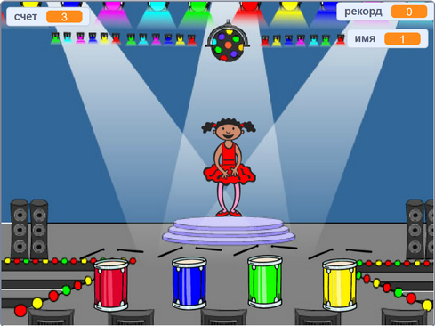

\--- no-print \---

Это **Scratch 3** версия проекта. Существует также [Scratch 2 версия проекта](https://projects.raspberrypi.org/en/projects/memory-scratch2).

\--- /no-print \---

## Введение

В этом проекте ты создашь игру для развития памяти, в которой тебе надо будет запомнить и повторить последовательность случайных цветов!

### Как это работает

\--- no-print \--- Нажми на зеленую кнопку, чтобы начать. Посмотри на последовательность цветов, которую покажет платье балерины и послушай сопровождающие удары барабана, а затем повтори цвета. Если ты выберешь цвета неправильно, то игра закончится!

  <iframe allowtransparency="true" width="485" height="402" src="//scratch.mit.edu/projects/embed/284452634/?autostart=false" frameborder="0" allowfullscreen scrolling="no" mark="crwd-mark"></iframe> 

\--- /no-print \---

\--- print-only \---  \--- /print-only \---

## \--- collapse \---

## title: Чему ты научишься

+ Как добавлять звук в проект Scratch
+ Как создавать и использовать списки для хранения данных
+ Как создавать и использовать пользовательские блоки повторяющегося кода

\--- /collapse \---

## \--- collapse \---

## title: Что тебе понадобится

### Оборудование

+ Компьютер, на котором можно запустить Scratch 3

### Программное обеспечение

Scratch 3 (либо [online](https://rpf.io/scratchon){:target="_blank"}, либо [offline](https://rpf.io/scratchoff){:target="_blank"}) \--- /collapse \---

## \--- collapse \---

## title: Дополнительная информация для учеников

\--- no-print \---

Если тебе нужно распечатать этот проект, то используй [printer-friendly version](https://projects.raspberrypi.org/en/projects/memory/print){:target="_blank"}.

\--- /no-print \---

Ты можешь найти [законченный проект тут](http://rpf.io/p/en/memory-get).

\--- /collapse \---