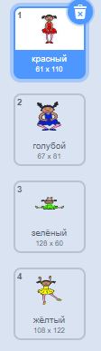
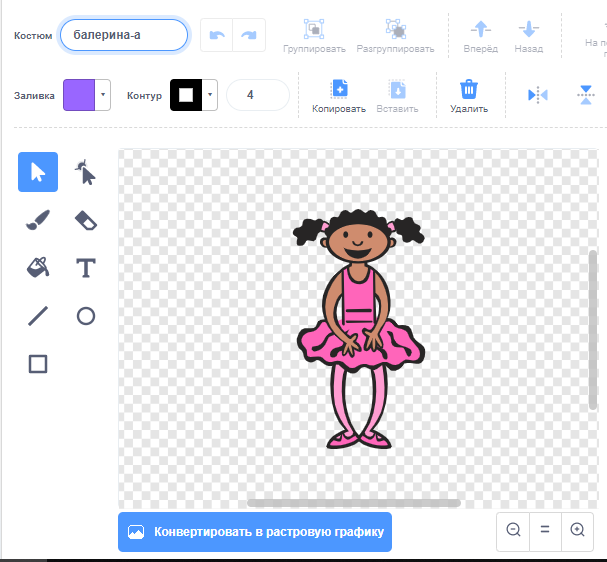
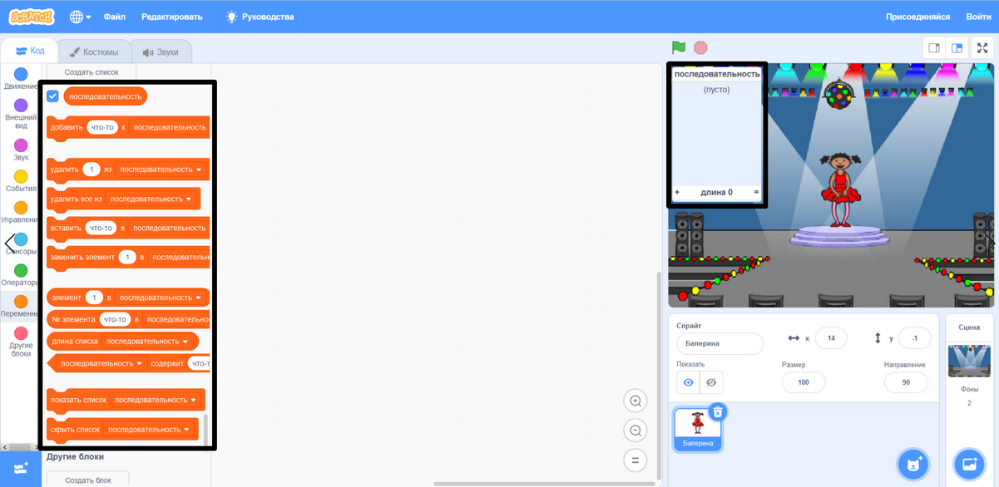

## Создай последовательность цветов

Сначала создай персонажа, который сможет отображать случайную последовательность цветов.

--- task ---

Открой новый проект Scratch.

**Онлайн**: открой новый онлайн проект Scratch [rpf.io/scratch-new](https://rpf.io/scratch-new){:target="_blank"}.

**Оффлайн**: Создай новый проект в оффлайн редакторе.

Если тебе нужно скачать и установить оффлайн редактор Scratch, ты можешь найти его по адресу [rpf.io/scratchoff](https://rpf.io/scratchoff){:target="_blank"}.

--- /task ---

--- task ---

Выбери спрайт и фон персонажа. Ты можешь использовать балерину, но твой персонаж не обязательно должен быть человеком, а только способный показывать разные цвета.


--- /task ---

+ Используй в игре разные числа для каждого цвета:
    
    + 1 = красный
    + 2 = синий
    + 3 = зеленый
    + 4 = желтый

--- task ---

Добавь своему персонажу четыре костюма разных цветов, по одному на каждый из четырех цветов, указанных раньше. Убедись, что твои цветные костюмы находятся в том же порядке, что и список.



--- /task ---

Если хочешь, можешь использовать инструмент **заливка** для заливки частей костюма другим цветом.



Затем добавь список для хранения случайной последовательности цветов, которую игрок должен запомнить.

--- task ---

Создай список с именем `последовательность`{:class="block3variables"}. Только спрайту персонажа нужно видеть этот список, поэтому ты можешь выбрать **Только для этого спрайта** при создании списка.

[[[generic-scratch3-make-list]]]

--- /task ---

Теперь ты видишь много новых блоков кода для списков. Пустой список должен быть виден в верхнем левом углу Cцены.



Каждый цвет имеет свой номер, поэтому ты можешь выбрать случайный цвет, случайным образом выбрав номер и добавив его в список.

--- task ---

Добавь этот код в спрайт персонажа, чтобы выбрать случайное число и добавить его в `последовательность`{:class="block3variables"}:


```blocks3
when flag clicked
add (pick random (1) to (4)) to [sequence v]
```

--- /task ---

--- task ---

Протестируй свой код. Убедись, что каждый раз, когда ты нажимаешь на флаг, случайное число от 1 до 4 добавляется к списку.

--- /task ---

--- task ---

Как изменить код программы, чтобы генерировать пять случайных чисел одновременно?

--- hints ---

--- hint ---

Добавь `удалить все из список`{:class="block3variables"}, чтобы сначала удалить все элементы списка, а затем добавить блок `повторить`{:class="block3control"}, который добавит пять случайных чисел в список.

--- /hint ---

--- hint ---

Так должен выглядеть твой код:


```blocks3
when flag clicked
delete (all v) of [sequence v]
repeat (5)
	add (pick random (1) to (4)) to [sequence v]
end
```

--- /hint ---

--- /hints ---

--- /task ---

--- task ---

Каждый раз, когда число добавляется в список, персонаж должен сменить цвет костюма в соответствии с числом. Добавь эти блоки, сразу после добавления случайного числа в `последовательность`{:class="block3variables"}:


```blocks3
switch costume to (item (length of [sequence v]) of [sequence v])
wait (1) seconds
```

--- /task ---