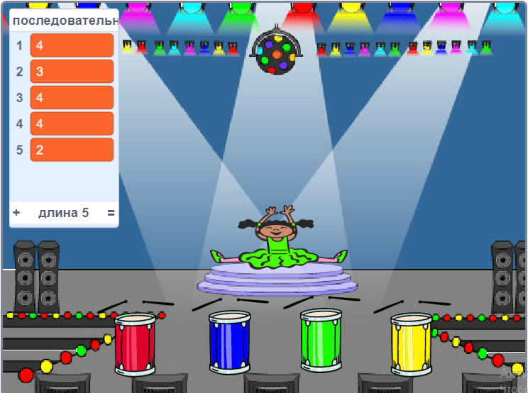
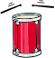

## Повтори последовательность

Теперь тебе нужно добавить четыре кнопки, которые должен нажать игрок, чтобы повторить цветовую последовательность.

\--- task \---

Добавь четыре новых спрайта в ваш проект для четырех кнопок.

+ Отредактируй костюмы новых спрайтов так, чтобы в каждом из четырёх цветов был один спрайт
+ Расставь спрайты в том же порядке, что и костюмы: красный, синий, зеленый, желтый



\--- /task \---

\--- task \---

Добавь код к красному спрайту так, чтобы при нажатии на спрайт он `передавал` {:class="block3events"} «красное» сообщение персонажу спрайта:



```blocks3
    когда спрайт нажат
    передать (красный v)
```

\--- /task \---

`Трансляция (передача)`{:class="block3events"} - это сообщение, объявленное через громкоговоритель, которое ты можешь, например, услышать в школах или супермаркетах. Все спрайты могут слышать `передачу сообщения` {:class="block3events"}, но реагировать на неё будет только определенный спрайт.

\--- task \---

Добавь аналогичный код к синим, зеленым и желтым спрайтам, чтобы заставить их `передавать`{:class="block3events"} сообщения о цвете.

\--- /task \---

Помнишь, что `передача`{:class="block3events"} похожа на сообщение громкоговорителя? Добавь код, чтобы заставить спрайт персонажа реагировать на `передачу` {:class="block3events"} сообщения.

\--- task \---

Когда спрайт персонажа получает сообщение `красный`{:class="block3events"}, код должен проверять, находится ли число `1` в начале `последовательности`{:class="block3variables"} списка (а это означает, что `красный`{:class="block3events"} это следующий цвет в последовательности).

Если `1` находится в начале списка, код должен удалить число из списка, так как игрок запомнил правильный цвет. В противном случае игра окончена, и код должен `остановить все` {:class="block3control"}, чтобы закончить игру.


```blocks3
когда я получу [красный v]
если <(элемент (1 v) в [последовательность v]) = [1]>, то 
 удалить (1 v) из [последовательность v]
иначе 
 говорить [Конец игры!] (1) секунд
 стоп [все v]
конец
```

\--- /task \---

\--- task \---

Добавь в код, который ты только что написал, возможность барабана играть при получении спрайтом правильной `передачи`{:class="block3events"} сообщения.

\--- hints \---

\--- hint \---

Можешь ли ты использовать номера для каждого цвета, соответствующие правильному звуку барабана?

+ 1 = красный
+ 2 = синий
+ 3 = зеленый
+ 4 = желтый

\--- /hint \---

\--- hint \---

Над блоком `удалить 1 из последовательности` {: class = "block3variables"} добавь блок `барабану играть ` {:class="block3sound"} для воспроизведения первого звука в список `последовательности` {:class="block3variables"}.

\--- /hint \---

\--- hint \---

Код, который тебе нужно добавить:

```blocks3
когда я получу [красный v]
если <(элемент (1 v) в [последовательность v]) = [1]>, то 
 + барабану играть ((1) Малый Барабан v) (0.25) бита
 удалить (1 v) из [последовательность v]
иначе 
 говорить [Конец игры!] (1) секунд
 стоп [все v]
конец
```

\--- /hint \---

\--- /hints \---

\--- /task \---

\--- task \---

Продублируй код, который ты использовал, чтобы спрайт реагировал на сообщение `красный`{:class="block3events"}. Измени продублированный код так, чтобы он отправлял сообщение `синий`{:class="block3events"}.

\--- /task \---

Когда спрайт отвечает на сообщение `синий`{:class="block3events"}, какая часть кода должна остаться прежней, а какая измениться? Помни, что каждый цвет соответствует числу.

\--- task \---

Измени код спрайта персонажа так, чтобы персонаж правильно отвечал на сообщение `синий`{:class="block3events"}.

\--- hints \---

\--- hint \---

Используй эти блоки, но тебе нужно их каким-то образом изменить:


```blocks3
<(элемент (1 v) в [последовательность v]) = [1]>

когда я получу [красный v]

барабану играть ((1) Малый Барабан v) (0.25) бита
```

\--- /hint \---

\--- hint \---

Вот так должен выглядеть твой код для передачи сообщения `синий`{:class="block3events"}.


```blocks3
когда я получу [синий v]
если <(элемент (1 v) в [последовательность v]) = [2]>, то 
  барабану играть ((2) Большой Барабан v) (0.25) бита
  удалить (1 v) из [последовательность v]
иначе 
  говорить [Конец игры!] (1) секунд
  стоп [все v]
конец
```

\--- /hint \---

\--- /hints \---

\--- /task \---

\--- task \---

Продублируй код ещё дважды (для зеленой и желтой кнопок) и измени необходимые части так, чтобы персонаж правильно отвечал на новые `сообщения`{:class="block3events"}.

\--- /task \---

Не забудь протестировать код! Можешь ли ты запомнить последовательность из пяти цветов? Последовательность каждый раз разная?

Когда игрок повторяет всю последовательность цветов правильно, то список `последовательность`{:class= "block3variables"} пуст, и игрок выигрывает. По желанию можешь добавить мигание лампочек как награду, если список `последовательность`{:class="block3variables"} пуст.

\--- task \---

Добавь этот код в конец скрипта вашего персонажа `когда флаг нажат`{:class="block3events"}:


```blocks3
    ждать до <(длина списка [последовательность v]) = [0]>
передать (победа v) и ждать до конца
```

\--- /task \---

\--- task \---

Перейди к Сцене и импортируй звук `драм-машины` или любой другой звук, который тебе нравится.

[[[generic-scratch3-sound-from-library]]]

\--- /task \---

\--- task \---

Добавь этот код, чтобы воспроизводился звук и менялся цвет фона в случае победы игрока.


```blocks3
    когда я получу [победа v]
включить звук (драм-машина v)
повторить (50) раз 
  изменить [цвет v] эффект на (25)
  ждать (0.1) секунд
конец
убрать графические эффекты
```

\--- /task \---