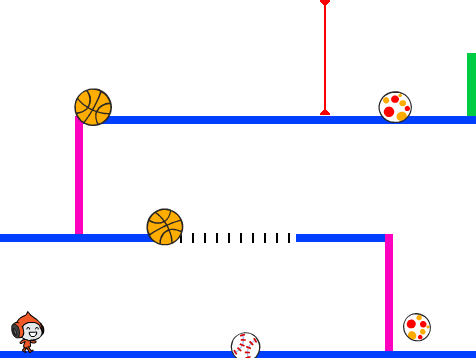

## Что дальше?

Обрати внимание на проект [Вышибалы](https://projects.raspberrypi.org/ru-RU/projects/dodgeball?utm_source=pathway&utm_medium=whatnext&utm_campaign=projects), где ты сможешь создать игру, в которой нужно будет уворачиваться от мячей, переходя с платформы на платформу.

--- no-print ---

Нажми на зеленый флажок, чтобы начать, а затем используй клавиши со стрелками для перемещения и <kbd>пробел</kbd>, чтобы прыгать.

  <iframe allowtransparency="true" width="485" height="402" src="https://scratch.mit.edu/projects/embed/251809924/?autostart=false" frameborder="0" scrolling="no"></iframe>
  

--- /no-print ---

--- print-only ---

--- /print-only ---

***
Этот проект был переведен волонтерами:

Мария Гапоник

Вадим Васильев

Благодаря волонтерам мы можем дать возможность людям во всем мире учиться на их родном языке. Вы можете помочь нам привлечь больше волонтёров-переводчиков - подробнее на [rpf.io/translate](https://rpf.io/translate).