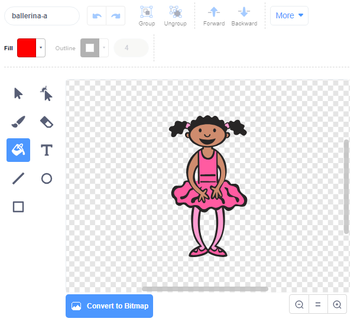

## වර්ණ(colour) අනුක්‍රමයක්(sequence එකක්) සෑදීම

පළමුව අහඹු(random) ලෙස වර්ණ(colour) අනුක්‍රමයක්(sequence එකක්) පෙන්විය හැකි චරිතයක්(character එකක්) සාදන්න.

\--- task \--- නව Scratch ව්යාපෘතියක්(project එකක්) විවෘත්ත කරන්න.

**Online**: open a new online Scratch project at [rpf.io/scratch-new](https://rpf.io/scratch-new){:target="_blank"}.

**අන්තර්ජාලයට නොබැඳිව(Offline):** නොබැඳි සංස්කාරකයේ(offline editor එකේ) නව ව්‍යාපෘතියක්(new project එකක්) විවෘත කරන්න.

If you need to download and install the Scratch offline editor, you can find it at [rpf.io/scratchoff](https://rpf.io/scratchoff){:target="_blank"}.

\--- /task \---

\--- task \--- sprite චරිතය(character එකක්) සහ පසුබිමක්(backdrop එකක්) තෝරාගන්න. ඔබට නර්තන ශිල්පිනිය භාවිතා කළ හැකිය, නමුත් ඔබේ චරිතය(character එක) පුද්ගල චරිතයක් විය යුතු නැත, අවශ්‍ය වන්නේ විවිධ වර්ණ පෙන්වීමට ඇති හැකියාව පමණි.

 \--- /task \---

+ එක් එක් වර්ණය නියෝජනය කිරීමට ඔබගේ ක්‍රීඩාව වෙනස්(different) අංකයක්(number එකක්) භාවිතා කළ යුතුයි:
    
    + 1 = red
    + 2 = blue
    + 3 = green
    + 4 = yellow

\--- task \--- ඔබේ චරිතයට(character එකට) විවිධ වර්ණ ඇති ඇඳුම්(costumes) හතරක් ලබා දෙන්න, ඉහත පෙන්වා ඇති වර්ණ හතරෙන් එක් එක් ඇඳුම(costume එක) එන පරිදි සකසන්න. ඔබේ වර්ණවත්(coloured) ඇඳුම්(costumes) ඉහත ලැයිස්තුවට(list) සමාන පිළිවෙලට(order එකට) ඇති බවට වග බලා ගන්න.

 \--- /task \---

ඔබට අවශ්‍ය නම්, ඔබට **හැඩයක් වර්ණ ගැන්වීම(color a shape)** මෙවලම භාවිතා කර, ඇඳුමේ(costume එකේ) කොටස් වෙනත් වර්ණයකින් වර්ණ ගැන්විය හැකිය.



ඊළඟට, ක්‍රීඩකයා මතක තබා ගත යුතු වර්ණවල අහඹු(random) අනුක්‍රමය(sequence එක) ගබඩා(store) කිරීම සඳහා ලැයිස්තුවක්(list එකක්) එක් කරන්න.

\--- task \--- `sequence`{:class="block3variables"} නමින් ලැයිස්තුවක්(list එකක්) සාදන්න. මෙම ලැයිස්තුව දැකීමට අවශ්‍ය වන්නේ අදාළ sprite චරිතය(character එක) පමණි, එබැවින් ඔබ ලැයිස්තුව(list එක) නිර්මාණය කරන විට **මෙම sprite එක සඳහා පමණක්(for this sprite only)** තෝරා ගත හැකිය.

[[[generic-scratch3-make-list]]]

\--- /task \---

ලැයිස්තු(lists) භාවිතා කිරීම සඳහා ඔබට දැන් නව කේත(code) කට්ටි(blocks) ගොඩක් දැකගත හැකිය. හිස්(empty) ලැයිස්තුවක්(list එකක්) වේදිකාවේ ඉහළ වම්(left-hand) කෙළවරේ(corner එකේ) දැකිය හැකිය.


සෑම වර්ණයකටම වෙනස් අංකයක්(number එකක්) ඇත, එබැවින් ඔබට අහඹු(random) ලෙස අංකයක්(number එකක්) තෝරාගෙන එය ලැයිස්තුවට(list එකට) එක් කිරීමෙන් අහඹු(random) වර්ණයක්(colour එකක්) තෝරා ගත හැකිය.

\--- task \--- අහඹු(random) අංකයක්(number එකක්) තෝරා ගැනීමට, මෙම කේතය(code එක) sprite චරිතට(character එකට) එකතු කර එය `අනුක්‍රමයට(sequence)`{:class= "block3variables"} එක් කරන්න:


```blocks3
when flag clicked
add (pick random (1) to (4)) to [sequence v]
```

\--- /task \---

\--- task \--- ඔබේ කේතය(code එක) පරීක්ෂා(test) කරන්න. ඔබ ධජය(flag එක) ක්ලික් කරන සෑම අවස්ථාවකම 1 සිට 4 දක්වා අහඹු(random) අංකයක්(number එකක්) ලැයිස්තුවට(list එකට) එකතු වනවාදැයි පරීක්ෂා කරන්න. \--- /task \---

\--- කාර්යය \--- අහඹු(random) සංඛ්‍යා(numbers) පහක් එකවර ජනනය(generate) කිරීමට ඔබේ වැඩසටහනට(program එකට) කේතයක්(code එකක්) එක් කළ හැකිද?

\--- hints \--- \--- hint \--- Add a `සියලු අනුක්‍රම මකන්න(delete all of sequence)`{:class="block3variables"} පළමුව ලැයිස්තුවේ(list එකේ) ඇති සියලුම(all) අයිතම(items) මකා(delete කරන්න) දමන්න, පසුව එම ලැයිස්තුවට(list එකට) අහඹු(random) සංඛ්‍යා(numbers) පහක් එක් කරන `පුනරාවර්තන(repeat)`{:class="block3control"} කට්ටියක්(block එකක්) එක් කරන්න. \--- /hint \--- \--- hint \---

ඔබගේ කේතය(code එක) මෙබඳු එකක් විය යුතුයි:


```blocks3
when flag clicked
delete (all v) of [sequence v]
repeat (5)
    add (pick random (1) to (4)) to [sequence v]
end
```

\--- /hint \--- \--- /hints \--- \--- /task \---

\--- task \--- ලැයිස්තුවට(list එකට) අංකයක්(number එකක්) එකතු(add) වූ සෑම අවස්ථාවකම චරිතය(character එක), එමඟින් ඇඳුමේ(costume's) වර්ණය අංකයට ගැලපෙන පරිදි සැකසිය ‍යුතුයි. `අනුක්‍රමයට(sequence එකට)`{:class= "block3variables"} අහඹු(random) අංකයක්(number එකක්) එක් කළ තැනට පහළින් මෙම කට්ටි(blocks) ඔබේ කේතයට(code එකට) යොදන්න:


```blocks3
switch costume to (item (length of [sequence v]) of [sequence v]) wait (1) seconds
```

\--- /task \---