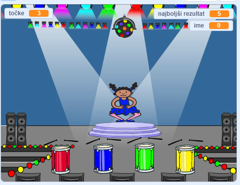

\--- no-print \---

To je **Scratch 3** različica projekta. Obstaja tudi [Scratch 2](https://projects.raspberrypi.org/en/projects/memory-scratch2) različica projekta.

\--- /no-print \---

## Uvod

V tej igri boš naredil-a igro Spomin, v kateri si moraš zapomniti in ponoviti naključno zaporedje barv!

### Kaj boš ustvaril-a?

\--- no-print \--- Za začetek klikni na zeleno zastavico. Oglej si zaporedje barv, ki jih prikazuje plesalčeva obleka, in poslušaj spremljajoče ritme bobna, nato pa ponovi to zaporedje barv. Če se zmotiš, je igre konec!

  <iframe allowtransparency="true" width="485" height="402" src="//scratch.mit.edu/projects/embed/284452634/?autostart=false" frameborder="0" allowfullscreen scrolling="no" mark="crwd-mark"></iframe> 

\--- /no-print \---

\--- print-only \---  \--- /print-only \---

## \--- collapse \---

## title: Kaj se boš naučila-a?

+ Kako dodati zvok v Scratch projekt
+ Kako ustvariti in uporabljati sezname za shranjevanje podatkov
+ Kako ustvariti in uporabljati lastne bloke za ponovno uporabo kode

\--- /collapse \---

## \--- collapse \---

## title: Kaj potrebuješ?

### Strojna oprema

+ Računalnik, ki lahko poganja Scratch 3

### Programska oprema

Scratch 3 (bodisi [na spletu](https://rpf.io/scratchon) {:target = "_blank"} ali [brez povezave](https://rpf.io/scratchoff){:target="_blank"})

## \--- collapse \---

## title: Dodatne informacije za izobraževalce

\--- no-print \---

Če želite natisniti ta projekt, uporabite [tiskalniku prijazno različico](https://projects.raspberrypi.org/en/projects/memory/print){:target="_blank"}.

\--- /no-print \---

Dokončan projekt lahko najdete [tukaj](http://rpf.io/p/en/memory-get).

\--- /collapse \---