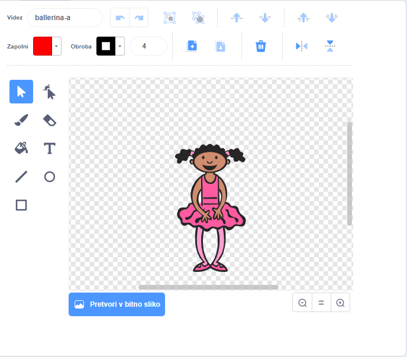
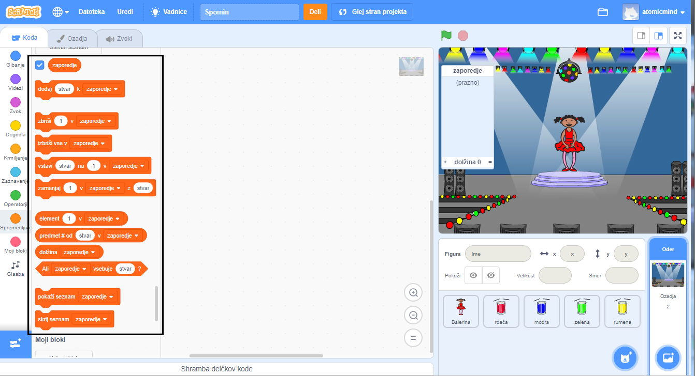

## Ustvari barvno zaporedje

Najprej ustvari lik, ki zna prikazati naključno zaporedje barv na zaslonu.

\--- task \--- Odprite nov Scratch projekt.

**S povezavo:** ustvari nov spletni Scratch projekt na [rpf.io/scratch-new](https://rpf.io/scratchon){:target="_blank.

**Brez povezave:** ustvari nov projekt v namiznem Scratch urejevalniku.

Če želiš prenesti in namestiti Namizni Scratch, ga lahko najdeš na [rpf.io/scratchoff](https://rpf.io/scratchoff).

\--- /task \---

\--- task \--- Izberi figuro lika in ozadje. Lahko denimo uporabiš balerino, vendar ni nujno, da je tvoj lik sploh oseba, vse kar je pomembno je to, da zna prikazati različne barve.

 \--- /task \---

+ Tvoja igra bi morala uporabljati različne številke za prikaz barv:
    
    + 1 = rdeča
    + 2 = modra
    + 3 = zelena
    + 4 = rumena

\--- task \--- Svojemu liku ustvari štiri videze različnih barv - po en videz za vsako od štirih barv, ki so prikazane zgoraj. Bodi pozoren, da bodo videzi v enakem zaporedju, kot na zgornjem seznamu barv.

 \--- /task \---

Če želiš, lahko uporabiš orodje **pobarvaj lik**, da zapolniš posamezne dele videza z drugačno barvo.



Nato ustvari seznam, v katerega se bo shranilo naključno zaporedje barv, ki si jih mora igralec zapomniti.

\--- task \--- Ustvari seznam imenovan`zaporedje`{:class="block3variables"}. Ta seznam potrebuje le figura lika, zato lahko izbereš **Samo za to figuro**, ko ustvarjaš seznam.

[[[generic-scratch3-make-list]]]

\--- /task \---

Zdaj bi moral videti številne nove bloke kode, za rabo s seznami. Prazen seznam bi moral biti viden v zgornjem levem kotu odra.



Vsaka barva ima drugačno številko, zato lahko izbereš naključno barvo s pomočjo naključno izbrane številke, ki jo dodaš seznamu.

\--- task \--- Figuri lika dodaj to kodo, da izbere naključno številko in jo doda v `zaporedje`{:class="block3variables"}:


```blocks3
when flag clicked
add (pick random (1) to (4)) to [sequence v]
```

\--- /task \---

\--- task \--- Test your code. Check that, each time you click the flag, a random number between 1 and 4 gets added to the list. \--- /task \---

\--- task \--- Can you add code to your program to generate five random numbers at once?

\--- hints \--- \--- hint \--- Add a `delete all of sequence`{:class="block3variables"} to first delete all the items on the list, and then add a `repeat`{:class="block3control"} block that adds five random numbers to the list. \--- /hint \--- \--- hint \---

Tvoja koda mora izgledati tako:


```blocks3
when flag clicked
delete (all v) of [sequence v]
repeat (5)
    add (pick random (1) to (4)) to [sequence v]
end
```

\--- /hint \--- \--- /hints \--- \--- /task \---

\--- task \--- Each time a number gets added to the list, the character should change its costume so the costume's colour matches the number. Put these blocks into your code immediately below where a random number is added to `sequence`{:class="block3variables"}:


```blocks3
switch costume to (item (length of [sequence v]) of [sequence v])
wait (1) seconds
```

\--- /task \---