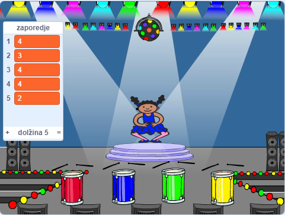

## Ponovi zaporedje

Sedaj boš dodal štiri gumbe, ki jih mora igralec pritisniti, da ponovi barvno zaporedje.

\--- task \--- Projektu dodaj štiri nove figure, ki bodo predstavljale štiri gumbe.

+ Uredi videze novih figur, da bo vsak ustreza eni od štirih barv
+ Figure postavi na oder v enakem zaporedju, kot si sledijo videzi: rdeča, modra, zelena, rumena

 \--- /task \---

\--- task \--- Rdeči figuri dodaj kodo, da bo ob kliku na njo `objavila`{:class="block3events"} sporočilo 'rdeča' za figuro lika:


```blocks3
    ko kliknemo na to figuro
  objavi (rdeča v)
```

\--- /task \---

`Objava`{:class="block3events"} je kot sporočilo, ki je posredovano preko zvočnika, kot ga lahko denimo slišiš v šoli ali v trgovskih centrih. Vse figure lahko slišijo `objavo`{:class="block3events"}, vendar se bo nanjo odzvala le tista figura, ki ji je namenjena.

\--- task \---

Dodaj podobno kodo modri, zeleni in rumeni figuri, da bodo `objavile`{:class="block3events"} sporočila o svoji barvi.

\--- /task \---

Si si zapomnil, da je `objava`{:class="block3events"} kot sporočilo posredovano preko zvočnika? Dodal boš kodo, ki bo poskrbela, da se bo figura lika odzvala na sporočilo `objave`{:class="block3events"}.

\--- task \---

Ko tvoja figura lika prejme sporočilo `rdeča`{:class="block3events"}, naj koda preveri ali je številka `1` na začetku seznama `zaporedje`{:class="block3variables"} (kar pomeni, da je `rdeča`{:class="block3events"} naslednja barva v zaporedju).

Če je `1` na začetku seznama, naj koda odstrani številko iz seznama, ker si je igralec zapomnil pravo barvo. V nasprotnem primeru pa je igre konec in koda mora `ustvaviti vse`{:class="block3control"}, da se igra konča.


```blocks3
when I receive [red v]
if <(item (1 v) of [sequence v])=[1]> then
delete (1 v) of [sequence v]
else
say [Game over!] for (1) seconds
stop [all v]
end
```

\--- /task \---

\--- task \--- Add to the code you just wrote so that a drum beat also plays when the character sprite receives the correct `broadcast`{:class="block3events"}.

\--- hints \--- \--- hint \--- Can you use the numbers that correspond to each colour to play the correct drum beat?

+ 1 = red
+ 2 = blue
+ 3 = green
+ 4 = yellow \--- /hint \--- \--- hint \--- Above the `delete 1 of sequence`{:class="block3variables"} block, add the `play drum`{:class="block3sound"} block to play the first sound in the `sequence`{:class="block3variables"} list.

\--- /hint \--- \--- hint \--- Here is the code you will need to add:

```blocks3
when I receive [red v]
if <(item (1 v) of [sequence v])=[1]> then

+ play drum (\(1\) Snare Drum v) for (0.25) beats
delete (1 v) of [sequence v]
else
say [Game over!] for (1) seconds
stop [all v]
end

```

\--- /hint \--- \--- /hints \--- \--- /task \---

\--- task \--- Duplicate the code you used to make your character sprite respond to the message `red`{:class="block3events"}. Change the duplicated code so that it sends the message `blue`{:class="block3events"}. \--- /task \---

When the sprite responds to the message `blue`{:class="block3events"}, which bit of code should stay the same, and which bit should change? Remember that each colour has a corresponding number.

\--- task \--- Change the character sprite's code so that the character responds correctly to the `blue`{:class="block3events"} message.

\--- hints \--- \--- hint \---

Keep these blocks, but you need to change them in some way:


```blocks3
<(item (1 v) of [sequence v]) = [1]>

when I receive [red v]

play drum (\(1\) Snare Drum v) for (0.25) beats
```

\--- /hint \--- \--- hint \--- Here is how your code should look for the `blue`{:class="block3events"} broadcast.


```blocks3
when I receive [blue v]
if <(item (1 v) of [sequence v])=[2]> then
    play drum (\(2\) Bass Drum v) for (0.25) beats
    delete (1 v) of [sequence v]
else
    say [Game over!] for (1) seconds
    stop [all v]
end
```

\--- /hint \--- \--- /hints \--- \--- /task \---

\--- task \--- Duplicate the code again twice (for the green and yellow buttons), and change the necessary parts so that the character responds correctly to the new `broadcasts`{:class="block3events"} . \--- /task \---

Remember to test the code! Can you memorise a sequence of five colours? Is the sequence different each time?

When the player repeats the whole colour sequence correctly, the `sequence`{:class="block3variables"} list emtpy and the player wins. If you want, you can also display some flashing lights as a reward once the `sequence`{:class="block3variables"} list is empty.

\--- task \--- Add this code to the end of your character's `when flag clicked`{:class="block3events"} script:


```blocks3
    wait until < (length of [sequence v]) = [0]>
    broadcast (won v) and wait
```

\--- /task \---

\--- task \--- Switch to the Stage, and import the `drum machine` sound or another sound you like.

[[[generic-scratch3-sound-from-library]]]

\--- /task \---

\--- task \--- Add this code to play a sound and make the backdrop change colour when the player wins.


```blocks3
    when I receive [won v]
    start sound (drum machine v)
    repeat (50)
        change [color v] effect by (25)
        wait (0.1) seconds
    end
    clear graphic effects
```

\--- /task \---