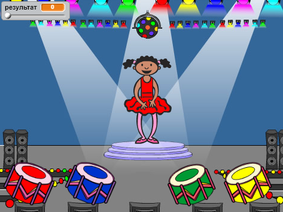

## Вступ

У цьому проекті ви створите гру, що тренує пам'ять, в якій потрібно запам'ятовувати і повторювати випадкову послідовність кольорів!

### Що ви будете робити

Натисніть на зелений прапорець, щоб почати. Запам'ятайте послідовність кольорів на платті танцівниці, слухайте супровідні звуки барабанів, а потім повторіть їх в такій самій послідовності. Якщо ви відтворили порядок неправильно, гра закінчена!

  <iframe allowtransparency="true" width="485" height="402" src="https://scratch.mit.edu/projects/embed/34874510/?autostart=false" frameborder="0"></iframe>
  

### Що ви дізнаєтесь

Цей проект охоплює елементи з наступними стандартами оформлення навчального плану [Raspberry Pi Digital Making Curriculum](http://rpf.io/curriculum)"}:

+ [Поєднання основних конструкцій програмування для вирішення проблем.](https://www.raspberrypi.org/curriculum/programming/builder){:target="_blank"}

### Додаткова інформація для вчителів

Якщо вам потрібно роздрукувати цей проект, скористайтеся [версією для друку ](https://projects.raspberrypi.org/en/projects/memory/print){:target="_ blank"}.

Скористайтеся посиланням у нижньому колонтитулі, щоб отримати доступ до сховища GitHub для даного проекту, який містить усі ресурси (включаючи приклад готового проекту) в папці en / resources.