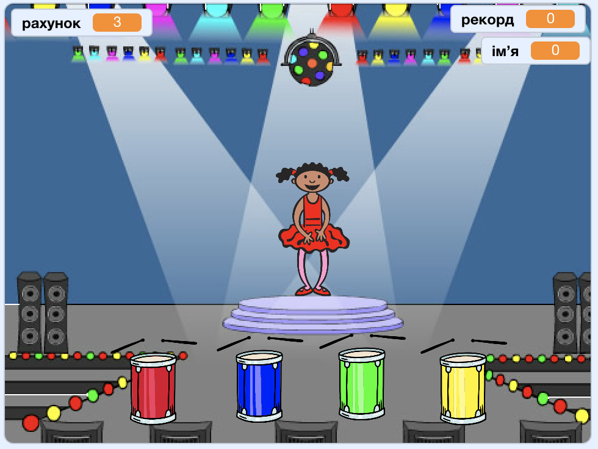

--- no-print ---

Це — версія проєкту для **Скретч 3**. Також існує [версія проєкту для Скретч 2](https://projects.raspberrypi.org/en/projects/memory-scratch2).

--- /no-print ---

## Вступ

У цьому проєкті ти створиш гру, де треба запам’ятовувати і відтворювати послідовність випадкових кольорів!

### Що ти зробиш

--- no-print ---

Натисни на зелений прапор для запуску. Слідкуй за послідовністю кольорів плаття танцівниці і слухай супутні удари барабана, а далі відтвори кольори в тій же послідовності. Якщо ти переплутаєш їх порядок, то гра закінчиться!

  <iframe allowtransparency="true" width="485" height="402" src="//scratch.mit.edu/projects/embed/396440011/?autostart=false" frameborder="0" allowfullscreen scrolling="no" mark="crwd-mark"></iframe> 

--- /no-print ---

--- print-only ---

--- /print-only ---

--- collapse ---
---
title: Чого ти навчишся
---
+ Як додавати звук до проєкту Скретч
+ Як створювати і використовувати списки для збереження даних
+ Як створювати власні блоки для коду, що повторюється

--- /collapse ---

--- collapse ---
---
title: Що тобі знадобиться
---
### Обладнання

+ Комп'ютер, що підтримує Скретч 3

### Програмне забезпечення

Скретч 3 (або [онлайн](https://rpf.io/scratchon){:target="_blank"}, або [офлайн](https://rpf.io/scratchoff){:target="_blank"})

--- /collapse ---

--- collapse ---
---
title: Додаткова інформація для викладачів
---
--- no-print ---

Якщо вам потрібно роздрукувати цей проєкт, будь ласка, скористайтеся [версією для друку](https://projects.raspberrypi.org/uk-UA/projects/memory/print){:target="_blank"}.

--- /no-print ---

Ви можете знайти [завершений проєкт тут](https://rpf.io/p/uk-UA/memory-get).

--- /collapse ---