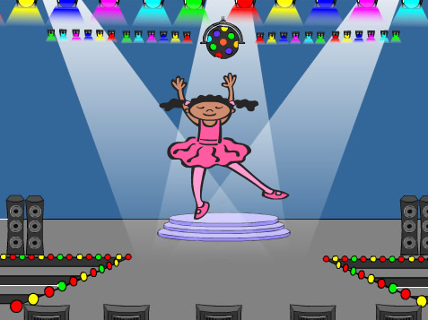
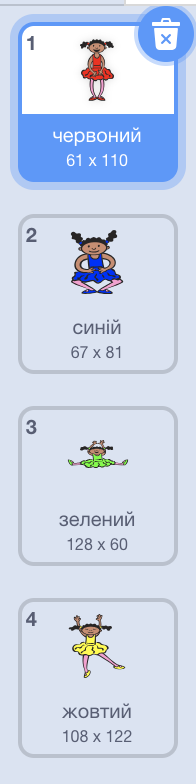

## Створи послідовність кольорів

Спочатку створи персонажа, який може відображати випадкову послідовність кольорів.

\--- task \---

Відкрий новий проєкт Скретч.

**Онлайн**: відкрий новий онлайн проєкт Скретч на [rpf.io/scratch-new](https://rpf.io/scratch-new){:target="_blank"}.

**Офлайн**: відкрий новий проєкт в офлайн-редакторі.

Якщо тобі треба завантажити та встановити офлайн-редактор Скретч, то ти можеш його знайти на [rpf.io/scratchoff](https://rpf.io/scratchoff){:target="_blank"}.

\--- /task \---

\--- task \---

Вибери спрайт та тло. Ти можеш використовувати балерину, але твій персонаж не обов’язково повинен бути людиною, все, що вимагається, — мати можливість показувати різні кольори.



\--- /task \---

+ Твоя гра повинна використовувати різні числа для кожного із кольорів:
    
    + 1 = червоний
    + 2 = синій
    + 3 = зелений
    + 4 = жовтий

\--- task \---

Створи своєму персонажу чотири різнокольорові образи, по одному для кожного із чотирьох кольорів, вказаних вище. Переконайся, що кольорові образи йдуть в тому ж порядку, що й кольори у вищенаведеному списку.



\--- /task \---

Ти можеш використовувати інструмент **заповнення**, щоб заливати частини образу певним кольором.


Далі додай список для зберігання випадкової послідовності кольорів, яку необхідно запам’ятати гравцеві.

\--- task \---

Створи список із назвою `послідовність`{:class="block3variables"}. Твій список має бути видимим лише для спрайта персонажа, тому при створенні списку ти можеш вибрати **Тільки для цього спрайту**.

[[[generic-scratch3-make-list]]]

\--- /task \---

Тепер ти маєш побачити багато нових блоків для списків. А сам порожній список має відображатися в лівому верхньому куті Сцени.


Кожен колір має свій номер, тому ти можеш вибирати випадкові кольори, вибираючи випадково числа і додаючи їх до списку.

\--- task \---

Додай наступний код до спрайта персонажа, щоб вибрати випадкове число і додати його до `послідовності`{:class="block3variables"}:


```blocks3
when flag clicked
add (pick random (1) to (4)) to [sequence v]
```

\--- /task \---

\--- task \---

Протестуй свій код. Перевір, що кожного разу, коли ти натискаєш прапор, випадкове число від 1 до 4 додається до списку.

\--- /task \---

\--- task \---

Чи можеш ти додати код до своєї програми, щоб згенерувати зразу п’ять випадкових чисел?

\--- hints \---

\--- hint \---

Додай блок `вилучити все з послідовності`{:class="block3variables"}, щоб спочатку очистити весь список, а далі додай блок `повторити`{:class="block3control"}, який додасть п’ять випадкових чисел в список.

\--- /hint \---

\--- hint \---

Ось як має виглядати твій код:


```blocks3
when flag clicked
delete (all v) of [sequence v]
repeat (5)
    add (pick random (1) to (4)) to [sequence v]
end
```

\--- /hint \---

\--- /hints \---

\--- /task \---

\--- task \---

Кожного разу, коли в список додається число, персонаж повинен змінювати образ так, щоб колір образу відповідав цьому числу. Додай наступні блоки в свій код прямо під додаванням випадкового числа до `послідовності`{:class="block3variables"}:


```blocks3
switch costume to (item (length of [sequence v]) of [sequence v])
wait (1) seconds
```

\--- /task \---