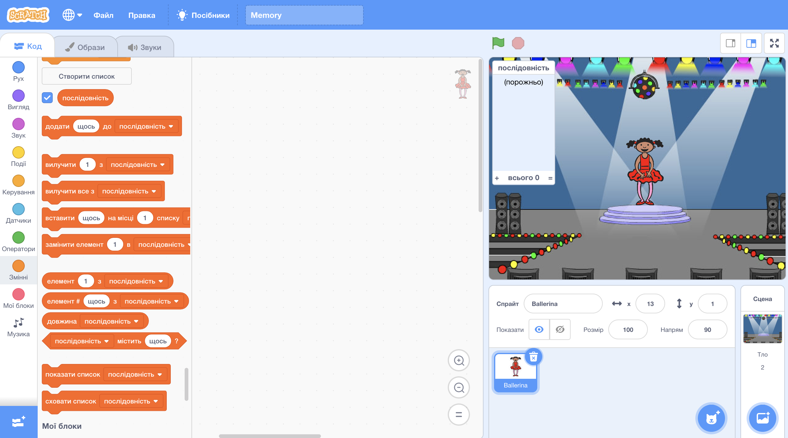

## Створіть послідовність кольорів

Спочатку створімо персонажа, який буде відображати випадкову послідовність кольорів для запам'ятовування.

+ Створіть новий проект "Скретч" та видаліть спрайт кота, щоб ваш проект був порожній. Ви можете знайти онлайн-редактор Scratch [тут](http://jumpto.cc/scratch-new).

+ Виберіть спрайт та фоновий малюнок. Ваш спрайт не повинен бути людиною, але він повинен мати можливість відображати різні кольори.


+ У своїй грі використовуйте певний номер, який буде представляти кожен колір:
    
    + 1 = червоний
    + 2 = синій
    + 3 = зелений
    + 4 = жовтий
    
    Надайте своєму персонажу чотири різних кольорових костюми, по одному для кожного з чотирьох кольорів. Переконайтеся, що ваші кольорові костюми знаходяться в тому ж порядку, що й вище.
    
    
    
    Ви можете використати інструмент *зафарбувати форму* для заповнення частини костюма іншим кольором.

Давайте створимо випадкову послідовність кольорів.

+ Створіть список, який називається `послідовність`{:class="blockdata"}. Ми будемо використовувати цей список для зберігання послідовності кольорів, які повинен запам'ятати гравець. Цей список потрібен лише для спрайт-персонажа, тож ви можете вибрати **лише для цього спрайта**.

[[[generic-scratch-make-list]]]

Тепер ви маєте побачити порожній список в лівому верхньому куті вашої сцени, а також багато нових блоків для використання списків.



+ Пам'ятаєте, ми надали кожному кольору номер? Ми можемо вибрати випадковий колір, вибравши випадкове число і додавши його до списку. Додайте цей код:

```blocks
коли натиснуто ⚑
додати (випадкове від (1) до (4)) до [послідовність v]
```

+ Перевірте свій код, натиснувши зелений прапорець. Переконайтеся, що при кожному натисканні на нього, випадковий номер від 1 до 4 додається до списку.

+ Чи можете ви додати цей блок до вашої програми, щоб згенерувати п'ять випадкових кольорів одночасно?

```blocks
повторити (5)
end
```

+ Ви можете помітити, що ваш список зараз трохи заповнений. Додамо блок, щоб видалити весь список спочатку, перш ніж генерувати будь-які числа.

```blocks
коли натиснуто ⚑
вилучити (все v) з [послідовність v]
повторити (5) 
  додати (випадкове від (1) до (4)) до [послідовність v]
end
```

+ Наостанок, кожен раз, коли ми вибираємо номер, змінюйте костюм танцівниці на останній елемент, який був доданий до списку, що являє собою номер, який ми вибрали. Додайте ці блоки до свого коду відразу після додавання випадкового числа до вашого списку:

```blocks
змінити образ на (елемент (останні v) з [послідовність v]:: list)
чекати (1) секунд
```