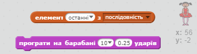

\--- challenge \---

## Завдання: додавання звуку

Перевірте свій проект кілька разів. Ви можете помітити, що іноді одне і те ж число вибирається двічі (або більше разів) поспіль, що ускладнює запам'ятовування послідовності. Чи можете ви додати звук барабану, щоб той грав кожного разу, коли персонаж змінює костюм?

Чи можете ви встановити різну гру для барабанів в залежності від того, який номер був вибраний? Це код *дуже*, подібний до вашого коду, що змінює костюм персонажа.

\--- hints \--- \--- hint \--- Ви можете виконати цей виклик, додавши лише два блоки до поточного коду вашого персонажа! \--- /hint \--- \--- hint \--- Ось блоки, які вам знадобляться:

 \--- /hint \---

\--- hint \--- Ось як має виглядати ваш готовий код:

```blocks
коли натиснуто ⚑
вилучити (все v) з [послідовність v]
повторити (5) 
  додати (випадкове від (1) до (4)) до [послідовність v]
  програти на барабані (елемент (останні v) з [послідовність v]:: list) (0.25) ударів
  змінити образ на (елемент (останні v) з [послідовність v]:: list)
  чекати (1) секунд
end
```

\--- /hint \---

\--- /hints \---

\--- /challenge \---