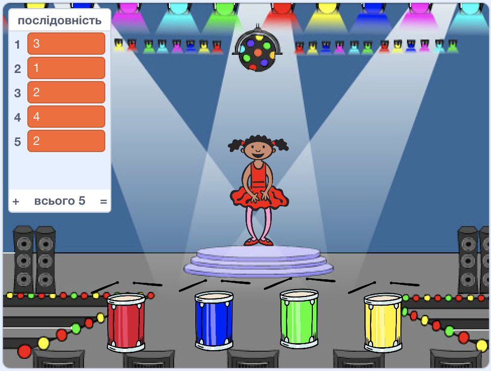

## Відтвори послідовність

Тепер ти додаси чотири кнопки, які гравець зможе натискати для відтворення послідовності кольорів.

--- task ---

Додай чотири нових спрайти до свого проєкту, які й будуть чотирма кнопками.

+ Відредагуй образи нових спрайтів так, щоб кожен спрайт був одного із чотирьох кольорів
+ Розмісти спрайти в тому ж порядку на сцені, як і кольорові образи персонажа: червоний, синій, зелений, жовтий



--- /task ---

--- task ---

Додай код до червоного спрайта, щоб коли на нього клацають, він `оповіщував`{:class="block3events"} спрайт персонажа повідомленням "червоний":


```blocks3
    when this sprite clicked
    broadcast (червоний v)
```

--- /task ---

`Оповіщення`{:class="block3events"} — це ніби трансляція повідомлення через гучномовець, які бувають в школах або супермаркетах. Усі спрайти можуть чути `оповіщення`{:class="block3events"}, але лише ті, які повинні відповідати, будуть щось виконувати.

--- task ---

Додай аналогічний код до синього, зеленого та жовтого спрайтів, щоб вони `оповіщували`{:class="block3events"} повідомленнями з відповідними кольорами.

--- /task ---

Ти ж пам’ятаєш, що `оповіщення`{:class="block3events"} — це все одно, що повідомлення через гучномовець? Ти додаси код, щоб змусити спрайт персонажа реагувати на повідомлення `оповіщень`{:class="block3events"}.

--- task ---

Коли твій спрайт персонажу отримує повідомлення `червоний`{:class="block3events"}, код має перевіряти, чи число `1` знаходиться на початку списку `послідовність`{:class="block3variables"} (що означає, що `червоний`{:class="block3events"} є наступним кольором послідовності).

Якщо `1` йде на початку списку, код має видалити звідти це число, бо гравець назвав правильний колір. Інакше гра завершується, і код має `зупинити все`{:class="block3control"} для закінчення гри.


```blocks3
when I receive [червоний v]
if <(item (1 v) of [послідовність v])=[1]> then
delete (1 v) of [послідовність v]
else
say [Кінець гри!] for (1) seconds
stop [all v]
end
```

--- /task ---

--- task ---

Додай до коду, який ти щойно написав, удар у барабан, коли спрайт персонажу отримує правильне `оповіщення`{:class="block3events"}.

--- hints ---

--- hint ---

Чи можеш ти використати числа, що відповідають кожному з кольорів, щоб зіграти правильний звук барабана?

+ 1 = червоний
+ 2 = синій
+ 3 = зелений
+ 4 = жовтий

--- /hint ---

--- hint ---

Над блоком `вилучити 1 з послідовності`{:class="block3variables"} додай `прогарти на барабані`{:class="block3extensions"}, щоб зіграти перший звук в списку `послідовність`{:class="block3variables"}.

--- /hint ---

--- hint ---

Ось код, який тобі треба буде додати:

```blocks3
when I receive [червоний v]
if <(item (1 v) of [послідовність v])=[1]> then

+ play drum ((1) Snare Drum v) for (0.25) beats
delete (1 v) of [послідовність v]
else
say [Кінець гри!] for (1) seconds
stop [all v]
end
```

--- /hint ---

--- /hints ---

--- /task ---

--- task ---

Продублюй код, який ти використовував для того, щоб спрайт персонажа зреагував на повідомлення `червоний`{:class="block3events"}. Зміни продубльований код так, що він реагував на повідомлення `синій`{:class="block3events"}.

--- /task ---

Коли спрайт обробляє повідомлення `синій`{:class="block3events"}, які частини коду мають залишитися такими ж, а які повинні змінитися? Пам’ятай, що кожен із кольорів має відповідний номер.

--- task ---

Зміни код спрайта персонажа так, щоб він коректно обробляв повідомлення `синій`{:class="block3events"}.

--- hints ---

--- hint ---

Використовуй такі блоки, але ти маєш їх змінити якимось чином:


```blocks3
<(item (1 v) of [послідовність v]) = [1]>

when I receive [червоний v]

play drum ((1) Snare Drum v) for (0.25) beats
```

--- /hint ---

--- hint ---

Ось як має виглядати твій код для оповіщення `синій`{:class="block3events"}.


```blocks3
when I receive [blue v]
if <(item (1 v) of [послідовність v])=[2]> then
    play drum ((2) Bass Drum v) for (0.25) beats
    delete (1 v) of [послідовність v]
else
    say [Кінець гри!] for (1) seconds
    stop [all v]
end
```

--- /hint ---

--- /hints ---

--- /task ---

--- task ---

Продублюй код двічі (для зеленої та жовтої кнопок) і зміни необхідні частини так, щоб персонаж правильно обробляв нові `оповіщення`{:class="block3events"}.

--- /task ---

Не забудь протестувати свій код! Чи можеш ти запам’ятати послідовність із п’яти кольорів? Чи змінюється послідовність кожного разу?

Коли гравець відтворює всю послідовність кольорів правильно, список `послідовність`{:class="block3variables"} стає порожнім, і гравець перемагає. Якщо бажаєш, можеш також відобразити блимаючі вогники як винагороду, коли список `послідовність`{:class="block3variables"} стає порожнім.

--- task ---

Додай наступний код в кінець скрипта `коли прапор натиснуто`{:class="block3events"} для персонажа:


```blocks3
    wait until < (length of [послідовність v]) = [0]>
    broadcast (Перемога v) and wait
```

--- /task ---

--- task ---

Перемкнися на Сцену та імпортуй звук`drum machine` або будь-який інший, який тобі до вподоби.

[[[generic-scratch3-sound-from-library]]]

--- /task ---

--- task ---

Додай цей код, щоб відтворювати звук, і щоб тло змінювало свій колір, коли гравець перемагає.


```blocks3
    when I receive [Перемога v]
    start sound (drum machine v)
    repeat (50)
        change [color v] effect by (25)
        wait (0.1) seconds
    end
    clear graphic effects
```

--- /task ---