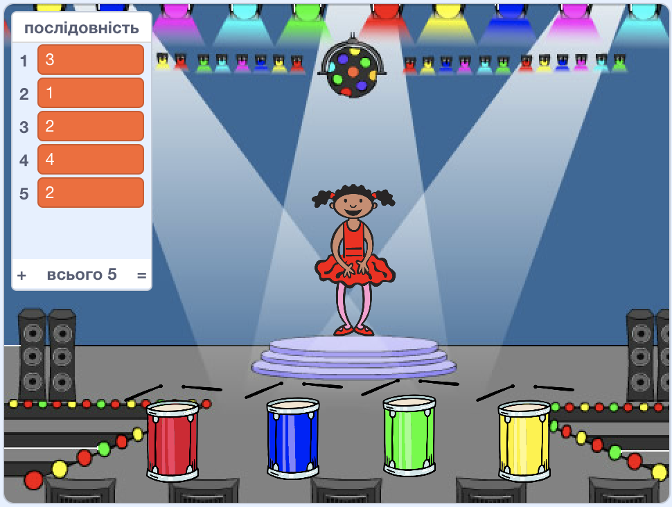

## Повторення послідовності

Додамо чотири кнопки для гравця, які потрібно натиснути, щоб повторити послідовність, яку вони запам'ятали.

+ Додайте чотири нових спрайти до вашого проекту, щоб відобразити чотири кнопки. Відредагуйте костюми таким чином, щоб кожен спрайт відповідав одному з чотирьох кольорів. Розмістіть спрайти у тому ж порядку, що й костюми танцівниці: червоний, синій, зелений, жовтий.



+ Коли натискатимуть на червоний барабан, вам потрібно буде транслювати повідомлення своєму персонажу, повідомляючи про те, що натиснута червона кнопка. Додайте цей код до червоного барабана:

```blocks
    коли спрайт натиснуто
оповістити [червоний v]
```

коли я отримаю [синій v] якщо <(item (1 v) of \[послідовність v] :: list) = [2]> то програти на барабані (елемент (1 v) з [послідовність v] :: list) (0.25) ударів вилучити (1 v) з [послідовність v] говорити [Кінець гри!\] (1) сек зупинити [все v] end Всі спрайти можуть чути це повідомлення, але тільки той спрайт, завдання якого відповісти на це повідомлення, буде щось робити.

+ Додайте такий ж код до синього, зеленого та жовтого барабанів, щоб вони транслювали повідомлення про власний колір.

\--- hints \--- \--- hint \--- Ось простий спосіб скопіювати код з одного спрайту на інший. Змініть транслююче повідомлення в кожному спрайті, щоб це повідомлення відповідало кольору спрайта.  \--- /hint \--- \--- /hints \---

Пам'ятаєте, ми сказали, що трансляція трохи схожа на оголошення по гучномовцю? Тільки той спрайт, який має відповідати, зробить щось. Тому давайте залишимо процес відповіді на повідомлення спрайту-персонажеві. Ми зробимо це, написавши код для кожного з персонажів, які виконуватимуть якісь дії, коли кожнен почує своє повідомлення.

+ Коли ваш спрайт-персонаж отримує повідомлення `червоний`, код повинен перевірити, чи є число `1` на початку списку (що означає, що `червоний` є наступним кольором в послідовності).
    
    Якщо це так, код повинен видалити номер зі списку, оскільки колір відгадали правильно. В іншому випадку гра закінчена, і ми повинні `зупинити все`{:class="blockcontrol"}, щоб зупинити гру.

```blocks
    коли я отримаю [червоний v]
якщо <(item (1 v) of [послідовність v]:: list) = [1]> то 
  вилучити (1 v) з [послідовність v]

  говорити [Кінець гри!] (1) сек
  зупинити [все v]
end
```

+ Додайте код до коду, який ви щойно написали, який би відтворював удар барабану і тоді, коли отримано правильний колір.

\--- hints \--- \--- hint \--- Чи можете ви використовувати цифри, які відповідають кожному кольору, для відтворення правильного ударного барабану?

+ 1 = червоний
+ 2 = синій
+ 3 = зелений
+ 4 = жовтий \--- /hint \--- \--- hint \--- Вам побтрібно буде додати блок `барабанна гра`{:class="blocksound"}, щоб відтворити перший звук у списку послідовностей перед `видаленням 1 послідовності`{:class="blockdata"}:

 \--- /hint \--- \--- hint \--- Ось код, який вам потрібно буде додати:

```blocks
програти на барабані (елемент (1 v) з [послідовність v]:: list) (0.25) ударів
```

\--- /hint \--- \--- /hints \---

+ Скопіюйте код, який ви використовували для створення відповіді на `червоне` повідомлення вашого спрайта-персонажа. На цей раз змініть повідомлення на `синє`.

Коли спрайт відповідає на ` синє ` повідомлення, який біт коду повинен залишатися незмінним, і який біт повинен змінюватися? Пам'ятайте, що кожен колір має відповідний номер.

+ Змініть свій код таким чином, щоб персонаж правильно відповідав на ` синє ` повідомлення.

\--- hints \--- \--- hint \--- Залиште ці блоки, але вам доведеться трохи змінити їх:  \--- /hint \--- \--- hint \--- Ось так ваш код повинен шукати блакитну трансляцію.

```blocks
    коли я отримаю [синій v]
якщо <(item (1 v) of [послідовність v]:: list) = [2]> то 
  програти на барабані (елемент (1 v) з [послідовність v]:: list) (0.25) ударів
  вилучити (1 v) з [послідовність v]

  говорити [Кінець гри!] (1) сек
  зупинити [все v]
end
```

чекати поки <(length of [послідовність v] :: list) = [0]> оповістити [перемога v] і чекати

+ Двічі скопіюйте код для зелених та жовтих кнопок та змініть необхідні частини так, щоб персонаж реагував правильно.

+ Не забудьте перевірити доданий код! Чи можете ви запам'ятати послідовність з п'яти кольорів? Чи послідовності є різними кожного разу?

Ви також можете встановити миготливі вогні як нагороду, коли список стане порожнім, оскільки це означає, що вся послідовність була запам'ятована правильно.

+ Додайте цей код до кінця скрипту вашого персонажа `коли прапорець натиснуто` {: class = "blockevents"}:

```blocks
    чекати поки <(length of [послідовність v]:: list) = [0]>
оповістити [перемога v] і чекати
```

+ Перейдіть на сцену та додайте цей код, щоб відтворити звук та змінити колір тла після того, як гравець виграв. Ви можете вибрати будь-який звук, який вам подобається.

```blocks
    коли я отримаю [перемога v]
грати звук [барабана машина v]
повторити (50) 
  змінити ефект [колір v] на (25)
  чекати (0.1) секунд
end
очистити графічні ефекти
```