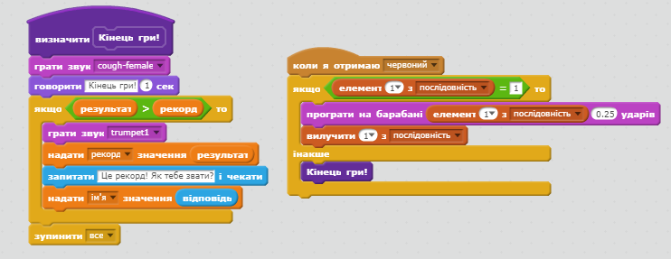

## Рекорд

Збережемо рекорд, щоб ви могли грати проти своїх друзів.

+ Додайте дві нові змінні, які називаються `рекорд`{:class="blockdata"} та `ім'я`{:class="blockdata"} до вашого проекту.

Коли гра закінчується через те, що гравець назвав послідовність неправильно, потрібно перевірити, чи є їх результат більшим за поточну цифру. Якщо так, то вам потрібно зберегти рахунок як найкращий результат і зберегти ім'я гравця.

+ Додайте код до свого персонажа-спрайта, щоб зберегти рекорд. Також запитайте гравців їхмі імена та запишіть їх в список `ім'я`{:class="blockdata"}.

[[[generic-scratch-high-score]]]

\--- hints \--- \--- hint \--- Ваш новий код повинен дотримуватися цієї логіки: після повідомлення ` кінець гри ` `
 `Якщо` `рахунок` `більший за `рекорд` `Встановити` `рахунок` як новий`рекорд` `Запитати` ім'я гравця `Встановити` `ім'я` на `відповідь` \--- /hint \--- \--- hint \--- Вам знадобляться наступні блоки:


\--- /hint \--- \--- hint \--- Ось як виглядає ваш код, коли натиснуто на червону кнопку:

```blocks
    коли я отримаю [червоний v]
якщо <(item (1 v) of [послідовність v]:: list) = [1]> то 
  вилучити (1 v) з [послідовність v]

  говорити [Кінець гри!] (1) сек
  якщо <(рахунок) > (рекорд)> то 
    надати [рекорд v] значення (рахунок)
    запитати [Рекорд! Як вас звати?] і чекати
    надати [ім'я v] значення (відповідь)
  end
  зупинити [все v]
end
```

\--- /hint \--- \--- /hints \---

+ Вам потрібно буде додати цей новий код до образу спрайта для трьох інших кольорів теж! Ви помітили, що код "Кінець гри" для кожного з чотирьох кольорів точно такий самий?


Якщо вам коли-небудь потрібно буде змінити будь-який з цих кодів, наприклад, щоб додати звук або змінити повідомлення "Кінець гри!", вам потрібно буде змінити його чотири рази. Це займає багато часу та може дратувати.

Замість цього ви можете визначити власні блоки та повторно використовувати їх у вашому проекті. Для цього натисніть `Ваші блоки`{:class="blockmoreblocks"}, а потім **Створити блок**. Назвіть цей новий блок "Кінець гри!".


+ Додайте код з блоку `Інше`{:class="blockcontrol"}, що підключений до червоної кнопки створеного вами блоку:



+ Тепер ви створили нову *функцію*, яка називається `Кінець гри`{:class="blockmoreblocks"}, яку можна використовувати де завгодно. Перетягніть новий блок `Кінець гри`{:class="blockmoreblocks"} на чотири скрипти для кнопок.


+ Тепер додавайте звук, коли натискається неправильна кнопка. Вам потрібно додати цей код лише один раз в блоці `Кінець гри`{:class="blockmoreblocks"}, який ви зробили, а не чотири окремі рази!

