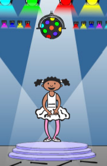

## Завдання: вдоскональ свою гру

### Створи більше блоків

Чи бачиш ти ще якийсь код, який є однаковим для усіх чотирьох кнопок?

```blocks3
when I receive [red v]
if <(item (1 v) of [sequence v])=[1]> then
    play drum (\(1\) Snare Drum v) for (0.25) beats
    delete (1 v) of [sequence v]
else
    Game Over :: custom
end

when I receive [blue v]
if <(item (1 v) of [sequence v])=[1]> then
    play drum (\(2\) Bass Drum v) for (0.25) beats
    delete (1 v) of [sequence v]
else
    Game over :: custom
end
```

Чи можеш ти зробити інший власний блок, який могли б використовувати усі кнопки?

### Ще один образ

Ти помітив (-ла), що твоя гра починається з того, що персонаж показує один з кольорів, і що останній колір послідовності все ще відображається, коли гравець її відтворює?

Чи можеш ти додати ще один білий образ до свого персонажа і додати код, щоб персонаж показував цей образ на початку гри, і коли гравець відтворює послідовність?



### Рівень складності

Чи можеш ти надати гравцеві можливість вибирати між "легким режимом" (з використанням лише червоного та синього кольорів) та "звичайним режимом" (який використовує всі чотири кольори)?

Якщо хочеш, можеш навіть додати "складний" режим, який використовує п’ятий барабан!