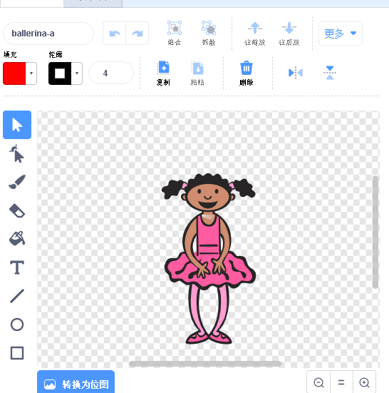
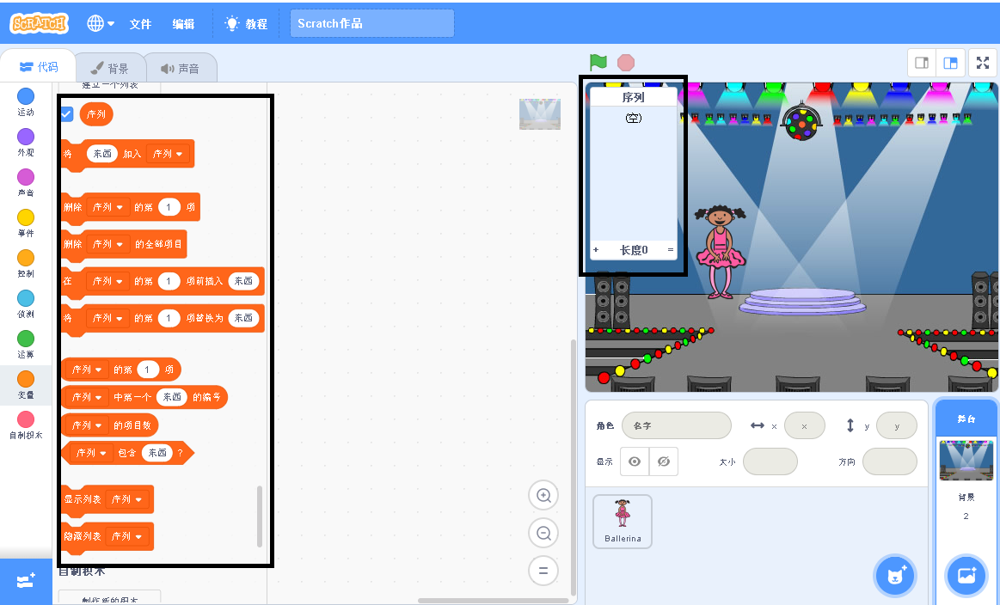

## 创建一个颜色序列

首先，让我们创建一个角色，该角色将展示一个需要记住的随机颜色序列。

\--- task \--- 打开一个新的Scratch项目。

**在线**: 在[rpf.io/scratch-new](https://rpf.io/scratchon)打开一个新的在线Scratch项目.

**离线**: 在离线编辑器中打开一个新项目。

如果您需要下载并安装Scratch离线编辑器，你可以在[ rpf.io/scratchoff ](https://rpf.io/scratchoff)中获取。

\--- /task \---

-- task -- 选择一个角色和一个背景。你可以使用芭蕾舞演员，但你的角色并不一定是一个人物角色，只要能展示不同颜色就够了。

 \--- /task \---

+ 您的游戏应使用不同的数字来表示每种颜色：
    
    + 1 = 红色
    + 2 = 蓝色
    + 3 = 绿色
    + 4 = 黄色

\---任务\--- 你的角色提供四种不同颜色的服装，以上四种颜色各一套。 确保您的服装颜色的顺序与上面的列表顺序相同。

 \--- /task \---

如果需要，可以使用**填充**工具来给服装不同部分填上不同的颜色。



接下来，添加一个列表，用于存储玩家必须记住的随机颜色序列。

\--- task \--- 创建一个列表，名字是 `序列`{:class="block3variables"}. 只有角色精灵需要去看这个列表，所以在你创建列表时你可以选择**仅适用于当前角色**

[[[generic-scratch3-make-list]]]

\--- /task \---

现在您应该可以看到许多新的可以使用列表的代码块。空列表应该在舞台的左上角可见。



每种颜色都有不同的数字，因此您可以通过随机选择一个数字并将其添加到列表中来选择随机颜色。

\--- task \--- 将此代码添加到角色精灵中以选择随机数，然后将其添加到`序列`{:class="block3variables"}中:


```blocks3
当 ⚑ 被点击
将 (在 (1) 和 (4) 之间取随机数) 加入 [序列]
```

\--- /task \---

\--- task \--- 测试你的代码。检查每次单击该标志时，1到4之间的随机数会添加到列表中。 \--- /任务\---

\--- task \--- 你可以在程序中添加代码，一次生成五个随机数吗？

\--- hints \--- \--- hint \--- 添加 一个 `删除序列的全部项目`{:class="block3variables"}去删除列表中的所有项，然后添加`重复执行`{:class="block3control"}块将五个随机数添加到列表中。 \--- /hint \--- \--- hint \---

你的代码应该是这样的：


```blocks3
当 ⚑ 被点击
删除 [序列] 的第 (all v) 项
重复执行 (5) 次 
  将 (在 (1) 和 (4) 之间取随机数) 加入 [序列]
end
```

\--- /hint \--- \--- /hints \--- \--- /task \---

\--- task \--- 每次将一个数字添加到列表中时，角色应该改变它的服装颜色，以便服装的颜色与数字匹配。 将这些块直接放到随机数添加到`序列`{:class="block3variables"}代码块的下方:


```blocks3
换成 ([序列] 的第 ([序列] 的项目数) 项) 造型
等待 (1) 秒
```

\--- /task \---