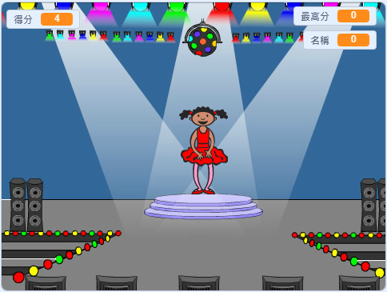

\---沒有印刷\---

這是該項目的 **Scratch 3** 版本。項目</a>還有Scratch 2版本。
 

\--- /無印刷\---

## 介紹

在這個項目中，你將創建一個記憶遊戲，你必須記住並重複隨機的顏色序列！

### 你要做什麼

\--- no-print \--- 點擊綠色標誌開始。 觀看舞者禮服所顯示的顏色序列，聽聽隨行的鼓點，然後將顏色重複給她。 如果你的顏色訂單錯了，它的遊戲就結束了！

  <iframe allowtransparency="true" width="485" height="402" src="//scratch.mit.edu/projects/embed/284452634/?autostart=false" frameborder="0" allowfullscreen scrolling="no" mark="crwd-mark"></iframe>  

\--- /無印刷\---

\---僅打印\---  \--- /僅打印\---

## - - 坍方 - -

## 標題：你將學到什麼

+ 如何為Scratch項目添加聲音
+ 如何創建和使用列表來存儲數據
+ 如何創建和使用自定義塊來重複代碼

- - /坍方 - -

## - - 坍方 - -

## 標題：你需要什麼

### 硬件

+ 能夠運行Scratch 3的計算機

### 軟件

從頭開始3（ [在線](https://rpf.io/scratchon){：target =“_ blank”}或 [離線](https://rpf.io/scratchoff){：target =“_ blank”}） \--- / collapse \---

## - - 坍方 - -

## 標題：教育工作者的附加信息

\---沒有印刷\---

如果您需要打印此項目，請使用 [打印機友好版本](https://projects.raspberrypi.org/en/projects/memory/print){：target =“_ blank”}。

\--- /無印刷\---

You can find the [completed project here](http://rpf.io/p/en/memory-get).

- - /坍方 - -