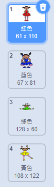
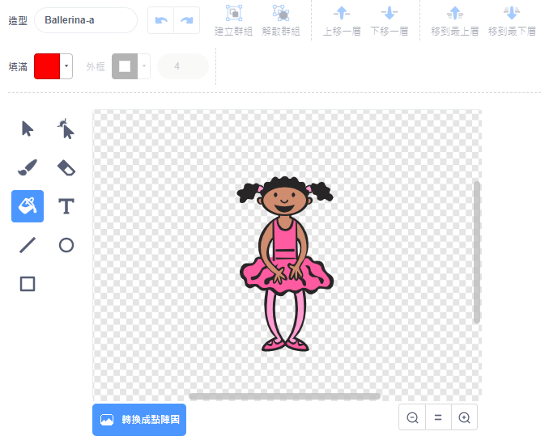
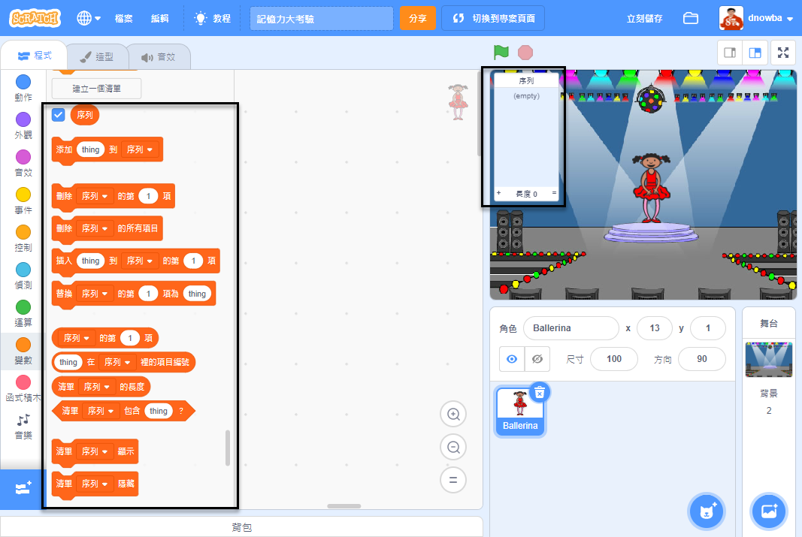

## 創建顏色序列

首先創建一個可以顯示隨機顏色序列的角色。

\--- task \--- 打開一個新的Scratch項目。

**Online**: open a new online Scratch project at [rpf.io/scratch-new](https://rpf.io/scratch-new){:target="_blank"}.

**脫機**：在脫機編輯器中打開一個新項目。

If you need to download and install the Scratch offline editor, you can find it at [rpf.io/scratchoff](https://rpf.io/scratchoff){:target="_blank"}.

\--- /任務\---

\--- task \--- 選擇一個角色精靈和一個背景。你可以使用芭蕾舞女演員，但你的角色不一定是一個人，他們只需要能夠展示不同的顏色。

 \--- /任務\---

+ 您的遊戲應使用不同的數字來表示每種顏色：
    
    + 1 =紅色
    + 2 =藍色
    + 3 =綠色
    + 4 =黃色

\---任務\--- 你的角色提供四種不同顏色的服裝，上面顯示的四種顏色各一種服裝。 確保您的彩色服裝與上面的列表順序相同。

 \--- /任務\---

如果你願意，你可以使用 **顏色形狀** 工具，填補了服裝的部分用不同的顏色。



接下來，添加一個列表，用於存儲玩家必須記住的隨機顏色序列。

\--- task \--- 創建一個名為 `sequence`{：class =“block3variables”}的列表。 只有字符精靈需要查看此列表，因此您可以在創建列表時選擇 **對於此精靈只有**。

[[[generic-scratch3-make-list]]]

\--- /任務\---

您現在應該看到許多用於使用列表的新代碼塊。空列表應該在舞台的左上角可見。



每種顏色都有不同的數字，因此您可以通過隨機選擇一個數字並將其添加到列表中來選擇隨機顏色。

\--- task \--- 將此代碼添加到字符精靈中以選擇一個隨機數並將其添加到 `序列`{：class =“block3variables”}：


```blocks3
當標記點擊時
添加（選擇隨機（1）到（4））到[序列v]
```

\--- /任務\---

\--- task \--- 測試你的代碼。檢查每次單擊該標誌時，1到4之間的隨機數會添加到列表中。 \--- /任務\---

\--- task \--- 你可以在程序中添加代碼，一次生成五個隨機數嗎？

\---提示\--- \---提示\--- 添加 a `刪除所有序列`{：class =“block3variables”}首先刪除列表中的所有項目，然後添加 `重複`{：class =“block3control”}塊將五個隨機數添加到列表中。 \--- /提示\--- \---提示\---

這是你的代碼應該是這樣的：


```blocks3
當標記點擊時
刪除（所有v）[序列v]
重複（5）
    添加（選擇隨機（1）到（4））到[序列v]
結束
```

\--- /提示\--- \--- /提示\--- \--- /任務\---

\--- task \--- 每次將一個數字添加到列表中時，角色應該改變它的服裝，以便服裝的顏色與數字匹配。 將這些塊放在緊跟下面的代碼中，其中隨機數被添加到 `序列`{：class =“block3variables”}：


```blocks3
將服裝切換為[序列v]的項目（[序列v]的長度）
等待（1）秒
```

\--- /任務\---