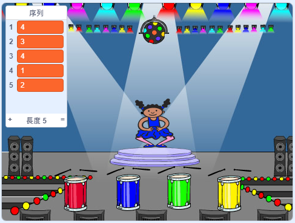

## 重複序列

現在，您將添加四個按鈕，玩家必須按下才能重複顏色序列。

\--- task \--- 在項目中添加四個新精靈來表示四個按鈕。

+ 編輯新精靈的服裝，以便四種顏色中的每一種都有一個精靈
+ 將精靈放在舞台上的順序與服裝相同：紅色，藍色，綠色，黃色

 \--- /任務\---

\--- \---任務 將代碼添加到紅色子畫面，使得當子畫面被點擊時，它 `廣播`{：類=“block3events”}一個“紅色”消息發送到所述字符子畫面：


```blocks3
    當這個精靈點擊
    廣播（紅色v）
```

\--- /任務\---

`廣播`{：class =“block3events”}就像通過揚聲器宣布的消息，您可以在學校或超市中聽到。 所有的精靈都可以聽到 `廣播`{：class =“block3events”}，但只有作為響應的作用的精靈會做一些事情。

\---任務\---

添加類似的代碼到藍色，綠色和黃色精靈，使它們 `廣播`{：class =“block3events”}有關自己顏色的消息。

\--- /任務\---

你還記得 `廣播`{：class =“block3events”}就像一個揚聲器信息嗎？ 您將添加代碼以使其成為字符精靈的工作，以響應 `廣播`{：class =“block3events”}消息。

\---任務\---

當你的角色精靈收到消息 `red`{：class =“block3events”}時，代碼應該檢查數字 `1` 是否在 `序列`{：class =“block3variables”}列表的開頭（這意味著 `red`{：class =“block3events”}是序列中的下一個顏色）。

如果 `1` 位於列表的開頭，則代碼應從列表中刪除該數字，因為播放器記住了正確的顏色。 否則它的遊戲結束，並且代碼需要 `停止所有`{：class =“block3control”}以結束遊戲。


```blocks3
當我收到[red v]
if <（[sequence v]的項目（1 v））=[1]> 然後
刪除（1 v）[sequence v]
else
說[Game over！] for（1）秒
停止[全v]
結束
```

\--- /任務\---

\--- task \--- 添加到你剛寫的代碼中，這樣當角色精靈收到正確的 `廣播`{：class =“block3events”}時，鼓聲也會播放。

\---提示\--- \---提示\--- 你能使用與每種顏色相對應的數字來播放正確的鼓點嗎？

+ 1 =紅色
+ 2 =藍色
+ 3 =綠色
+ 4 =黃色 \--- /提示\--- \---提示\--- 在序列</code>{：class =“block3variables”}塊的 `刪除1之上，添加 <code>鼓`{：class =“ block3sound“}阻止播放 `序列`{：class =”block3variables“}列表中的第一個聲音。

\--- /提示\--- \---提示\--- 這是您需要添加的代碼：

```blocks3
當我收到[紅色v]
如果 <（[序列v]的項目（1 v））=[1]> 然後

+播放鼓（\（1 \）Snare Drum v）for（0.25）beats
delete（1 v ）[序列v]
其他
說[遊戲結束！]為（1）秒
停止[全v]
結束

```

\--- /提示\--- \--- /提示\--- \--- /任務\---

\--- task \--- 複製用於使角色精靈響應消息 `red`{：class =“block3events”}的代碼。 更改重複的代碼，以便它發送消息 `blue`{：class =“block3events”}。 \--- /任務\---

當精靈響應消息 `blue`{：class =“block3events”}時，哪一位代碼應該保持不變，哪一位應該改變？ 請記住，每種顏色都有相應的數字。

\--- task \--- 更改字符精靈的代碼，使字符正確響應 `藍色`{：class =“block3events”}消息。

\---提示\--- \---提示\---

保留這些塊，但您需要以某種方式更改它們：


```blocks3
<（[序列v]的項目（1 v））= [1]>

當我收到[red v]

play drum（\（1 \）Snare Drum v）for（0.25）beats
```

\--- /提示\--- \---提示\--- 這是你的代碼應該如何尋找 `藍色`{：class =“block3events”}廣播。


```blocks3
當我收到[藍色v]
如果 <（[序列v]的項目（1 v））=[2]> 然後
    播放鼓（\（2 \）Bass Drum v）for（0.25）beats
    delete（1 v） [序列v]
其他
    說[遊戲結束！]為（1）秒
    停止[全v]
結束
```

\--- /提示\--- \--- /提示\--- \--- /任務\---

\--- task \--- 再次復制代碼兩次（對於綠色和黃色按鈕），並更改必要的部分，以便角色正確響應新的 `廣播`{：class =“block3events”}。 \--- /任務\---

記得測試代碼！你能記住五種顏色的序列嗎？每次序列是否不同？

當玩家正確重複整個顏色序列時， `序列`{：class =“block3variables”}列出emtpy並且玩家獲勝。 如果需要，一旦 `序列`{：class =“block3variables”}列表為空，您還可以顯示一些閃爍的燈作為獎勵。

\--- task \--- 當標記點擊</code>{：class =“block3events”}腳本時，將此代碼添加到角色 `的末尾：</p>

<p></p>

<pre><code class="blocks3">    等到 < （[序列v]的長度）= [0]>
    廣播（贏了v）並等待
`</pre> 

\--- /任務\---

\---任務\--- 切換到舞台，並導入 `鼓機` 聲音或你喜歡的另一種聲音。

[[[generic-scratch3-sound-from-library]]]

\--- /任務\---

\--- task \--- 添加此代碼以播放聲音，並在玩家獲勝時使背景改變顏色。


```blocks3
    當我收到[won v]
    開始聲音（鼓機v）
    重複（50）
        改變[color v]效果（25）
        等待（0.1）秒
    結束
    清除圖形效果
```

\--- /任務\---